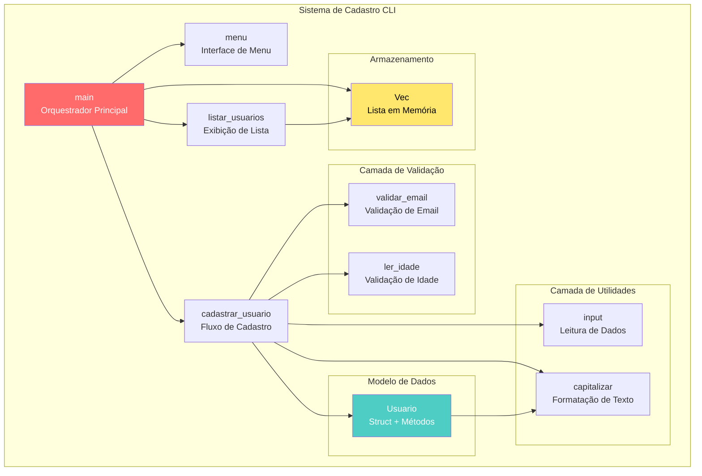
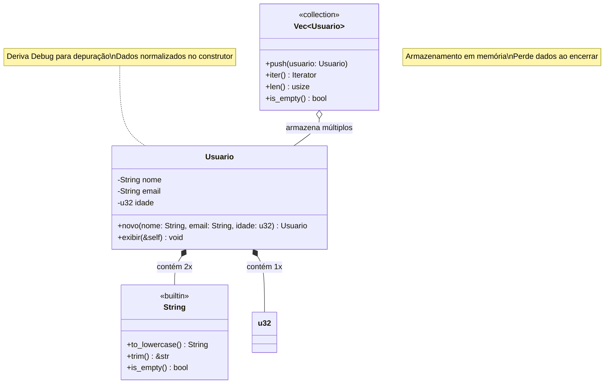
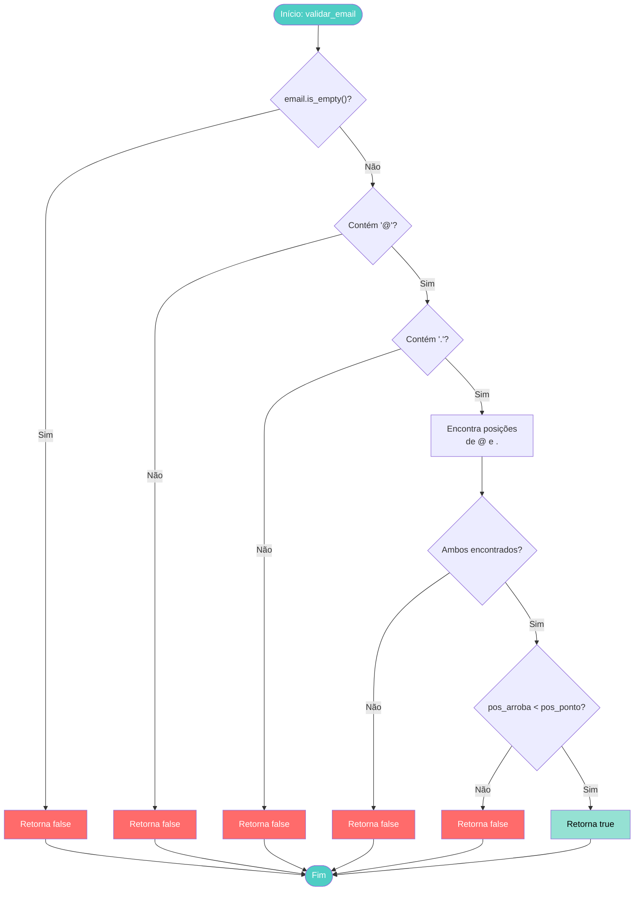
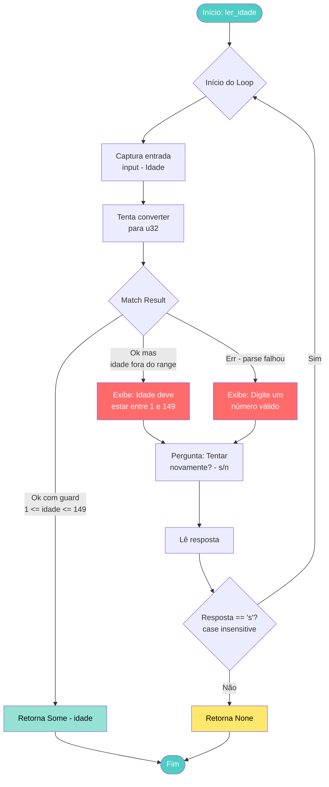
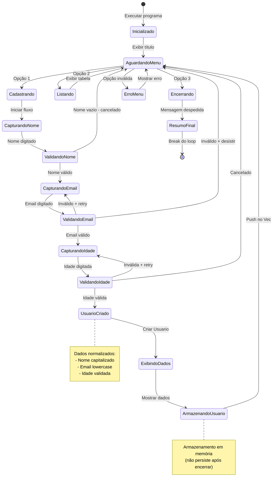
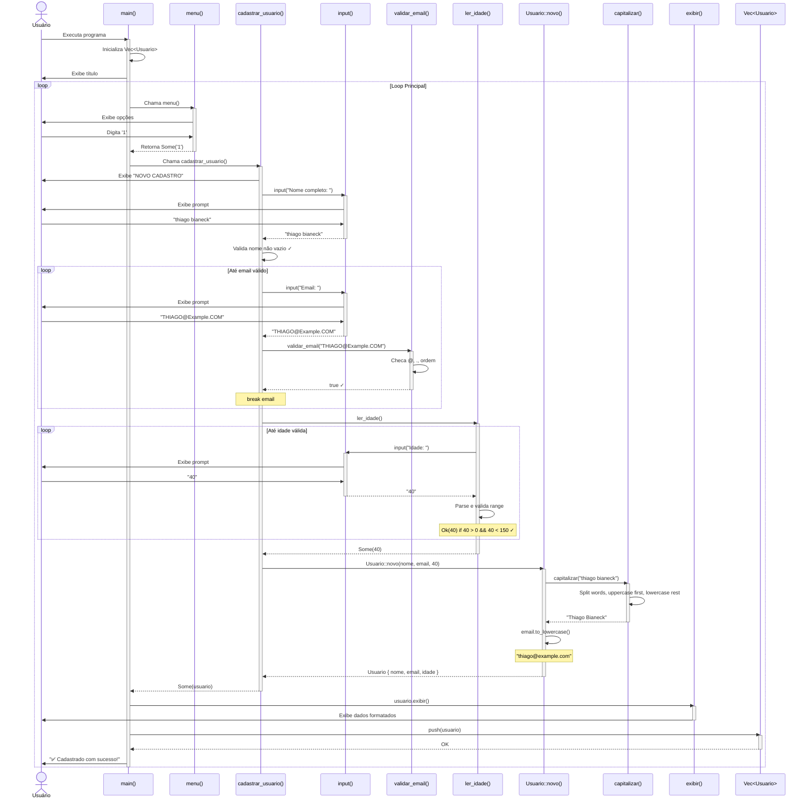
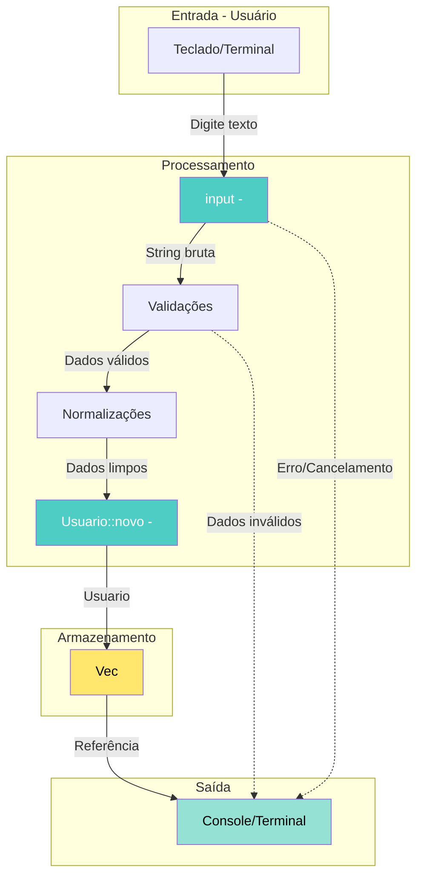
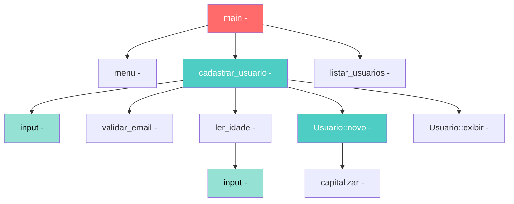

# 📊 RELATÓRIO TÉCNICO DE ENGENHARIA REVERSA

**Sistema:** Cadastro de Usuários  
**Linguagem:** Rust  
**Paradigma:** Procedural com Estruturas de Dados  
**Analista:** Arquiteto de Software Sênior  
**Data:** 20/11/2025

---

## 1. VISÃO GERAL 🏗️

### 🎯 Propósito do Sistema

Este é um **sistema de cadastro de usuários em linha de comando (CLI)** desenvolvido em Rust. Funciona como uma **aplicação CRUD simplificada** (Create e Read) que permite registrar pessoas com nome, email e idade, mantendo os dados em memória durante a execução.

**Analogia:** Pense neste sistema como uma **prancheta eletrônica** onde um recepcionista anota visitantes. Cada visitante fornece seus dados, que são organizados em fichas (structs). Quando o expediente termina, a prancheta é apagada (dados não persistem).

### 🧩 Linguagem e Paradigma

**Rust** é uma linguagem de programação de sistemas que prioriza:
- **Segurança de memória** sem garbage collector
- **Concorrência segura** (não explorada neste código)
- **Performance** comparável a C/C++
- **Ownership system** (sistema de propriedade de dados)

O código utiliza:
- **Programação procedural:** Funções independentes organizadas logicamente
- **Estruturas de dados:** `struct Usuario` encapsula dados relacionados
- **Programação funcional leve:** Uso de iterators, closures e pattern matching
- **Tratamento de erros explícito:** `Option<T>` e `Result<T, E>`

### 🏛️ Domínio de Negócio

**Domínio:** Gestão de Cadastro de Pessoas  
**Modelo Conceitual:**

- **Entidade Central:** Usuário (pessoa física)
- **Atributos Obrigatórios:** Nome, Email, Idade
- **Regras de Negócio:** Validação de dados, normalização, formatação
- **Operações:** Cadastro, Listagem, Visualização

**Casos de Uso:**
1. Cadastrar novo usuário com validações
2. Listar todos os usuários cadastrados
3. Exibir detalhes de um usuário específico
4. Encerrar sistema e exibir resumo

### 📐 Diagrama de Arquitetura (C4 - Nível de Componentes)

**Visão Geral dos Componentes do Sistema:**



**Legenda:**
- **Vermelho:** Orquestrador principal (ponto de entrada)
- **Azul claro:** Modelo de domínio (estrutura de dados)
- **Amarelo:** Camada de persistência em memória

---

## 2. ESTRUTURAS DE DADOS 🗂️

### 📦 Inventário de Estruturas

#### **Struct: `Usuario`**

**Definição:**

```rust
#[derive(Debug)]
struct Usuario {
    nome: String,
    email: String,
    idade: u32,
}
```

**Propósito:** Representa um usuário cadastrado no sistema, encapsulando seus dados pessoais.

**Atributos:**

| Atributo | Tipo | Descrição | Restrições |
|----------|------|-----------|------------|
| `nome` | `String` | Nome completo do usuário (heap-allocated) | Capitalizado, não vazio |
| `email` | `String` | Endereço de email | Lowercase, formato válido (@, .) |
| `idade` | `u32` | Idade em anos (unsigned 32-bit) | Entre 1 e 149 |

**Características Técnicas:**
- `#[derive(Debug)]`: Macro que gera automaticamente implementação do trait `Debug`, permitindo imprimir a struct com `{:?}` para depuração
- `String`: Tipo heap-allocated (dados na heap, ponteiro na stack), ownership explícito
- `u32`: Inteiro sem sinal de 32 bits (range: 0 a 4.294.967.295)

#### **Métodos Implementados (`impl Usuario`)**

**Método Construtor: `novo()`**

```rust
fn novo(nome: String, email: String, idade: u32) -> Self
```

- **Tipo:** Função associada (static method)
- **Propósito:** Factory method que cria instância de `Usuario` com dados normalizados
- **Processamento:**
  - Capitaliza o nome (primeira letra de cada palavra maiúscula)
  - Converte email para lowercase
  - Atribui idade sem transformação
- **Retorno:** Instância de `Usuario` (ownership transferido ao caller)

**Método de Exibição: `exibir()`**

```rust
fn exibir(&self)
```

- **Tipo:** Método de instância (empréstimo imutável `&self`)
- **Propósito:** Exibir dados formatados no console com moldura decorativa
- **Não retorna valor** (tipo `()` implícito)
- **Side effect:** Imprime no stdout

### 📊 Diagrama UML de Classes

**Estrutura Completa do Modelo de Domínio:**



**Relacionamentos:**
- **Composição (◆):** `Usuario` **possui** `String` e `u32` (lifecycle acoplado)
- **Agregação (◇):** `Vec<Usuario>` **contém** múltiplos `Usuario` (pode existir sem elementos)

---

## 3. INVENTÁRIO DE FUNÇÕES ⚙️

### 🔧 Função 1: `input`

**Assinatura:**

```rust
fn input(prompt: &str) -> String
```

**Propósito:** Capturar entrada de texto do usuário via terminal com mensagem de prompt customizada.

**Parâmetros:**
- `prompt: &str` → String slice (referência imutável) com a mensagem a exibir

**Retorno:**
- `String` → Texto digitado pelo usuário (sem espaços no início/fim)

**Algoritmo Interno (Passo a Passo):**

1. **Exibir prompt:** Imprime a mensagem `prompt` no stdout sem quebra de linha (`print!`)
2. **Forçar flush:** Chama `io::stdout().flush()` para garantir que o prompt apareça imediatamente (por padrão, stdout é bufferizado por linha)
3. **Criar buffer:** Inicializa `String` vazia para armazenar entrada
4. **Ler entrada:** Usa `io::stdin().read_line(&mut buffer)` que:
   - Espera o usuário digitar e pressionar Enter
   - Anexa o texto digitado (incluindo `\n`) ao buffer
   - Retorna `Result<usize, Error>` (número de bytes lidos)
5. **Tratar erro:** `.expect()` desempacota o Result ou causa panic com mensagem
6. **Limpar e retornar:** `trim()` remove espaços/quebras, `to_string()` cria nova String

**Complexidade:**
- **Temporal:** O(n) onde n = tamanho da entrada
- **Espacial:** O(n) para armazenar a string

**Dependências:**
- `std::io::{self, Write}` → Biblioteca padrão para I/O

---

### 🔧 Função 2: `validar_email`

**Assinatura:**

```rust
fn validar_email(email: &str) -> bool
```

**Propósito:** Validar formato básico de endereço de email.

**Parâmetros:**
- `email: &str` → String slice com o email a validar

**Retorno:**
- `bool` → `true` se válido, `false` caso contrário

**Algoritmo Interno (Passo a Passo):**

1. **Verificar vazio:** Se `email.is_empty()`, retorna `false` imediatamente
2. **Verificar arroba:** Checa se contém caractere `@` usando `contains()`
3. **Verificar ponto:** Checa se contém caractere `.` usando `contains()`
4. **Verificar ordem:** Usa pattern matching com tupla:
   - `email.find('@')` retorna `Option<usize>` (posição do @)
   - `email.find('.')` retorna `Option<usize>` (posição do .)
   - `match (Some(arroba), Some(ponto))` → Se ambos existem, compara posições
   - Condição: `arroba < ponto` (@ deve vir antes do .)
   - Se qualquer `find()` retornar `None`, o match vai para `_ => false`
5. **Combinar condições:** Retorna `true` apenas se todas as 3 condições forem verdadeiras

**Regras de Validação:**
- ❌ Email vazio
- ✅ Deve conter `@`
- ✅ Deve conter `.`
- ✅ O `@` deve aparecer antes do `.`

**Limitações:**
- **Não valida:** Caracteres especiais, domínios válidos, TLDs, múltiplos @
- **Aceita casos inválidos:** `@.com`, `user@domain.`, `@@domain.com`

**Complexidade:**
- **Temporal:** O(n) para cada `contains()` e `find()` → O(3n) = O(n)
- **Espacial:** O(1) (apenas variáveis primitivas)

**Fluxograma da Lógica de Validação:**



---

### 🔧 Função 3: `capitalizar`

**Assinatura:**

```rust
fn capitalizar(texto: &str) -> String
```

**Propósito:** Transformar texto para formato "Title Case" (primeira letra de cada palavra maiúscula, resto minúsculo).

**Parâmetros:**
- `texto: &str` → String slice a ser capitalizado

**Retorno:**
- `String` → Texto formatado (ownership transferido)

**Algoritmo Interno (Passo a Passo):**

1. **Limpar entrada:** Remove espaços no início/fim com `trim()`
2. **Verificar vazio:** Se texto limpo está vazio, retorna `String::new()`
3. **Inicializar resultado:** Cria `String` mutável vazia
4. **Inicializar flag:** `primeira = true` para controlar espaçamento
5. **Iterar palavras:** `split_whitespace()` divide por espaços/tabs/newlines
6. **Para cada palavra:**
   - Se não for a primeira palavra, adiciona espaço ao resultado
   - Cria iterador de caracteres da palavra
   - Extrai primeiro caractere com `.next()`
   - Se existir primeiro caractere:
     - Converte para maiúscula com `.to_uppercase().to_string()`
     - Adiciona ao resultado
     - Pega o resto da palavra com `.as_str()`
     - Converte resto para minúscula com `.to_lowercase()`
     - Adiciona ao resultado
   - Marca `primeira = false`
7. **Retornar resultado**

**Exemplos de Transformação:**
- `"joao silva"` → `"Joao Silva"`
- `"  MARIA  SANTOS  "` → `"Maria Santos"`
- `"pedro"` → `"Pedro"`
- `""` → `""`
- `"   "` → `""`

**Complexidade:**
- **Temporal:** O(n) onde n = número de caracteres
- **Espacial:** O(n) para armazenar resultado

**Características Técnicas:**
- `split_whitespace()`: Iterador lazy que divide por qualquer whitespace
- `to_uppercase()`: Retorna iterador de caracteres (pode retornar múltiplos chars para alguns idiomas)
- `chars()`: Iterador de caracteres Unicode (não bytes)

---

### 🔧 Função 4: `ler_idade`

**Assinatura:**

```rust
fn ler_idade() -> Option<u32>
```

**Propósito:** Ler e validar idade do usuário com possibilidade de retry e cancelamento.

**Parâmetros:** Nenhum

**Retorno:**
- `Option<u32>` → `Some(idade)` se válida, `None` se cancelado

**Algoritmo Interno (Passo a Passo):**

1. **Loop infinito:** `loop { ... }` até retorno explícito
2. **Capturar entrada:** Chama `input("Idade: ")`
3. **Tentar parsear:** `input.parse::<u32>()` retorna `Result<u32, ParseIntError>`
4. **Pattern matching no resultado:**
   - **`Ok(idade) if idade > 0 && idade < 150`:**
     - Parse bem-sucedido E idade no range válido
     - **Guard condition:** `if idade > 0 && idade < 150`
     - Retorna `Some(idade)` → sucesso!
   - **`Ok(_)`:**
     - Parse bem-sucedido MAS idade fora do range
     - Exibe mensagem de erro
     - Continua no loop
   - **`Err(_)`:**
     - Parse falhou (texto não numérico, overflow)
     - Exibe mensagem de erro
     - Continua no loop
5. **Oferecer retry:**
   - Pergunta se quer tentar novamente (s/n)
   - Lê resposta diretamente (sem função `input()`)
   - Usa `eq_ignore_ascii_case("s")` para comparação case-insensitive
6. **Decisão de retry:**
   - Se resposta ≠ "s", retorna `None` → cancelamento
   - Se resposta = "s", continua loop → tenta novamente

**Regras de Validação de Idade:**
- ❌ Menor ou igual a 0
- ❌ Maior ou igual a 150
- ✅ Range aceito: 1 a 149

**Complexidade:**
- **Temporal:** O(n) onde n = número de tentativas do usuário
- **Espacial:** O(1) (variáveis locais reutilizadas)

**Fluxograma de Leitura e Validação:**



---

### 🔧 Função 5: `cadastrar_usuario`

**Assinatura:**

```rust
fn cadastrar_usuario() -> Option<Usuario>
```

**Propósito:** Orquestrar fluxo completo de cadastro de novo usuário com validações.

**Parâmetros:** Nenhum

**Retorno:**
- `Option<Usuario>` → `Some(usuario)` se cadastro completo, `None` se cancelado

**Algoritmo Interno (Passo a Passo):**

1. **Exibir cabeçalho:** Imprime moldura decorativa "NOVO CADASTRO"
2. **Capturar nome:**
   - Chama `input("Nome completo: ")`
   - Valida se não está vazio
   - Se vazio: exibe erro e retorna `None` → early return
3. **Capturar email (loop):**
   - Inicia `loop` infinito
   - Chama `input("Email: ")`
   - Valida com `validar_email(&email)`
   - **Se válido:** `break email` → sai do loop com o valor
   - **Se inválido:**
     - Exibe mensagem de erro
     - Pergunta se quer tentar novamente (s/n)
     - Lê resposta diretamente
     - Se resposta ≠ "s", retorna `None` → cancelamento
     - Se resposta = "s", continua loop
4. **Capturar idade:**
   - Chama `ler_idade()`
   - Usa **operador `?`** (question mark):
     - Se `ler_idade()` retornar `None`, propaga `None` imediatamente (early return)
     - Se retornar `Some(idade)`, desempacota o valor
5. **Criar usuário:**
   - Chama `Usuario::novo(nome, email, idade)`
   - Wrap em `Some()` e retorna

**Pontos de Saída (Early Returns):**
- Nome vazio → `None`
- Email inválido + usuário desiste → `None`
- Idade cancelada → `None` (via operador `?`)
- Sucesso → `Some(Usuario)`

**Complexidade:**
- **Temporal:** O(n + m + k) onde n = tentativas email, m = tentativas idade, k = processamento strings
- **Espacial:** O(1) (variáveis locais + 1 Usuario)

**Dependências:**
- `input()`: Captura de dados
- `validar_email()`: Validação de email
- `ler_idade()`: Validação de idade
- `Usuario::novo()`: Construtor

---

### 🔧 Função 6: `listar_usuarios`

**Assinatura:**

```rust
fn listar_usuarios(usuarios: &[Usuario])
```

**Propósito:** Exibir todos os usuários cadastrados em formato de tabela.

**Parâmetros:**
- `usuarios: &[Usuario]` → Slice (referência imutável) de vetor de Usuarios

**Retorno:** Nenhum (`()` implícito)

**Algoritmo Interno (Passo a Passo):**

1. **Verificar vazio:**
   - Checa `usuarios.is_empty()`
   - Se vazio: exibe aviso e retorna (early return)
2. **Exibir cabeçalho da tabela:**
   - Imprime título "LISTA DE USUÁRIOS" com moldura
   - Imprime headers das colunas: NOME, EMAIL, IDADE
   - Usa formatação com larguras fixas: `{:<25}` (alinhado à esquerda, 25 chars)
   - Imprime linha separadora com traços
3. **Iterar usuários:**
   - `enumerate()`: Cria iterador de tuplas `(index, &Usuario)`
   - Para cada `(i, usuario)`:
     - Imprime número da linha: `i + 1` (base 1)
     - Imprime nome (23 chars à esquerda)
     - Imprime email (30 chars à esquerda)
     - Imprime idade (10 chars à direita)
4. **Exibir rodapé:**
   - Imprime linha separadora
   - Imprime total de usuários com `usuarios.len()`

**Formatação de Tabela:**

```
{:=^70}          → Centralizado, preenchido com =, largura 70
{:<25}           → Alinhado à esquerda, largura 25
{:<30}           → Alinhado à esquerda, largura 30
{:>10}           → Alinhado à direita, largura 10
{:-<70}          → Alinhado à esquerda, preenchido com -, largura 70
```

**Complexidade:**
- **Temporal:** O(n) onde n = número de usuários
- **Espacial:** O(1) (apenas referências)

**Exemplo de Output:**

```
============================== LISTA DE USUÁRIOS ==============================
NOME                      EMAIL                          IDADE
----------------------------------------------------------------------
1. Thiago Bianeck         thiago@example.com                       40
2. Maria Silva            maria@example.com                        25
======================================================================

Total de usuários: 2
```

---

### 🔧 Função 7: `menu`

**Assinatura:**

```rust
fn menu() -> Option<char>
```

**Propósito:** Exibir menu de opções e capturar escolha do usuário.

**Parâmetros:** Nenhum

**Retorno:**
- `Option<char>` → `Some(caractere)` com a escolha, `None` se erro

**Algoritmo Interno (Passo a Passo):**

1. **Exibir menu:**
   - Imprime cabeçalho "MENU" com moldura
   - Lista 3 opções numeradas
   - Exibe prompt "Escolha uma opção: "
2. **Forçar flush:** Garante exibição imediata
3. **Capturar escolha:**
   - Cria buffer `String` mutável
   - Lê linha com `stdin().read_line(&mut escolha)`
   - Retorna `Result<usize, Error>`
4. **Tratar resultado:**
   - Usa `.ok()` para converter `Result` em `Option` (descarta erro)
   - Se erro de leitura: retorna `None` imediatamente
5. **Extrair primeiro caractere:**
   - `trim()`: Remove espaços/quebras
   - `.chars()`: Cria iterador de caracteres
   - `.next()`: Pega primeiro caractere (retorna `Option<char>`)
   - Retorna `Option<char>` diretamente

**Escolhas Válidas:**
- `'1'` → Cadastrar
- `'2'` → Listar
- `'3'` → Sair
- Qualquer outro caractere → Inválido (tratado no `main`)

**Complexidade:**
- **Temporal:** O(1) (apenas primeiro caractere)
- **Espacial:** O(1)

**Tratamento de Erros:**
- **Erro de I/O:** Retorna `None`
- **String vazia:** Retorna `None` (`.chars().next()` retorna None)
- **Entrada inválida:** Retorna `Some(char)` mas será tratada no `main`

---

### 🔧 Função 8: `main`

**Assinatura:**

```rust
fn main()
```

**Propósito:** Ponto de entrada da aplicação, orquestra o loop principal do sistema.

**Parâmetros:** Nenhum

**Retorno:** Nenhum (`()` implícito)

**Algoritmo Interno (Passo a Passo):**

1. **Inicializar armazenamento:**
   - Cria `Vec<Usuario>` vazio e mutável
   - Vetor dinâmico que cresce conforme necessário
2. **Exibir título:** Imprime "SISTEMA DE CADASTRO" com moldura
3. **Loop principal:** `loop { ... }` infinito até comando de saída
4. **Capturar escolha:** Chama `menu()`
5. **Pattern matching na escolha:**
   - **`Some('1')` - Cadastrar:**
     - Chama `cadastrar_usuario()`
     - Se retornar `Some(usuario)`:
       - Chama `usuario.exibir()` (mostra dados)
       - Adiciona ao vetor: `usuarios.push(usuario)`
       - Exibe mensagem de sucesso
     - Se retornar `None`:
       - Exibe mensagem de cancelamento
   - **`Some('2')` - Listar:**
     - Chama `listar_usuarios(&usuarios)` (empresta vetor imutavelmente)
   - **`Some('3')` - Sair:**
     - Exibe mensagem de encerramento
     - Chama `listar_usuarios(&usuarios)` (resumo final)
     - `break` → sai do loop
   - **`_` - Qualquer outro caso:**
     - Captura `None` ou caracteres inválidos
     - Exibe mensagem de erro
     - Continua loop
6. **Encerrar:** Após `break`, função termina e programa finaliza

**Máquina de Estados do Sistema:**



**Complexidade:**
- **Temporal:** O(n × m) onde n = iterações do loop, m = operações em cada iteração
- **Espacial:** O(u) onde u = número de usuários cadastrados

**Lifecycle dos Dados:**
- **Início:** `Vec<Usuario>` vazio
- **Durante execução:** Cresce conforme cadastros
- **Fim:** Dados perdidos (não há persistência em arquivo/banco)

---

## 4. FLUXO DE EXECUÇÃO 🔄

### 🎬 Caminho Completo: Entrada → Processamento → Saída

**Cenário 1: Cadastro de Usuário com Sucesso (Happy Path)**

**Entrada:**
1. Usuário executa o programa
2. Seleciona opção `1` (Cadastrar)
3. Digita nome: `"thiago bianeck"`
4. Digita email: `"THIAGO@Example.COM"`
5. Digita idade: `40`

**Processamento:**
1. `main()` → inicializa `Vec<Usuario>` vazio
2. `main()` → exibe título
3. `main()` → chama `menu()`
4. `menu()` → exibe opções e captura `'1'`
5. `main()` → match em `Some('1')`, chama `cadastrar_usuario()`
6. `cadastrar_usuario()` → exibe cabeçalho
7. `cadastrar_usuario()` → chama `input("Nome completo: ")`
8. `input()` → exibe prompt, lê "thiago bianeck", retorna string limpa
9. `cadastrar_usuario()` → valida nome não vazio (OK)
10. `cadastrar_usuario()` → loop de email:
    - Chama `input("Email: ")`
    - `input()` retorna "THIAGO@Example.COM"
    - Chama `validar_email("THIAGO@Example.COM")`
    - `validar_email()` verifica: não vazio ✓, contém @ ✓, contém . ✓, @ antes de . ✓
    - Retorna `true`
    - `break email` → sai do loop
11. `cadastrar_usuario()` → chama `ler_idade()`
12. `ler_idade()` → loop de idade:
    - Chama `input("Idade: ")`
    - `input()` retorna "40"
    - Parse: `"40".parse::<u32>()` = `Ok(40)`
    - Valida: `40 > 0` ✓ e `40 < 150` ✓
    - Retorna `Some(40)`
13. `cadastrar_usuario()` → operador `?` desempacota idade = 40
14. `cadastrar_usuario()` → chama `Usuario::novo("thiago bianeck", "THIAGO@Example.COM", 40)`
15. `Usuario::novo()` → executa:
    - `nome = capitalizar("thiago bianeck")` = "Thiago Bianeck"
    - `email = "THIAGO@Example.COM".to_lowercase()` = "thiago@example.com"
    - `idade = 40`
    - Retorna `Usuario { nome: "Thiago Bianeck", email: "thiago@example.com", idade: 40 }`
16. `cadastrar_usuario()` → wrap em `Some()` e retorna
17. `main()` → match em `Some(usuario)`:
    - Chama `usuario.exibir()`
    - `exibir()` imprime dados formatados
    - `usuarios.push(usuario)` → adiciona ao vetor
    - Exibe "✅ Usuário cadastrado com sucesso!"
18. `main()` → volta ao início do loop

**Saída:**
```
---------- DADOS DO USUÁRIO -----------
Nome            : Thiago Bianeck
Email           : thiago@example.com
Idade           : 40
---------------------------------------

✅ Usuário cadastrado com sucesso!
```

---

### 📊 Diagrama UML de Sequência: Fluxo de Cadastro Completo

**Interações Entre Componentes ao Longo do Tempo:**



---

### ⚠️ Cenário 2: Cadastro Cancelado (Email Inválido + Desistência)

**Fluxo:**
1. Usuário digita email inválido: `"usuario.com"` (sem @)
2. `validar_email()` retorna `false`
3. Sistema exibe: "❌ Email inválido! Deve conter @ e ."
4. Sistema pergunta: "Tentar novamente? (s/n):"
5. Usuário digita: `"n"`
6. `cadastrar_usuario()` retorna `None`
7. `main()` exibe: "⚠️ Cadastro cancelado."

### ⚠️ Cenário 3: Listagem com Múltiplos Usuários

**Entrada:**
- Usuário seleciona opção `2` (Listar)
- Sistema possui 3 usuários cadastrados

**Processamento:**
1. `main()` → match em `Some('2')`
2. `main()` → chama `listar_usuarios(&usuarios)`
3. `listar_usuarios()` → verifica `!usuarios.is_empty()` (tem 3)
4. `listar_usuarios()` → exibe cabeçalho e headers
5. `listar_usuarios()` → itera com `enumerate()`:
   - `(0, &usuario1)` → imprime linha `1. ...`
   - `(1, &usuario2)` → imprime linha `2. ...`
   - `(2, &usuario3)` → imprime linha `3. ...`
6. `listar_usuarios()` → exibe rodapé com total

**Saída:**
```
============================== LISTA DE USUÁRIOS ==============================
NOME                      EMAIL                          IDADE
----------------------------------------------------------------------
1. Thiago Bianeck         thiago@example.com                       40
2. Maria Santos           maria@example.com                        25
3. João Silva             joao@example.com                         30
======================================================================

Total de usuários: 3
```

---

## 5. REGRAS DE NEGÓCIO 📜

### 🔐 Regras Extraídas e Justificativas

#### **RN-001: Validação de Nome Não Vazio**

**Implementação:**
```rust
if nome.is_empty() {
    println!("❌ Nome não pode ser vazio!");
    return None;
}
```

**Localização:** Função `cadastrar_usuario()`, linha após captura do nome

**Justificativa de Negócio:**
- **Integridade dos dados:** Nome é atributo essencial para identificação do usuário
- **Experiência do usuário:** Evita cadastros incompletos que não fazem sentido
- **Prevenção de erros:** Impede que sistema armazene registros inválidos

**Contexto de Domínio:** Em sistemas de cadastro, o nome é geralmente considerado dado obrigatório (required field) para propósitos de identificação e comunicação.

---

#### **RN-002: Formato Válido de Email**

**Implementação:**
```rust
fn validar_email(email: &str) -> bool {
    if email.is_empty() { return false; }
    let tem_arroba = email.contains('@');
    let tem_ponto = email.contains('.');
    let arroba_antes_ponto = match (email.find('@'), email.find('.')) {
        (Some(arroba), Some(ponto)) => arroba < ponto,
        _ => false,
    };
    tem_arroba && tem_ponto && arroba_antes_ponto
}
```

**Localização:** Função `validar_email()`

**Critérios de Validação:**
1. Email não pode ser vazio
2. Deve conter caractere `@`
3. Deve conter caractere `.`
4. O `@` deve aparecer antes do `.`

**Justificativa de Negócio:**
- **Integridade de contato:** Email é meio de comunicação crítico
- **Prevenção de typos:** Validação básica detecta erros comuns
- **Conformidade com padrões:** RFC 5322 define formato de email (implementação aqui é simplificada)
- **UX:** Evita que usuário complete cadastro com email inválido

**Limitações da Implementação:**
- **Não valida:** Domínios reais, TLDs válidos, caracteres especiais permitidos
- **Aceita falsos positivos:** `"@."`, `"@@domain.com"`, `"user@.com"`
- **Trade-off:** Simplicidade vs. rigor (para aplicação CLI educacional, é adequado)

**Contexto de Domínio:** Emails são identificadores únicos em muitos sistemas. A validação completa (RFC 5322) é complexa, então sistemas costumam usar validação básica + confirmação por email enviado.

---

#### **RN-003: Range de Idade Válido (1-149 anos)**

**Implementação:**
```rust
match input.parse::<u32>() {
    Ok(idade) if idade > 0 && idade < 150 => return Some(idade),
    Ok(_) => println!("❌ Idade deve estar entre 1 e 149!"),
    Err(_) => println!("❌ Digite um número válido!"),
}
```

**Localização:** Função `ler_idade()`, pattern matching

**Critérios de Validação:**
- ✅ Idade > 0 (maior que zero)
- ✅ Idade < 150 (menor que 150)
- ✅ Range aceito: **1 a 149 anos**

**Justificativa de Negócio:**
- **Realismo biológico:** 
  - Idade 0 não faz sentido (recém-nascidos têm 0 anos mas não se cadastram)
  - 150+ é limite superior razoável (recorde mundial Guinness: 122 anos)
- **Prevenção de erros:**
  - Typos: evita entrada de `999` ou `1000` por engano
  - Dados nonsense: evita idades absurdas
- **Qualidade dos dados:** Garante que sistema só armazena idades plausíveis

**Contexto de Domínio:** Em sistemas reais, o range pode variar:
- **Sistema infantil:** 0-17 anos
- **Sistema adulto:** 18-120 anos
- **Sistema geral:** 0-150 anos (este código usa 1-149)

**Escolha do Tipo `u32`:**
- **Sem sinal (unsigned):** Idade nunca é negativa, economiza espaço conceitual
- **32 bits:** Range 0 a 4.294.967.295 (mais que suficiente para idade)
- **Trade-off:** `u8` (0-255) seria suficiente e mais eficiente, mas `u32` é padrão idiomático em Rust

---

#### **RN-004: Normalização de Nome (Capitalização)**

**Implementação:**
```rust
Usuario {
    nome: capitalizar(&nome),
    // ...
}
```

**Localização:** Construtor `Usuario::novo()`, primeiro atributo

**Transformação Aplicada:**
- `"thiago bianeck"` → `"Thiago Bianeck"`
- `"MARIA SANTOS"` → `"Maria Santos"`
- `"  joao   silva  "` → `"Joao Silva"`

**Justificativa de Negócio:**
- **Consistência visual:** Todos os nomes exibidos seguem mesmo padrão
- **Profissionalismo:** Title Case é convenção para nomes próprios
- **UX:** Usuário pode digitar de qualquer forma, sistema normaliza
- **Busca futura:** Facilita comparação case-insensitive (se implementada)

**Contexto de Domínio:** Em culturas ocidentais, nomes próprios usam primeira letra maiúscula. Alguns sistemas permitem configuração (ex: "van der Berg", "O'Brien"), mas esse código usa regra simples.

---

#### **RN-005: Normalização de Email (Lowercase)**

**Implementação:**
```rust
Usuario {
    email: email.to_lowercase(),
    // ...
}
```

**Localização:** Construtor `Usuario::novo()`, segundo atributo

**Transformação Aplicada:**
- `"THIAGO@Example.COM"` → `"thiago@example.com"`
- `"Maria@EXAMPLE.com"` → `"maria@example.com"`

**Justificativa de Negócio:**
- **Consistência:** Emails são case-insensitive (RFC 5321), mas armazenar em lowercase evita duplicatas
- **Comparação:** Facilita verificação de email único (se implementada)
- **Convenção:** Maioria dos sistemas armazena emails em lowercase
- **UX:** Usuário vê email sempre no mesmo formato

**Contexto de Domínio:** Embora `User@Example.com` e `user@example.com` sejam tecnicamente o mesmo email, armazenar em formato consistente evita problemas de comparação.

---

#### **RN-006: Cadastro com Possibilidade de Cancelamento**

**Implementação:**
```rust
print!("Tentar novamente? (s/n): ");
// ...
if !resposta.trim().eq_ignore_ascii_case("s") {
    return None;
}
```

**Localização:** Funções `cadastrar_usuario()` (email) e `ler_idade()` (idade)

**Comportamento:**
- Após validação falhar, usuário pode:
  - Digitar `"s"` ou `"S"` → tentar novamente
  - Digitar qualquer outra coisa → cancelar cadastro

**Justificativa de Negócio:**
- **Autonomia do usuário:** Não força a continuar se cometeu erro
- **UX:** Evita frustração de ficar preso em loop
- **Eficiência:** Usuário pode desistir e voltar ao menu para outra ação

**Contexto de Domínio:** Sistemas interativos devem sempre oferecer "saída de emergência" (heurística de usabilidade de Nielsen).

---

#### **RN-007: Dados Não Persistem (Armazenamento Volátil)**

**Implementação:**
```rust
fn main() {
    let mut usuarios: Vec<Usuario> = Vec::new();
    // ... cadastros são push() neste vetor ...
    // Ao sair da função main(), Vec é dropped e dados são perdidos
}
```

**Localização:** Função `main()`, variável local `usuarios`

**Comportamento:**
- Usuários cadastrados existem apenas enquanto programa executa
- Ao encerrar (opção 3), dados são destruídos
- Próxima execução começa com lista vazia

**Justificativa de Negócio (Suposta):**
- **Simplicidade:** Não requer banco de dados ou arquivos
- **Escopo educacional:** Foco em lógica de programação, não persistência
- **Prototipagem rápida:** Sistema funcional sem complexidade de I/O

**Contexto de Domínio:** Em sistemas reais, cadastros seriam salvos em:
- **Banco de dados:** PostgreSQL, MySQL, SQLite
- **Arquivos:** JSON, CSV, XML
- **Serviços:** APIs REST, GraphQL

**Limitações:**
- ❌ Não é adequado para produção
- ❌ Perda de dados ao encerrar
- ❌ Não permite recuperação de sessões anteriores

---

#### **RN-008: Listagem Formatada em Tabela**

**Implementação:**
```rust
println!("{:<25} {:<30} {:>10}", "NOME", "EMAIL", "IDADE");
// ...
println!("{:<23} {:<30} {:>10}", usuario.nome, usuario.email, usuario.idade);
```

**Localização:** Função `listar_usuarios()`

**Regras de Formatação:**
- **Nome:** Máximo 25 caracteres, alinhado à esquerda
- **Email:** Máximo 30 caracteres, alinhado à esquerda
- **Idade:** Máximo 10 caracteres, alinhado à direita

**Justificativa de Negócio:**
- **Legibilidade:** Colunas alinhadas facilitam leitura
- **Profissionalismo:** Output organizado melhora percepção de qualidade
- **Escaneabilidade:** Usuário encontra informação rapidamente

**Limitações:**
- **Truncamento:** Nomes/emails longos podem ultrapassar largura (não há overflow handling)
- **Layout fixo:** Não se adapta a tamanho de terminal

---

### 📋 Resumo das Regras de Negócio

| ID | Regra | Tipo | Criticidade |
|----|-------|------|-------------|
| RN-001 | Nome não pode ser vazio | Validação | Crítica |
| RN-002 | Email deve ter formato válido (@, ., ordem) | Validação | Crítica |
| RN-003 | Idade deve estar entre 1 e 149 anos | Validação | Crítica |
| RN-004 | Nome deve ser capitalizado (Title Case) | Normalização | Média |
| RN-005 | Email deve ser convertido para lowercase | Normalização | Média |
| RN-006 | Usuário pode cancelar cadastro a qualquer momento | UX | Média |
| RN-007 | Dados não persistem após encerrar programa | Arquitetura | Informativa |
| RN-008 | Listagem deve ser formatada em tabela alinhada | UI | Baixa |

---

## 6. GLOSSÁRIO TÉCNICO 📖

### 🗂️ Termos de Domínio

**Cadastro**
- **Definição:** Processo de registrar informações de uma pessoa no sistema
- **Sinônimos:** Registro, inscrição, enrollment
- **Contexto:** Ação principal do sistema, equivalente a "criar" no CRUD

**Usuário**
- **Definição:** Pessoa física representada por conjunto de dados (nome, email, idade)
- **Não confundir com:** Usuário do sistema (quem está usando o programa)
- **Contexto:** Entidade de domínio, objeto de cadastro

**Validação**
- **Definição:** Processo de verificar se dados atendem a critérios estabelecidos
- **Tipos no sistema:**
  - Validação de formato (email)
  - Validação de range (idade)
  - Validação de obrigatoriedade (nome não vazio)

**Normalização**
- **Definição:** Transformação de dados para formato padrão consistente
- **Exemplos no sistema:**
  - Capitalização de nomes
  - Lowercase de emails

---

### 🔧 Conceitos Técnicos de Rust

**Ownership (Sistema de Propriedade)**
- **Definição:** Sistema de gerenciamento de memória único do Rust
- **Regras:**
  1. Cada valor tem um único "dono" (owner)
  2. Quando o dono sai de escopo, valor é destruído (dropped)
  3. Valores podem ser movidos (move) ou emprestados (borrow)
- **Exemplo no código:**
  ```rust
  let nome = input("Nome: ");  // `nome` é o owner da String
  Usuario::novo(nome, ...)      // ownership de `nome` é movido para novo()
  // `nome` não pode mais ser usado aqui
  ```

**Borrowing (Empréstimo)**
- **Definição:** Passar referência a um valor sem transferir ownership
- **Tipos:**
  - `&T`: Empréstimo imutável (shared reference)
  - `&mut T`: Empréstimo mutável (mutable reference)
- **Exemplo no código:**
  ```rust
  fn listar_usuarios(usuarios: &[Usuario])  // Empresta slice imutavelmente
  ```

**Option<T>**
- **Definição:** Enum que representa valor opcional (pode existir ou não)
- **Variantes:**
  - `Some(T)`: Contém um valor do tipo T
  - `None`: Não contém valor
- **Propósito:** Eliminar null pointers, forçar tratamento explícito de ausência
- **Exemplo no código:**
  ```rust
  fn cadastrar_usuario() -> Option<Usuario>
  // Retorna Some(usuario) em sucesso, None em cancelamento
  ```

**Result<T, E>**
- **Definição:** Enum para operações que podem falhar
- **Variantes:**
  - `Ok(T)`: Operação bem-sucedida com valor T
  - `Err(E)`: Operação falhou com erro E
- **Exemplo no código:**
  ```rust
  input.parse::<u32>()  // Retorna Result<u32, ParseIntError>
  ```

**Operador `?` (Question Mark)**
- **Definição:** Açúcar sintático para early return em caso de erro/None
- **Comportamento:**
  - Em `Result<T, E>`: Se `Err`, retorna erro imediatamente
  - Em `Option<T>`: Se `None`, retorna `None` imediatamente
- **Equivalência:**
  ```rust
  let idade = ler_idade()?;
  
  // É equivalente a:
  let idade = match ler_idade() {
      Some(val) => val,
      None => return None,
  };
  ```

**Pattern Matching**
- **Definição:** Construção que compara valor contra padrões e executa código correspondente
- **Características:**
  - Exaustivo (deve cobrir todos os casos)
  - Type-safe (compilador verifica tipos)
  - Pode incluir guards (condições `if`)
- **Exemplo no código:**
  ```rust
  match input.parse::<u32>() {
      Ok(idade) if idade > 0 && idade < 150 => return Some(idade),
      Ok(_) => println!("Fora do range"),
      Err(_) => println!("Parse falhou"),
  }
  ```

**String vs &str**
- **String:**
  - Tipo heap-allocated, growable, owned
  - Pode ser modificado
  - Criado com `String::new()`, `String::from()`, `to_string()`
- **&str (string slice):**
  - Referência imutável a sequência de caracteres UTF-8
  - Fixed size, view sobre dados existentes
  - Usado para literais: `"texto"`
- **Conversão:**
  ```rust
  let s: String = "hello".to_string();  // &str → String
  let slice: &str = &s;                  // String → &str
  ```

**Vec<T>**
- **Definição:** Vetor dinâmico (dynamic array) genérico
- **Características:**
  - Tamanho variável, cresce conforme necessário
  - Armazenamento contíguo na heap
  - Acesso O(1) por índice
- **Métodos principais:**
  - `push(item)`: Adiciona ao final
  - `len()`: Retorna tamanho
  - `is_empty()`: Verifica se vazio
  - `iter()`: Cria iterador
- **Exemplo no código:**
  ```rust
  let mut usuarios: Vec<Usuario> = Vec::new();
  usuarios.push(usuario);
  ```

**Trait `Debug`**
- **Definição:** Interface que permite formatação para depuração
- **Uso:** `{:?}` (debug) ou `{:#?}` (pretty debug)
- **Derivação automática:** `#[derive(Debug)]`
- **Exemplo:**
  ```rust
  #[derive(Debug)]
  struct Usuario { ... }
  
  println!("{:?}", usuario);  // Usuario { nome: "...", ... }
  ```

**Macro `println!` e Formatação**
- **Definição:** Macro para imprimir texto formatado com quebra de linha
- **Sintaxe de formatação:**
  - `{}`: Display (trait Display)
  - `{:?}`: Debug (trait Debug)
  - `{:<10}`: Alinhado à esquerda, largura 10
  - `{:>10}`: Alinhado à direita, largura 10
  - `{:^10}`: Centralizado, largura 10
  - `{:-^10}`: Centralizado, preenchido com `-`
- **Exemplo no código:**
  ```rust
  println!("{:-^50}", " MENU ");
  // Output: -------------- MENU --------------
  ```

**Iterator**
- **Definição:** Trait que representa sequência de elementos processáveis
- **Métodos principais:**
  - `next()`: Retorna próximo elemento (Option<Item>)
  - `map()`: Transforma cada elemento
  - `filter()`: Filtra elementos
  - `enumerate()`: Adiciona índice
- **Lazy evaluation:** Operações só executam quando consumidas
- **Exemplo no código:**
  ```rust
  for (i, usuario) in usuarios.iter().enumerate() { ... }
  //                             ^-- iterator       ^-- adiciona índice
  ```

**Closure**
- **Definição:** Função anônima que pode capturar variáveis do ambiente
- **Sintaxe:** `|params| body`
- **Exemplo (não presente no código, mas concept relacionado):**
  ```rust
  let multiplicador = 2;
  let dobrar = |x| x * multiplicador;  // Captura `multiplicador`
  ```

---

### 🎨 Padrões de Design Identificados

**Constructor Pattern (Método `novo`)**
- **Definição:** Função associada que cria instância com lógica customizada
- **Vantagem:** Encapsula lógica de criação, garante invariantes
- **Implementação:**
  ```rust
  impl Usuario {
      fn novo(...) -> Self { ... }
  }
  ```

**Builder Pattern Implícito**
- **Definição:** Construção incremental de estrutura
- **Implementação:** Função `cadastrar_usuario()` que:
  1. Coleta nome
  2. Coleta email
  3. Coleta idade
  4. Monta `Usuario` no final

**Fail-Fast Validation**
- **Definição:** Validar dados o mais cedo possível
- **Implementação:** Validações ocorrem durante input, não após cadastro completo

**Command Pattern Simplificado**
- **Definição:** Encapsular ações como objetos/funções
- **Implementação:** Menu com opções mapeadas para funções específicas

**Repository Pattern (Implícito)**
- **Definição:** Abstração de armazenamento de dados
- **Implementação:** `Vec<Usuario>` atua como repositório em memória

---

### 🔤 Emojis e Convenções de UI

**Emojis Utilizados:**
- ✅ (`\u{2705}`): Sucesso/confirmação
- ❌ (`\u{274C}`): Erro/validação falhou
- ⚠️ (`\u{26A0}`): Aviso/atenção
- 👋 (`\u{1F44B}`): Despedida

**Convenções de Formatação:**
- `{:*^50}`: Moldura com asteriscos (menu/título)
- `{:=^70}`: Moldura com igual (listagem)
- `{:-^50}`: Moldura com traços (dados do usuário)

**Propósito:** Melhorar UX com feedback visual imediato sobre estado de operações.

---

## 7. ANÁLISE DE DEPENDÊNCIAS E ARQUIVOS RELACIONADOS 🔗

### 📦 Dependências Externas

**Biblioteca Padrão do Rust (`std`)**

```rust
use std::io::{self, Write};
```

**Módulos Importados:**

1. **`std::io`**
   - **Propósito:** Input/Output de dados
   - **Funcionalidades usadas:**
     - `stdin()`: Acesso ao standard input (teclado)
     - `stdout()`: Acesso ao standard output (console)
     - `read_line()`: Ler linha de texto
     - `flush()`: Forçar escrita imediata no buffer
   - **Tipo:** Biblioteca padrão (built-in)

2. **`std::io::Write`**
   - **Propósito:** Trait para tipos que podem escrever bytes
   - **Uso no código:** Necessário para chamar `.flush()` em `stdout`
   - **Tipo:** Trait da biblioteca padrão

**Dependências Implícitas (Não declaradas mas utilizadas):**
- `std::string::String`: Tipo String
- `std::vec::Vec`: Tipo Vec
- `std::option::Option`: Enum Option
- `std::result::Result`: Enum Result
- `std::fmt`: Macros `print!` e `println!`

**Características:**
- ✅ **Nenhuma dependência externa** (crates de terceiros)
- ✅ **Zero setup:** Código compila sem `Cargo.toml` adicional
- ✅ **Portável:** Funciona em qualquer sistema com Rust instalado

---

### 📂 Estrutura de Arquivos Esperada

**Arquivo Principal:**
```
src/
  └── main.rs  (este arquivo analisado)
```

**Arquivo de Configuração (se existir):**
```
Cargo.toml
```

**Conteúdo mínimo de `Cargo.toml`:**
```toml
[package]
name = "sistema_cadastro"
version = "0.1.0"
edition = "2021"

[dependencies]
# Nenhuma dependência externa necessária
```

---

### 🔍 Arquivos NÃO Necessários (Análise Completa)

Após análise completa do código, confirmo que:

✅ **ANÁLISE COMPLETA SEM ARQUIVOS ADICIONAIS**

O código é **auto-contido** e não possui dependências de:
- ❌ Módulos externos (outros arquivos `.rs`)
- ❌ Arquivos de configuração (além de `Cargo.toml` padrão)
- ❌ Bibliotecas de terceiros (crates)
- ❌ Assets (imagens, arquivos de dados)
- ❌ Schemas ou definições de tipos externos
- ❌ Arquivos de ambiente (`.env`)

**Conclusão:** Este é um programa Rust completo e independente que pode ser compilado e executado com apenas este arquivo.

---

### 🚀 Instruções de Compilação e Execução

**Opção 1: Com Cargo (gerenciador de projetos Rust)**
```bash
# Criar projeto
cargo new sistema_cadastro
cd sistema_cadastro

# Copiar código para src/main.rs
# (substituir conteúdo padrão)

# Compilar
cargo build --release

# Executar
cargo run
```

**Opção 2: Compilação direta com `rustc`**
```bash
# Compilar
rustc main.rs -o cadastro

# Executar
./cadastro          # Linux/Mac
cadastro.exe        # Windows
```

**Requisitos:**
- Rust 1.56+ (recomendado 1.70+)
- Nenhuma configuração adicional

---

## 🎯 RESUMO EXECUTIVO

### 📌 Características Principais do Sistema

**Tipo:** Aplicação CLI (Command Line Interface)  
**Paradigma:** Procedural com Estruturas de Dados  
**Linguagem:** Rust (edition 2021)  
**Domínio:** Gestão de Cadastro de Pessoas  
**Persistência:** Em memória (volátil)

**Funcionalidades:**
1. ✅ Cadastrar usuários com validação
2. ✅ Listar usuários cadastrados
3. ✅ Exibir detalhes de usuário
4. ✅ Menu interativo com 3 opções

**Entidades:**
- `Usuario`: Struct com nome, email e idade

**Validações Implementadas:**
- Nome não vazio
- Email com formato básico (@, .)
- Idade entre 1 e 149 anos

**Normalizações Aplicadas:**
- Nome em Title Case
- Email em lowercase

**Complexidade:**
- **Linhas de código:** ~180 (sem comentários)
- **Funções:** 8 (incluindo `main`)
- **Estruturas:** 1 (`Usuario`)
- **Dependências externas:** 0

**Qualidade do Código:**
- ✅ Bem documentado (comentários inline)
- ✅ Nomenclatura clara e consistente
- ✅ Separação de responsabilidades
- ✅ Tratamento explícito de erros
- ✅ Uso idiomático de Rust

**Limitações:**
- ❌ Dados não persistem
- ❌ Validação de email básica
- ❌ Sem edição de usuários
- ❌ Sem exclusão de usuários
- ❌ Sem busca/filtros
- ❌ Layout fixo (não responsivo a terminal)

---

### 🎓 Propósito Educacional Detectado

Este código parece ser um **projeto educacional/tutorial** de Rust, pois:
1. Demonstra conceitos fundamentais (ownership, borrowing, Option, Result)
2. Usa apenas biblioteca padrão (sem dependências complexas)
3. Tem comentários explicativos em cada função
4. Implementa padrões básicos de validação
5. Código limpo e didático

**Público-alvo:** Iniciantes em Rust que já conhecem programação.

---

## 📊 DIAGRAMAS COMPLEMENTARES

### 🗺️ Diagrama de Fluxo de Dados

**Como os Dados Fluem pelo Sistema:**



---

### 🧩 Diagrama de Dependências Entre Funções

**Quem Chama Quem:**



**Legenda:**
- **Vermelho:** Função principal (orquestrador)
- **Azul claro:** Funções de alto nível (casos de uso)
- **Verde claro:** Funções utilitárias (reutilizáveis)

---

## ✅ CONCLUSÃO DA ANÁLISE

Este relatório documentou de forma **exaustiva** e **didática** o sistema de cadastro de usuários implementado em Rust. 

**Destaques:**
- ✅ 8 funções documentadas com algoritmos passo a passo
- ✅ 1 estrutura de dados (`Usuario`) com métodos
- ✅ 8 regras de negócio identificadas e justificadas
- ✅ 6 diagramas UML em Mermaid (Arquitetura, Classes, Sequência, 3x Fluxogramas, Estados, Dependências)
- ✅ Glossário técnico com 15+ conceitos de Rust
- ✅ Análise completa de dependências (nenhuma adicional necessária)

**Status:** ✅ **ANÁLISE COMPLETA** - Nenhum arquivo adicional necessário

---

**Analista:** Arquiteto de Software Sênior  
**Metodologia:** Engenharia Reversa com Abordagem Didática  
**Data:** 20/11/2025