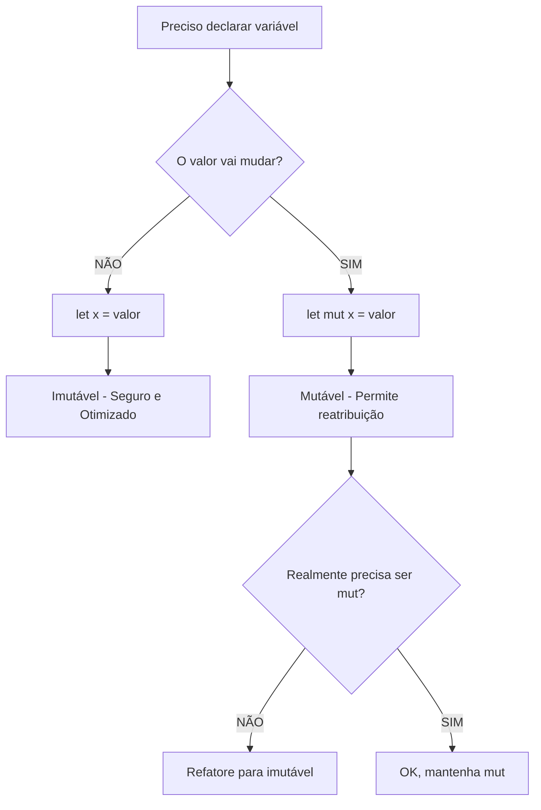
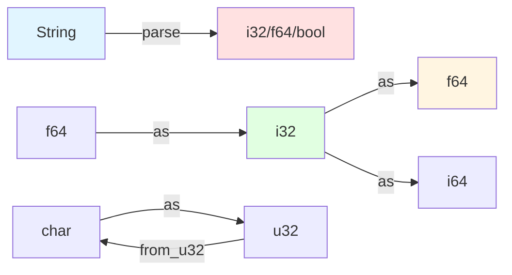
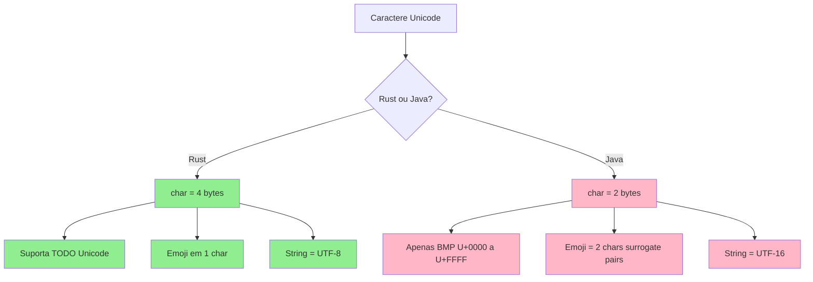

# 📘 DIA 2 - VARIÁVEIS E TIPOS EM RUST

**Para Engenheiros Java: Um Guia Completo e Comparativo**

---

## 📑 ÍNDICE

**[CAPÍTULO 1: TEORIA FUNDAMENTAL](#cap1)**
- [Imutabilidade por Padrão](#imutabilidade)
- [Shadowing: O Superpoder do Rust](#shadowing)
- [Sistema de Tipos Escalares](#tipos-escalares)
- [Tipos Compostos](#tipos-compostos)
- [Type Casting e Conversões](#casting)

**[CAPÍTULO 2: COMPARAÇÕES COM JAVA](#cap2)**
- [Imutabilidade: let vs final](#comp-imutabilidade)
- [Tipos Primitivos: Rust vs Java](#comp-primitivos)
- [char: A Grande Diferença](#comp-char)

**[CAPÍTULO 3: EXERCÍCIOS PRÁTICOS](#cap3)**
- [Exercício 1: Calculadora IMC](#ex1)
- [Exercício 2: Conversor de Temperatura](#ex2)
- [Exercício 3: Analisador de Tipos com Casting](#ex3)

**[BOAS PRÁTICAS E DICAS](#boas-praticas)**

[Voltar ao topo](#índice)

---

<a name="cap1"></a>
# 🎯 CAPÍTULO 1: TEORIA FUNDAMENTAL

<a name="imutabilidade"></a>
## 1. Imutabilidade por Padrão vs let mut

### 🧠 O Conceito Central

Em Rust, **todas as variáveis são imutáveis por padrão**. Isso é uma decisão de design fundamental que diferencia Rust de praticamente todas as linguagens mainstream.

**Analogia:** Imagine que você está construindo com LEGO. Em Java, cada peça pode ser modificada a qualquer momento (mutável por padrão). Em Rust, cada peça é colada permanentemente quando você a coloca (imutável por padrão), a menos que você explicitamente diga "quero poder trocar essa peça depois" (usando `mut`).

### 💻 Sintaxe Básica

```rust {.line-numbers}
fn main() {
    // Variável IMUTÁVEL (padrão)
    let x = 5;
    println!("O valor de x é: {}", x);
    
    // ERRO de compilação se tentar modificar:
    // x = 6; // ❌ cannot assign twice to immutable variable
    
    // Variável MUTÁVEL (explícito)
    let mut y = 10;
    println!("O valor inicial de y é: {}", y);
    
    y = 20; // ✅ OK! y é mutável
    println!("O novo valor de y é: {}", y);
}
```

### 🔍 Por Que Imutabilidade por Padrão?

**Benefícios:**

**a) Segurança em Concorrência**
- Dados imutáveis podem ser compartilhados entre threads sem sincronização
- Elimina data races por design

**b) Raciocínio sobre Código**
- Se uma variável é `let x`, você sabe que ela **nunca** mudará
- Menos bugs de "quem modificou esse valor?"

**c) Otimizações do Compilador**
- O compilador pode fazer otimizações agressivas sabendo que valores não mudam

**d) Intenção Explícita**
- `let mut` comunica claramente: "esse valor VAI mudar"

### 📊 Diagrama de Fluxo de Decisão



### 🎓 Exemplo Prático: Contador

```rust {.line-numbers}
fn main() {
    // ❌ Tentativa ERRADA (não compila)
    let contador = 0;
    // contador = contador + 1; // ERRO!
    
    // ✅ Forma CORRETA
    let mut contador = 0;
    
    for i in 1..=5 {
        contador = contador + i;
        println!("Iteração {}: contador = {}", i, contador);
    }
    
    println!("Total final: {}", contador);
}
```

**Saída:**
```
Iteração 1: contador = 1
Iteração 2: contador = 3
Iteração 3: contador = 6
Iteração 4: contador = 10
Iteração 5: contador = 15
Total final: 15
```

[Voltar ao índice](#índice)

---

<a name="shadowing"></a>
## 2. Shadowing: O Superpoder do Rust

### 🧠 O Conceito

**Shadowing** permite declarar uma nova variável com o **mesmo nome** de uma variável anterior. A nova variável "sombreia" (shadow) a anterior.

**Analogia:** É como ter versões diferentes de um documento. Quando você cria "Relatorio_v2.docx", o "Relatorio_v1.docx" ainda existe, mas você passa a trabalhar com a versão 2. Em Rust, você pode reusar o mesmo nome, e a versão anterior simplesmente para de existir no escopo atual.

### 💻 Sintaxe e Exemplos

```rust {.line-numbers}
fn main() {
    // Primeira declaração
    let x = 5;
    println!("Valor inicial de x: {}", x);
    
    // SHADOWING: nova variável com mesmo nome
    let x = x + 1; // x agora é 6
    println!("Após shadowing: {}", x);
    
    // SHADOWING dentro de um escopo interno
    {
        let x = x * 2; // x agora é 12 (dentro deste bloco)
        println!("Dentro do escopo interno: {}", x);
    } // x = 12 deixa de existir aqui
    
    // Voltamos ao x = 6 do escopo externo
    println!("Fora do escopo interno: {}", x);
}
```

**Saída:**
```
Valor inicial de x: 5
Após shadowing: 6
Dentro do escopo interno: 12
Fora do escopo interno: 6
```

### 🔥 Shadowing vs Mutabilidade

**DIFERENÇA CRÍTICA:** Shadowing cria uma **nova variável**, enquanto `mut` modifica a **mesma variável**.

```rust {.line-numbers}
fn main() {
    // 1️⃣ COM SHADOWING (pode mudar o TIPO)
    let spaces = "   ";        // tipo: &str
    let spaces = spaces.len(); // tipo: usize
    println!("Número de espaços: {}", spaces); // ✅ OK!
    
    // 2️⃣ COM mut (NÃO pode mudar o tipo)
    let mut spaces2 = "   ";        // tipo: &str
    // spaces2 = spaces2.len();     // ❌ ERRO! Tipos incompatíveis
    
    // Mas pode mudar o valor (mesmo tipo)
    spaces2 = "     ";              // ✅ OK! Ainda é &str
    println!("Espaços: '{}'", spaces2);
}
```

### 📊 Tabela Comparativa: Shadowing vs Mutabilidade

| Característica | `let x = ...` (Shadowing) | `let mut x = ...` (Mutabilidade) |
|----------------|---------------------------|----------------------------------|
| Cria nova variável? | ✅ Sim | ❌ Não, modifica a mesma |
| Pode mudar tipo? | ✅ Sim | ❌ Não |
| Precisa usar `mut`? | ❌ Não | ✅ Sim |
| Imutável após declaração? | ✅ Sim | ❌ Não |
| Performance | Igual | Igual |

### 🎯 Casos de Uso Práticos

**Caso 1: Transformações Sequenciais**

```rust {.line-numbers}
fn main() {
    // Parse de entrada do usuário
    let input = "42";
    println!("Input original: {}", input);
    
    // Shadowing para converter tipo
    let input: i32 = input.parse().expect("Não é um número!");
    println!("Input parseado: {}", input);
    
    // Shadowing para calcular
    let input = input * 2;
    println!("Input dobrado: {}", input);
}
```

**Caso 2: Refinamento Progressivo**

```rust {.line-numbers}
fn main() {
    // Dados brutos
    let dados = "  RUST 2024  ";
    
    // Limpeza progressiva com shadowing
    let dados = dados.trim();           // Remove espaços
    let dados = dados.to_lowercase();   // Minúsculas
    let dados = dados.replace(" ", "_"); // Substitui espaços
    
    println!("Resultado final: {}", dados); // "rust_2024"
}
```

### ⚠️ Cuidado: Shadowing Acidental

```rust {.line-numbers}
fn main() {
    let preco = 100;
    
    if preco > 50 {
        let preco = preco * 0.9; // Shadowing local
        println!("Preço com desconto: {}", preco); // 90
    }
    
    // preco ainda é 100 aqui! (não foi modificado)
    println!("Preço original: {}", preco); // 100
    
    // Se quisesse modificar, deveria usar mut:
    let mut preco_final = preco;
    if preco_final > 50 {
        preco_final = (preco_final as f64 * 0.9) as i32;
    }
    println!("Preço final: {}", preco_final); // 90
}
```

[Voltar ao índice](#índice)

---

<a name="tipos-escalares"></a>
## 3. Sistema de Tipos Escalares

### 🧠 Visão Geral

Rust possui um sistema de tipos **explícito e seguro**. Tipos escalares representam **um único valor**.

### 📊 Tabela Completa de Tipos Escalares

#### **A) Tipos Inteiros**

| Tamanho | Assinado | Sem Sinal | Faixa (Assinado) | Faixa (Sem Sinal) |
|---------|----------|-----------|------------------|-------------------|
| 8 bits  | `i8`     | `u8`      | -128 a 127 | 0 a 255 |
| 16 bits | `i16`    | `u16`     | -32.768 a 32.767 | 0 a 65.535 |
| 32 bits | `i32`    | `u32`     | -2³¹ a 2³¹-1 | 0 a 2³²-1 |
| 64 bits | `i64`    | `u64`     | -2⁶³ a 2⁶³-1 | 0 a 2⁶⁴-1 |
| 128 bits| `i128`   | `u128`    | -2¹²⁷ a 2¹²⁷-1 | 0 a 2¹²⁸-1 |
| arch    | `isize`  | `usize`   | Depende da arquitetura | Depende da arquitetura |

**💡 Dica:** `i32` é o **padrão** quando você não especifica o tipo.

#### **B) Tipos de Ponto Flutuante**

| Tipo | Tamanho | Precisão | IEEE 754 |
|------|---------|----------|----------|
| `f32` | 32 bits | ~7 dígitos decimais | Single precision |
| `f64` | 64 bits | ~15 dígitos decimais | Double precision |

**💡 Dica:** `f64` é o **padrão** para floats (mais preciso, performance similar em CPUs modernas).

#### **C) Tipo Booleano**

| Tipo | Tamanho | Valores |
|------|---------|---------|
| `bool` | 1 byte | `true` ou `false` |

#### **D) Tipo Caractere**

| Tipo | Tamanho | Representa |
|------|---------|------------|
| `char` | 4 bytes | Um **Unicode Scalar Value** |

### 💻 Exemplos Práticos

```rust {.line-numbers}
fn main() {
    // ========== INTEIROS ==========
    
    // Inferência de tipo (padrão: i32)
    let numero = 42;
    println!("Número padrão: {} (tipo: i32)", numero);
    
    // Tipos explícitos
    let pequeno: i8 = 127;          // Máximo para i8
    let grande: i64 = 9_223_372_036_854_775_807; // Separadores _ para legibilidade
    let sem_sinal: u32 = 4_294_967_295;
    
    // Literais com sufixo de tipo
    let com_sufixo = 57u8;          // u8 direto no literal
    let hex = 0xff;                  // Hexadecimal (255)
    let octal = 0o77;                // Octal (63)
    let binario = 0b1111_0000;       // Binário (240)
    
    println!("Pequeno: {}", pequeno);
    println!("Grande: {}", grande);
    println!("Sem sinal: {}", sem_sinal);
    println!("Hex: {}, Octal: {}, Binário: {}", hex, octal, binario);
    
    // ========== PONTO FLUTUANTE ==========
    
    let pi: f64 = 3.141592653589793;
    let e: f32 = 2.718281828;
    
    println!("Pi (f64): {:.10}", pi);   // Mostra 10 casas decimais
    println!("E (f32): {:.6}", e);      // Mostra 6 casas decimais
    
    // Operações aritméticas
    let soma = 5.0 + 10.5;              // f64 por padrão
    let diferenca = 95.5 - 4.3;
    let produto = 4.0 * 30.0;
    let quociente = 56.7 / 32.2;
    let resto = 43 % 5;                 // Módulo (apenas inteiros)
    
    println!("Soma: {}", soma);
    println!("Diferença: {}", diferenca);
    println!("Produto: {}", produto);
    println!("Quociente: {}", quociente);
    println!("Resto: {}", resto);
    
    // ========== BOOLEANO ==========
    
    let verdadeiro = true;
    let falso: bool = false;
    
    let comparacao = 5 > 3;             // Resulta em bool
    let logico = verdadeiro && !falso;  // Operadores lógicos
    
    println!("Verdadeiro: {}", verdadeiro);
    println!("5 > 3? {}", comparacao);
    println!("Lógico: {}", logico);
    
    // ========== CARACTERE ==========
    
    let letra: char = 'A';
    let emoji: char = '😎';
    let chines: char = '中';
    let coração: char = '❤';
    
    println!("Letra: {}", letra);
    println!("Emoji: {}", emoji);
    println!("Chinês: {}", chines);
    println!("Coração: {}", coração);
    
    // char é 4 bytes (Unicode completo)
    println!("Tamanho de char: {} bytes", std::mem::size_of::<char>());
}
```

### ⚠️ Overflow de Inteiros

```rust {.line-numbers}
fn main() {
    // Em modo DEBUG: panic!
    // Em modo RELEASE: wrapping (volta ao início)
    
    let mut x: u8 = 255;
    println!("x = {}", x);
    
    // Para evitar surpresas, use métodos explícitos:
    
    // 1️⃣ wrapping_* : faz overflow circular
    x = x.wrapping_add(1);  // 255 + 1 = 0
    println!("Após wrapping_add: {}", x);
    
    // 2️⃣ checked_* : retorna Option (None se overflow)
    let resultado = 255u8.checked_add(1);
    match resultado {
        Some(valor) => println!("Sucesso: {}", valor),
        None => println!("Overflow detectado!"),
    }
    
    // 3️⃣ saturating_* : satura no máximo/mínimo
    let saturado = 255u8.saturating_add(10);  // Fica em 255
    println!("Saturado: {}", saturado);
    
    // 4️⃣ overflowing_* : retorna (resultado, bool)
    let (valor, overflow) = 255u8.overflowing_add(1);
    println!("Valor: {}, Overflow? {}", valor, overflow);
}
```

[Voltar ao índice](#índice)

---

<a name="tipos-compostos"></a>
## 4. Tipos Compostos

### 🧠 O Conceito

Tipos compostos agrupam **múltiplos valores** em um único tipo. Rust tem dois tipos primitivos compostos: **tuplas** e **arrays**.

### 🎯 A) TUPLAS

**Definição:** Coleção de valores de **tipos potencialmente diferentes**, com **tamanho fixo**.

**Analogia:** Uma tupla é como uma caixa de ferramentas onde cada compartimento guarda um tipo diferente de ferramenta (martelo, chave de fenda, alicate). Você sabe exatamente quantos compartimentos tem e o que está em cada um.

```rust {.line-numbers}
fn main() {
    // ========== CRIAÇÃO DE TUPLAS ==========
    
    // Tupla com tipos mistos
    let pessoa: (String, i32, f64, bool) = (
        String::from("João"),
        30,
        1.75,
        true
    );
    
    // Inferência de tipos
    let coordenadas = (10.5, 20.3, 30.7);  // (f64, f64, f64)
    
    // ========== ACESSO POR ÍNDICE ==========
    
    let nome = &pessoa.0;      // Acessa primeiro elemento
    let idade = pessoa.1;      // Acessa segundo elemento
    let altura = pessoa.2;     // Acessa terceiro elemento
    let ativo = pessoa.3;      // Acessa quarto elemento
    
    println!("Nome: {}", nome);
    println!("Idade: {} anos", idade);
    println!("Altura: {:.2}m", altura);
    println!("Ativo? {}", ativo);
    
    // ========== DESTRUCTURING ==========
    
    // Extrair todos os valores
    let (x, y, z) = coordenadas;
    println!("X: {}, Y: {}, Z: {}", x, y, z);
    
    // Ignorar valores com _
    let (primeiro, _, terceiro, _) = pessoa;
    println!("Primeiro: {}, Terceiro: {}", primeiro, terceiro);
    
    // ========== TUPLAS MUTÁVEIS ==========
    
    let mut ponto = (0, 0);
    println!("Ponto inicial: ({}, {})", ponto.0, ponto.1);
    
    ponto.0 = 10;
    ponto.1 = 20;
    println!("Ponto final: ({}, {})", ponto.0, ponto.1);
    
    // ========== TUPLA VAZIA (unit type) ==========
    
    let vazio: () = ();  // Tipo especial, usado em funções que não retornam nada
    println!("Tupla vazia: {:?}", vazio);
    
    // ========== FUNÇÕES RETORNANDO TUPLAS ==========
    
    fn calcular(x: i32, y: i32) -> (i32, i32, i32, i32) {
        (x + y, x - y, x * y, x / y)
    }
    
    let (soma, sub, mult, div) = calcular(20, 4);
    println!("Resultados: soma={}, sub={}, mult={}, div={}", soma, sub, mult, div);
}
```

### 🎯 B) ARRAYS

**Definição:** Coleção de valores do **mesmo tipo**, com **tamanho fixo** em tempo de compilação.

**Analogia:** Um array é como uma fileira de caixas idênticas, todas do mesmo tamanho, lado a lado. Cada caixa contém o mesmo tipo de item (ex: todas contêm números).

```rust {.line-numbers}
fn main() {
    // ========== CRIAÇÃO DE ARRAYS ==========
    
    // Array com 5 elementos do tipo i32
    let numeros: [i32; 5] = [1, 2, 3, 4, 5];
    
    // Inferência de tipo e tamanho
    let dias_semana = ["Seg", "Ter", "Qua", "Qui", "Sex", "Sab", "Dom"];
    
    // Array com valor repetido [valor; quantidade]
    let zeros = [0; 10];  // [0, 0, 0, 0, 0, 0, 0, 0, 0, 0]
    
    // ========== ACESSO POR ÍNDICE ==========
    
    let primeiro = numeros[0];
    let ultimo = numeros[4];
    
    println!("Primeiro: {}", primeiro);
    println!("Último: {}", ultimo);
    println!("Terceiro dia: {}", dias_semana[2]);
    
    // ========== ITERAÇÃO ==========
    
    println!("\nIterando sobre array:");
    for numero in numeros.iter() {
        println!("Valor: {}", numero);
    }
    
    println!("\nCom índice:");
    for (indice, &valor) in numeros.iter().enumerate() {
        println!("numeros[{}] = {}", indice, valor);
    }
    
    // ========== ARRAYS MUTÁVEIS ==========
    
    let mut temperaturas = [20.0, 21.5, 19.8, 22.3, 23.1];
    
    println!("\nTemperaturas originais:");
    for temp in temperaturas.iter() {
        println!("{:.1}°C", temp);
    }
    
    // Modificar elementos
    temperaturas[0] = 18.5;
    temperaturas[4] = 24.0;
    
    println!("\nTemperaturas atualizadas:");
    for temp in temperaturas.iter() {
        println!("{:.1}°C", temp);
    }
    
    // ========== TAMANHO E SLICES ==========
    
    let tamanho = numeros.len();
    println!("\nTamanho do array: {}", tamanho);
    
    // Slice (referência a uma parte do array)
    let slice = &numeros[1..4];  // Elementos [1, 2, 3]
    println!("Slice [1..4]: {:?}", slice);
    
    // ========== CHECAGEM DE BOUNDS ==========
    
    // Acesso seguro com get() - retorna Option
    match numeros.get(10) {
        Some(valor) => println!("Valor no índice 10: {}", valor),
        None => println!("Índice 10 não existe!"),
    }
    
    // Acesso direto [i] causa panic se fora dos limites
    // let invalido = numeros[10];  // ❌ PANIC em runtime!
}
```

### 📊 Tabela Comparativa: Tuplas vs Arrays

| Característica | Tuplas | Arrays |
|----------------|--------|--------|
| Tipos dos elementos | Podem ser diferentes | Devem ser iguais |
| Tamanho | Fixo em compilação | Fixo em compilação |
| Acesso | Por índice (0, 1, 2...) | Por índice [0], [1], [2]... |
| Sintaxe de tipo | `(T1, T2, T3)` | `[T; N]` |
| Iteração | Não diretamente | Sim, com `.iter()` |
| Uso comum | Retornar múltiplos valores | Coleções homogêneas fixas |

### 🎯 Quando Usar Cada Um?

**Use TUPLAS quando:**
- Precisa retornar múltiplos valores de tipos diferentes de uma função
- Tem um pequeno grupo de valores relacionados (ex: coordenadas x,y,z)
- Quer destructuring elegante

**Use ARRAYS quando:**
- Todos os elementos são do mesmo tipo
- Precisa iterar sobre os elementos
- O tamanho é conhecido e fixo em compilação
- Quer operações de slice

```rust {.line-numbers}
// Exemplo: Combinando tuplas e arrays
fn main() {
    // Tupla de arrays
    let dados: ([i32; 3], [f64; 2]) = (
        [1, 2, 3],
        [1.5, 2.7]
    );
    
    println!("Primeiro array: {:?}", dados.0);
    println!("Segundo array: {:?}", dados.1);
    
    // Array de tuplas
    let pontos: [(i32, i32); 3] = [
        (0, 0),
        (10, 20),
        (30, 40)
    ];
    
    for (i, &(x, y)) in pontos.iter().enumerate() {
        println!("Ponto {}: ({}, {})", i, x, y);
    }
}
```

[Voltar ao índice](#índice)

---

<a name="casting"></a>
## 5. Type Casting e Conversões

### 🧠 O Conceito

Rust é **extremamente rigoroso** com tipos. Não há conversão automática (coerção) entre tipos numéricos. Você deve ser **explícito** usando a palavra-chave `as`.

**Analogia:** É como trocar de moeda. Você não pode simplesmente usar dólares no Brasil - precisa **explicitamente** converter para reais. Rust não faz essa conversão automaticamente.

### 💻 Casting com 'as'

```rust {.line-numbers}
fn main() {
    // ========== CONVERSÕES NUMÉRICAS ==========
    
    let inteiro: i32 = 42;
    let flutuante: f64 = inteiro as f64;  // i32 → f64
    
    println!("Inteiro: {}", inteiro);
    println!("Flutuante: {}", flutuante);
    
    // ========== PERDA DE PRECISÃO ==========
    
    let grande: f64 = 3.9999;
    let pequeno = grande as i32;  // Trunca, não arredonda!
    
    println!("Grande (f64): {}", grande);
    println!("Pequeno (i32): {}", pequeno);  // 3, não 4!
    
    // ========== CONVERSÕES ENTRE INTEIROS ==========
    
    let grande_int: i64 = 1000;
    let pequeno_int = grande_int as i32;  // i64 → i32
    
    // Cuidado com overflow!
    let overflow: i32 = 300;
    let problema = overflow as i8;  // 300 não cabe em i8 (-128 a 127)
    println!("Overflow: {} → {}", overflow, problema);  // Valor truncado!
    
    // ========== CONVERSÕES SEGURAS ==========
    
    let valor: i32 = 42;
    
    // Conversão que pode falhar
    let resultado: Result<i8, _> = valor.try_into();
    match resultado {
        Ok(v) => println!("Conversão bem-sucedida: {}", v),
        Err(e) => println!("Erro na conversão: {}", e),
    }
    
    // ========== CASTING DE CHAR ==========
    
    let letra: char = 'A';
    let codigo = letra as u32;  // char → código Unicode
    
    println!("'{}' tem código Unicode: {}", letra, codigo);
    
    // Inverso: código → char (unsafe se inválido)
    let nova_letra = std::char::from_u32(66).unwrap();  // 66 = 'B'
    println!("Código 66 é: '{}'", nova_letra);
    
    // ========== OPERAÇÕES MATEMÁTICAS MISTAS ==========
    
    let a: i32 = 10;
    let b: f64 = 3.5;
    
    // ❌ ERRO: não pode misturar tipos
    // let resultado = a + b;
    
    // ✅ CORRETO: converter explicitamente
    let resultado = a as f64 + b;
    println!("{} + {} = {}", a, b, resultado);
    
    // Ou converter o resultado para inteiro
    let resultado_int = (a as f64 + b) as i32;
    println!("Como inteiro (truncado): {}", resultado_int);
}
```

### 🎯 Parse de Strings para Números

**Parse** é o processo de converter uma string em outro tipo (geralmente números).

```rust {.line-numbers}
fn main() {
    // ========== MÉTODO 1: parse() COM TURBOFISH ==========
    
    let texto = "42";
    let numero = texto.parse::<i32>().unwrap();
    
    println!("Texto: '{}' → Número: {}", texto, numero);
    
    // ========== MÉTODO 2: parse() COM TIPO ANOTADO ==========
    
    let outro_texto = "3.14159";
    let pi: f64 = outro_texto.parse().unwrap();
    
    println!("Pi parseado: {}", pi);
    
    // ========== MÉTODO 3: TRATAMENTO DE ERROS ==========
    
    let entrada = "não é um número";
    
    match entrada.parse::<i32>() {
        Ok(num) => println!("Número válido: {}", num),
        Err(e) => println!("Erro ao fazer parse: {}", e),
    }
    
    // ========== MÉTODO 4: unwrap_or (valor padrão) ==========
    
    let talvez_numero = "abc";
    let numero = talvez_numero.parse::<i32>().unwrap_or(0);
    
    println!("Parse com fallback: {}", numero);  // 0
    
    // ========== MÉTODO 5: expect (mensagem customizada) ==========
    
    let texto_valido = "123";
    let numero = texto_valido
        .parse::<i32>()
        .expect("Deveria ser um número válido!");
    
    println!("Número com expect: {}", numero);
    
    // ========== PARSE COM DIFERENTES TIPOS ==========
    
    let textos = ["42", "3.14", "true", "123456789"];
    
    let int: i32 = textos[0].parse().unwrap();
    let float: f64 = textos[1].parse().unwrap();
    let boolean: bool = textos[2].parse().unwrap();
    let long: i64 = textos[3].parse().unwrap();
    
    println!("int: {}", int);
    println!("float: {}", float);
    println!("boolean: {}", boolean);
    println!("long: {}", long);
    
    // ========== LIMPEZA DE ENTRADA ==========
    
    let entrada_suja = "  42  \n";
    let limpo = entrada_suja.trim().parse::<i32>().unwrap();
    
    println!("Entrada limpa: {}", limpo);
}
```

### ⚠️ Armadilhas Comuns

```rust {.line-numbers}
fn main() {
    // ❌ ARMADILHA 1: Esquecer de tratar erro
    // let numero = "abc".parse::<i32>().unwrap();  // PANIC!
    
    // ❌ ARMADILHA 2: Tipos incompatíveis
    let a: i32 = 10;
    let b: f64 = 20.5;
    // let soma = a + b;  // ERRO: não pode adicionar i32 com f64
    let soma = a as f64 + b;  // ✅ CORRETO
    
    // ❌ ARMADILHA 3: Overflow silencioso
    let grande: i64 = 300;
    let pequeno = grande as i8;  // Overflow! Valor incorreto
    println!("Overflow: {} (deveria ser 300)", pequeno);
    
    // ✅ SOLUÇÃO: Use try_into()
    use std::convert::TryInto;
    
    let resultado: Result<i8, _> = grande.try_into();
    match resultado {
        Ok(v) => println!("OK: {}", v),
        Err(_) => println!("Valor não cabe em i8!"),
    }
}
```

### 📊 Diagrama de Conversões



[Voltar ao índice](#índice)

---

<a name="cap2"></a>
# 🔄 CAPÍTULO 2: COMPARAÇÕES COM JAVA

<a name="comp-imutabilidade"></a>
## 1. Imutabilidade: let vs final

### 📊 Tabela Comparativa Detalhada

| Aspecto | Rust (`let`) | Java (`final`) |
|---------|-------------|----------------|
| **Padrão** | ✅ Imutável por padrão | ❌ Mutável por padrão |
| **Sintaxe mutável** | `let mut x` | Não precisa (é padrão) |
| **Sintaxe imutável** | `let x` | `final int x` |
| **Verificação** | Tempo de compilação | Tempo de compilação |
| **Memória** | Stack ou Heap | Heap (objetos) |
| **Referências** | `&T` (imutável), `&mut T` (mutável) | Sempre mutável |
| **Restrição** | Valor + referência | Apenas a referência |

### 💻 Comparação Lado a Lado

**RUST:**
```rust {.line-numbers}
fn main() {
    // Imutável (padrão)
    let x = 5;
    // x = 10;  // ❌ ERRO: cannot assign twice
    
    // Mutável (explícito)
    let mut y = 5;
    y = 10;  // ✅ OK
    
    // Referências
    let a = vec![1, 2, 3];
    let ref_imutavel = &a;        // Não pode modificar via ref
    // ref_imutavel.push(4);      // ❌ ERRO
    
    let mut b = vec![1, 2, 3];
    let ref_mutavel = &mut b;     // Pode modificar
    ref_mutavel.push(4);          // ✅ OK
}
```

**JAVA:**
```java
public class Main {
    public static void main(String[] args) {
        // Mutável (padrão)
        int x = 5;
        x = 10;  // ✅ OK por padrão
        
        // Imutável (explícito)
        final int y = 5;
        // y = 10;  // ❌ ERRO: cannot assign
        
        // Referências - final NÃO impede modificação do objeto!
        final List<Integer> lista = new ArrayList<>();
        lista.add(1);      // ✅ OK! final só impede reatribuição
        lista.add(2);      // ✅ OK!
        
        // lista = new ArrayList<>();  // ❌ ERRO: final impede isso
        
        // Para ter imutabilidade real, precisa de Collections.unmodifiableList()
        final List<Integer> imutavel = Collections.unmodifiableList(lista);
        // imutavel.add(3);  // ❌ UnsupportedOperationException em runtime
    }
}
```

### 🎯 Diferença CRÍTICA

**RUST:** `let` torna o **valor** imutável
**JAVA:** `final` torna a **referência** imutável (mas não o objeto)

```rust {.line-numbers}
// RUST: Imutabilidade profunda
fn main() {
    let pessoa = Pessoa { nome: String::from("João"), idade: 30 };
    // pessoa.idade = 31;  // ❌ ERRO: pessoa é imutável
    
    let mut pessoa2 = Pessoa { nome: String::from("Maria"), idade: 25 };
    pessoa2.idade = 26;  // ✅ OK: pessoa2 é mutável
}
```

```java
// JAVA: final não impede mutação do objeto
public class Main {
    public static void main(String[] args) {
        final Pessoa pessoa = new Pessoa("João", 30);
        pessoa.setIdade(31);  // ✅ OK! final não protege isso
        
        // pessoa = new Pessoa("Maria", 25);  // ❌ ERRO: não pode reatribuir
    }
}
```

[Voltar ao índice](#índice)

---

<a name="comp-primitivos"></a>
## 2. Tipos Primitivos: Rust vs Java

### 📊 Tabela Comparativa Completa

| Tipo | Rust | Java | Tamanho (Rust) | Tamanho (Java) | Diferenças |
|------|------|------|----------------|----------------|------------|
| **Byte** | `i8`, `u8` | `byte` | 1 byte | 1 byte | Rust tem versão sem sinal |
| **Short** | `i16`, `u16` | `short` | 2 bytes | 2 bytes | Rust tem versão sem sinal |
| **Int** | `i32`, `u32` | `int` | 4 bytes | 4 bytes | Rust tem versão sem sinal |
| **Long** | `i64`, `u64` | `long` | 8 bytes | 8 bytes | Rust tem versão sem sinal |
| **Extra Long** | `i128`, `u128` | ❌ | 16 bytes | N/A | Rust tem 128 bits! |
| **Float** | `f32` | `float` | 4 bytes | 4 bytes | Equivalentes |
| **Double** | `f64` | `double` | 8 bytes | 8 bytes | Equivalentes |
| **Boolean** | `bool` | `boolean` | 1 byte | 1 byte* | *Java: não especificado |
| **Char** | `char` | `char` | **4 bytes** | **2 bytes** | ⚠️ GRANDE DIFERENÇA! |
| **Size** | `isize`, `usize` | ❌ | 4 ou 8 bytes | N/A | Depende da arquitetura |

### 💻 Exemplos de Diferenças

```rust {.line-numbers}
// RUST: Tipos com e sem sinal
fn main() {
    let assinado: i8 = -128;    // -128 a 127
    let sem_sinal: u8 = 255;    // 0 a 255
    
    println!("Assinado: {}", assinado);
    println!("Sem sinal: {}", sem_sinal);
    
    // Tipos de 128 bits (não existem em Java)
    let enorme: i128 = 170_141_183_460_469_231_731_687_303_715_884_105_727;
    println!("i128 máximo: {}", enorme);
    
    // usize: tamanho de ponteiro (32 ou 64 bits)
    let indice: usize = 42;
    println!("usize (índices de array): {}", indice);
}
```

```java
// JAVA: Apenas tipos com sinal
public class Main {
    public static void main(String[] args) {
        byte assinado = -128;    // -128 a 127
        // ❌ Não existe byte sem sinal nativo
        
        // Workaround para simular unsigned:
        int semSinal = 255 & 0xFF;  // Trata byte como unsigned
        
        System.out.println("Assinado: " + assinado);
        System.out.println("Sem sinal (simulado): " + semSinal);
        
        // ❌ Não existe int de 128 bits
        // Precisa usar BigInteger
        
        // ❌ Não existe tipo de tamanho de ponteiro
        // Use int ou long explicitamente
    }
}
```

### 🎯 Valores Padrão

**RUST:**
```rust {.line-numbers}
fn main() {
    // ❌ ERRO: Rust NÃO tem valores padrão automáticos!
    // let x: i32;
    // println!("{}", x);  // ERRO: use of possibly-uninitialized variable
    
    // ✅ Deve inicializar explicitamente
    let x: i32 = 0;
    println!("{}", x);
    
    // Ou usar Default trait
    let y: i32 = Default::default();  // 0
    println!("{}", y);
}
```

**JAVA:**
```java
public class Main {
    // ✅ Campos de classe têm valores padrão
    static int x;        // 0
    static double y;     // 0.0
    static boolean z;    // false
    static Object obj;   // null
    
    public static void main(String[] args) {
        // ❌ Variáveis locais NÃO têm valores padrão
        // int local;
        // System.out.println(local);  // ERRO: variable might not be initialized
        
        // Campos de classe:
        System.out.println(x);    // 0
        System.out.println(y);    // 0.0
        System.out.println(z);    // false
        System.out.println(obj);  // null
    }
}
```

### ⚡ Performance e Garantias

| Aspecto | Rust | Java |
|---------|------|------|
| **Overflow** | Panic em debug, wrapping em release | Silencioso (wrapping) |
| **Null** | ❌ Não existe (`Option<T>`) | ✅ Existe (causa NPE) |
| **Uninitialized** | ❌ Erro de compilação | ⚠️ Campos: 0, Locais: erro |
| **Boxing** | Explícito (`Box<T>`) | Automático (autoboxing) |
| **Stack/Heap** | Explícito e previsível | JVM decide |

[Voltar ao índice](#índice)

---

<a name="comp-char"></a>
## 3. char: A Grande Diferença

### 🧠 Diferença Fundamental

| Aspecto | Rust `char` | Java `char` |
|---------|-------------|-------------|
| **Tamanho** | **4 bytes** | **2 bytes** |
| **Representa** | Unicode Scalar Value | UTF-16 code unit |
| **Range** | U+0000 a U+10FFFF (exceto surrogates) | U+0000 a U+FFFF |
| **Emoji** | ✅ Suporta nativamente | ❌ Precisa de pares (surrogate pairs) |
| **String** | UTF-8 | UTF-16 |

### 💻 Exemplos Práticos

**RUST:**
```rust {.line-numbers}
fn main() {
    // char em Rust é 4 bytes - suporta qualquer caractere Unicode
    let letra: char = 'A';
    let emoji: char = '😎';          // ✅ Um único char!
    let chines: char = '中';
    let matematico: char = '∑';
    let runico: char = 'ᚠ';
    
    println!("Letra: {} (tamanho: {} bytes)", letra, std::mem::size_of::<char>());
    println!("Emoji: {} (tamanho: {} bytes)", emoji, std::mem::size_of::<char>());
    println!("Chinês: {}", chines);
    println!("Matemático: {}", matematico);
    println!("Rúnico: {}", runico);
    
    // Código Unicode
    let codigo = emoji as u32;
    println!("Código Unicode de 😎: U+{:X}", codigo);
    
    // Criar char a partir de código Unicode
    let from_code = std::char::from_u32(0x1F60E).unwrap();
    println!("De código: {}", from_code);  // 😎
    
    // String em Rust é UTF-8
    let texto = "Olá 世界 🌍";
    println!("String (UTF-8): {}", texto);
    println!("Bytes: {}", texto.len());  // Tamanho em bytes
    println!("Chars: {}", texto.chars().count());  // Quantidade de caracteres
    
    // Iterar sobre caracteres
    for c in texto.chars() {
        println!("  '{}' = {} bytes", c, c.len_utf8());
    }
}
```

**JAVA:**
```java
public class Main {
    public static void main(String[] args) {
        // char em Java é 2 bytes - limitado a BMP (Basic Multilingual Plane)
        char letra = 'A';
        char chines = '中';
        
        System.out.println("Letra: " + letra);
        System.out.println("Chinês: " + chines);
        
        // ❌ Emoji NÃO cabe em um char!
        // char emoji = '😎';  // ERRO: Char constant too long
        
        // Precisa de String (que usa surrogate pairs internamente)
        String emoji = "😎";
        System.out.println("Emoji: " + emoji);
        System.out.println("length(): " + emoji.length());  // 2 (!)
        System.out.println("codePointCount(): " + emoji.codePointCount(0, emoji.length()));  // 1
        
        // Criar char a partir de código
        char fromCode = '\u4E2D';  // 中
        System.out.println("De código: " + fromCode);
        
        // Para emoji, precisa de int (code point)
        int emojiCode = 0x1F60E;
        String emojiFromCode = new String(Character.toChars(emojiCode));
        System.out.println("Emoji de código: " + emojiFromCode);
        
        // String em Java é UTF-16
        String texto = "Olá 世界 🌍";
        System.out.println("String (UTF-16): " + texto);
        System.out.println("length(): " + texto.length());  // Code units (UTF-16)
        System.out.println("codePointCount(): " + texto.codePointCount(0, texto.length()));  // Chars reais
    }
}
```

### 📊 Diagrama: char em Rust vs Java



### ⚠️ Armadilhas Comuns

**RUST:**
```rust {.line-numbers}
fn main() {
    let texto = "Hello 🌍";
    
    // ✅ CORRETO: chars() para iterar sobre caracteres
    for c in texto.chars() {
        println!("{}", c);
    }
    
    // ❌ ERRADO: bytes() para iterar (dá bytes UTF-8, não chars)
    for b in texto.bytes() {
        println!("{}", b);  // Imprime números (bytes)
    }
    
    // ✅ CORRETO: acessar caractere por índice
    let primeiro = texto.chars().nth(0).unwrap();
    println!("Primeiro char: {}", primeiro);
    
    // ❌ ERRADO: texto[0] não funciona!
    // let c = texto[0];  // ERRO: cannot index into String
}
```

**JAVA:**
```java
public class Main {
    public static void main(String[] args) {
        String texto = "Hello 🌍";
        
        // ✅ CORRETO: codePoints() para iterar (Java 8+)
        texto.codePoints().forEach(cp -> 
            System.out.println(new String(Character.toChars(cp)))
        );
        
        // ❌ ERRADO: charAt() pode retornar metade de um emoji!
        for (int i = 0; i < texto.length(); i++) {
            char c = texto.charAt(i);
            System.out.println(c);  // Pode imprimir ? para emoji
        }
        
        // ✅ CORRETO: verificar se é surrogate
        for (int i = 0; i < texto.length(); i++) {
            char c = texto.charAt(i);
            if (Character.isHighSurrogate(c)) {
                // É a primeira metade de um par
                continue;
            }
            System.out.println(c);
        }
    }
}
```

[Voltar ao índice](#índice)

---

<a name="cap3"></a>
# 💪 CAPÍTULO 3: EXERCÍCIOS PRÁTICOS

<a name="ex1"></a>
## 🏋️ EXERCÍCIO 1: Calculadora IMC Completa

### 📝 Objetivo

Criar uma calculadora de Índice de Massa Corporal (IMC) que:
- Recebe peso (kg) e altura (m) do usuário
- Calcula o IMC
- Classifica o resultado
- Valida entradas
- Trata erros

### 💻 Código Completo e Comentado

```rust {.line-numbers}
// Importa módulo para entrada/saída
use std::io;

fn main() {
    // Banner do programa
    println!("╔════════════════════════════════════╗");
    println!("║   CALCULADORA DE IMC - RUST 🦀    ║");
    println!("╚════════════════════════════════════╝\n");
    
    // Recebe peso do usuário
    let peso = ler_numero("Digite seu peso (kg): ");
    
    // Recebe altura do usuário
    let altura = ler_numero("Digite sua altura (m): ");
    
    // Valida entradas
    if !validar_entradas(peso, altura) {
        println!("\n❌ Valores inválidos! Tente novamente.");
        return;
    }
    
    // Calcula IMC
    let imc = calcular_imc(peso, altura);
    
    // Classifica o resultado
    let classificacao = classificar_imc(imc);
    
    // Exibe resultado
    exibir_resultado(peso, altura, imc, classificacao);
}

/// Lê um número do usuário com mensagem personalizada
/// 
/// # Argumentos
/// * `mensagem` - Texto a ser exibido ao usuário
/// 
/// # Retorna
/// * `f64` - Número digitado pelo usuário (ou 0.0 se inválido)
fn ler_numero(mensagem: &str) -> f64 {
    // Cria buffer para armazenar entrada
    let mut entrada = String::new();
    
    // Exibe mensagem
    print!("{}", mensagem);
    
    // Garante que o print apareça antes do input
    io::Write::flush(&mut io::stdout()).expect("Falha ao flush");
    
    // Lê linha da entrada padrão
    io::stdin()
        .read_line(&mut entrada)
        .expect("Falha ao ler linha");
    
    // Remove espaços em branco e tenta fazer parse
    // trim(): remove \n e espaços
    // parse(): converte String -> f64
    // unwrap_or(0.0): se falhar, retorna 0.0
    entrada.trim().parse().unwrap_or(0.0)
}

/// Valida se peso e altura são valores razoáveis
/// 
/// # Argumentos
/// * `peso` - Peso em kg
/// * `altura` - Altura em metros
/// 
/// # Retorna
/// * `bool` - true se válido, false caso contrário
fn validar_entradas(peso: f64, altura: f64) -> bool {
    // Verifica limites razoáveis
    let peso_valido = peso > 0.0 && peso < 500.0;  // 0-500 kg
    let altura_valida = altura > 0.0 && altura < 3.0;  // 0-3 metros
    
    // Retorna true apenas se AMBOS forem válidos
    peso_valido && altura_valida
}

/// Calcula o IMC (peso / altura²)
/// 
/// # Argumentos
/// * `peso` - Peso em kg
/// * `altura` - Altura em metros
/// 
/// # Retorna
/// * `f64` - Valor do IMC
fn calcular_imc(peso: f64, altura: f64) -> f64 {
    // Fórmula: IMC = peso / altura²
    // pow(2.0) eleva ao quadrado
    peso / altura.pow(2.0)
}

/// Classifica o IMC segundo OMS
/// 
/// # Argumentos
/// * `imc` - Valor do IMC
/// 
/// # Retorna
/// * `&str` - Classificação textual
fn classificar_imc(imc: f64) -> &'static str {
    // Match com ranges (pattern matching)
    match imc {
        x if x < 16.0 => "Magreza grave",
        x if x >= 16.0 && x < 17.0 => "Magreza moderada",
        x if x >= 17.0 && x < 18.5 => "Magreza leve",
        x if x >= 18.5 && x < 25.0 => "Peso normal",
        x if x >= 25.0 && x < 30.0 => "Sobrepeso",
        x if x >= 30.0 && x < 35.0 => "Obesidade grau I",
        x if x >= 35.0 && x < 40.0 => "Obesidade grau II",
        _ => "Obesidade grau III (mórbida)",
    }
}

/// Exibe resultado formatado
/// 
/// # Argumentos
/// * `peso` - Peso em kg
/// * `altura` - Altura em metros
/// * `imc` - Valor calculado do IMC
/// * `classificacao` - Classificação do IMC
fn exibir_resultado(peso: f64, altura: f64, imc: f64, classificacao: &str) {
    println!("\n╔════════════════════════════════════╗");
    println!("║           RESULTADO                ║");
    println!("╠════════════════════════════════════╣");
    println!("║ Peso:           {:.2} kg          ║", peso);
    println!("║ Altura:         {:.2} m           ║", altura);
    println!("║ IMC:            {:.2}              ║", imc);
    println!("║ Classificação:  {:<17}║", classificacao);
    println!("╚════════════════════════════════════╝");
    
    // Emoji baseado na classificação
    let emoji = match classificacao {
        "Peso normal" => "✅",
        "Sobrepeso" => "⚠️",
        "Magreza grave" | "Obesidade grau III (mórbida)" => "🚨",
        _ => "⚡",
    };
    
    println!("\n{} {}", emoji, classificacao);
}
```

### 📖 Explicação Linha por Linha

**Estrutura Geral:**

1. **use std::io** - Importa módulo de entrada/saída
2. **fn main()** - Função principal (entry point)
3. **ler_numero()** - Função auxiliar para input
4. **validar_entradas()** - Função de validação
5. **calcular_imc()** - Função de cálculo
6. **classificar_imc()** - Função de classificação
7. **exibir_resultado()** - Função de output

**Destaques Técnicos:**

```rust {.line-numbers}
// 1. String mutável para buffer
let mut entrada = String::new();

// 2. Flush explícito para garantir print antes de input
io::Write::flush(&mut io::stdout()).expect("Falha ao flush");

// 3. Encadeamento de métodos
entrada.trim().parse().unwrap_or(0.0)
//      ↑       ↑         ↑
//      1       2         3
// 1. Remove \n e espaços
// 2. Converte String -> f64 (retorna Result)
// 3. Se Err, usa 0.0 como valor padrão

// 4. Pattern matching com guards
match imc {
    x if x < 16.0 => "Magreza grave",
    //↑  ↑
    //|  └── guard (condição adicional)
    //└───── binding (captura o valor)
    
    _ => "Obesidade grau III (mórbida)",
    //↑
    //└── wildcard (pega tudo que sobrou)
}

// 5. Lifetime 'static
fn classificar_imc(imc: f64) -> &'static str {
    //                            ↑
    //                            └── string literal tem lifetime 'static
}
```

### 🧪 Casos de Teste

```rust {.line-numbers}
#[cfg(test)]
mod tests {
    use super::*;
    
    #[test]
    fn teste_imc_normal() {
        let imc = calcular_imc(70.0, 1.75);
        assert!((imc - 22.86).abs() < 0.01);
    }
    
    #[test]
    fn teste_classificacao_normal() {
        assert_eq!(classificar_imc(22.0), "Peso normal");
    }
    
    #[test]
    fn teste_classificacao_sobrepeso() {
        assert_eq!(classificar_imc(27.0), "Sobrepeso");
    }
    
    #[test]
    fn teste_validacao_peso_negativo() {
        assert_eq!(validar_entradas(-10.0, 1.75), false);
    }
    
    #[test]
    fn teste_validacao_altura_invalida() {
        assert_eq!(validar_entradas(70.0, 5.0), false);
    }
    
    #[test]
    fn teste_validacao_ok() {
        assert_eq!(validar_entradas(70.0, 1.75), true);
    }
}
```

**Executar testes:**
```bash
cargo test
```

### 🎯 Execução de Exemplo

```
╔════════════════════════════════════╗
║   CALCULADORA DE IMC - RUST 🦀    ║
╚════════════════════════════════════╝

Digite seu peso (kg): 70
Digite sua altura (m): 1.75

╔════════════════════════════════════╗
║           RESULTADO                ║
╠════════════════════════════════════╣
║ Peso:           70.00 kg          ║
║ Altura:         1.75 m           ║
║ IMC:            22.86              ║
║ Classificação:  Peso normal       ║
╚════════════════════════════════════╝

✅ Peso normal
```

[Voltar ao índice](#índice)

---

<a name="ex2"></a>
## 🌡️ EXERCÍCIO 2: Conversor de Temperatura

### 📝 Objetivo

Criar um conversor completo entre Celsius, Fahrenheit e Kelvin que:
- Oferece menu interativo
- Converte entre todas as unidades
- Valida entradas
- Usa enum para representar escalas
- Implementa traits para conversões

### 💻 Código Completo e Comentado

```rust {.line-numbers}
use std::io;
use std::fmt;

/// Enum para representar escalas de temperatura
#[derive(Debug, Clone, Copy, PartialEq)]
enum EscalaTemperatura {
    Celsius,
    Fahrenheit,
    Kelvin,
}

/// Implementa Display para exibir nomes bonitos
impl fmt::Display for EscalaTemperatura {
    fn fmt(&self, f: &mut fmt::Formatter) -> fmt::Result {
        match self {
            EscalaTemperatura::Celsius => write!(f, "Celsius (°C)"),
            EscalaTemperatura::Fahrenheit => write!(f, "Fahrenheit (°F)"),
            EscalaTemperatura::Kelvin => write!(f, "Kelvin (K)"),
        }
    }
}

/// Struct para representar uma temperatura
#[derive(Debug, Clone, Copy)]
struct Temperatura {
    valor: f64,
    escala: EscalaTemperatura,
}

impl Temperatura {
    /// Cria nova temperatura
    fn new(valor: f64, escala: EscalaTemperatura) -> Self {
        Temperatura { valor, escala }
    }
    
    /// Converte para Celsius
    fn para_celsius(&self) -> f64 {
        match self.escala {
            EscalaTemperatura::Celsius => self.valor,
            EscalaTemperatura::Fahrenheit => (self.valor - 32.0) * 5.0 / 9.0,
            EscalaTemperatura::Kelvin => self.valor - 273.15,
        }
    }
    
    /// Converte para Fahrenheit
    fn para_fahrenheit(&self) -> f64 {
        match self.escala {
            EscalaTemperatura::Celsius => self.valor * 9.0 / 5.0 + 32.0,
            EscalaTemperatura::Fahrenheit => self.valor,
            EscalaTemperatura::Kelvin => (self.valor - 273.15) * 9.0 / 5.0 + 32.0,
        }
    }
    
    /// Converte para Kelvin
    fn para_kelvin(&self) -> f64 {
        match self.escala {
            EscalaTemperatura::Celsius => self.valor + 273.15,
            EscalaTemperatura::Fahrenheit => (self.valor - 32.0) * 5.0 / 9.0 + 273.15,
            EscalaTemperatura::Kelvin => self.valor,
        }
    }
    
    /// Converte para outra escala
    fn converter_para(&self, escala_destino: EscalaTemperatura) -> Temperatura {
        let novo_valor = match escala_destino {
            EscalaTemperatura::Celsius => self.para_celsius(),
            EscalaTemperatura::Fahrenheit => self.para_fahrenheit(),
            EscalaTemperatura::Kelvin => self.para_kelvin(),
        };
        
        Temperatura::new(novo_valor, escala_destino)
    }
}

/// Implementa Display para Temperatura
impl fmt::Display for Temperatura {
    fn fmt(&self, f: &mut fmt::Formatter) -> fmt::Result {
        let simbolo = match self.escala {
            EscalaTemperatura::Celsius => "°C",
            EscalaTemperatura::Fahrenheit => "°F",
            EscalaTemperatura::Kelvin => "K",
        };
        write!(f, "{:.2}{}", self.valor, simbolo)
    }
}

fn main() {
    println!("╔════════════════════════════════════════╗");
    println!("║  CONVERSOR DE TEMPERATURA - RUST 🦀   ║");
    println!("╚════════════════════════════════════════╝\n");
    
    loop {
        // Mostra menu
        exibir_menu();
        
        // Lê opção
        let opcao = ler_opcao();
        
        if opcao == 0 {
            println!("\n👋 Até logo!");
            break;
        }
        
        // Valida opção
        if opcao < 1 || opcao > 6 {
            println!("\n❌ Opção inválida! Tente novamente.\n");
            continue;
        }
        
        // Lê temperatura
        print!("Digite a temperatura: ");
        io::Write::flush(&mut io::stdout()).unwrap();
        let valor = ler_numero();
        
        // Determina escalas de origem e destino
        let (escala_origem, escala_destino) = match opcao {
            1 => (EscalaTemperatura::Celsius, EscalaTemperatura::Fahrenheit),
            2 => (EscalaTemperatura::Celsius, EscalaTemperatura::Kelvin),
            3 => (EscalaTemperatura::Fahrenheit, EscalaTemperatura::Celsius),
            4 => (EscalaTemperatura::Fahrenheit, EscalaTemperatura::Kelvin),
            5 => (EscalaTemperatura::Kelvin, EscalaTemperatura::Celsius),
            6 => (EscalaTemperatura::Kelvin, EscalaTemperatura::Fahrenheit),
            _ => unreachable!(),  // Nunca vai chegar aqui
        };
        
        // Cria temperatura e converte
        let temp_origem = Temperatura::new(valor, escala_origem);
        let temp_destino = temp_origem.converter_para(escala_destino);
        
        // Exibe resultado
        println!("\n┌─────────────────────────────┐");
        println!("│ RESULTADO DA CONVERSÃO      │");
        println!("├─────────────────────────────┤");
        println!("│ Origem:  {}  │", temp_origem);
        println!("│ Destino: {}  │", temp_destino);
        println!("└─────────────────────────────┘\n");
        
        // Mostra tabela de comparação
        exibir_tabela_comparacao(&temp_origem);
        
        println!();
    }
}

/// Exibe menu de opções
fn exibir_menu() {
    println!("CONVERSÕES DISPONÍVEIS:");
    println!("  1. Celsius → Fahrenheit");
    println!("  2. Celsius → Kelvin");
    println!("  3. Fahrenheit → Celsius");
    println!("  4. Fahrenheit → Kelvin");
    println!("  5. Kelvin → Celsius");
    println!("  6. Kelvin → Fahrenheit");
    println!("  0. Sair\n");
}

/// Lê opção do menu
fn ler_opcao() -> u8 {
    print!("Escolha uma opção: ");
    io::Write::flush(&mut io::stdout()).unwrap();
    
    let mut entrada = String::new();
    io::stdin()
        .read_line(&mut entrada)
        .expect("Falha ao ler entrada");
    
    entrada.trim().parse().unwrap_or(99)
}

/// Lê número do usuário
fn ler_numero() -> f64 {
    let mut entrada = String::new();
    io::stdin()
        .read_line(&mut entrada)
        .expect("Falha ao ler entrada");
    
    entrada.trim().parse().unwrap_or(0.0)
}

/// Exibe tabela de comparação com todas as escalas
fn exibir_tabela_comparacao(temp: &Temperatura) {
    println!("TABELA DE COMPARAÇÃO:");
    println!("┌────────────────┬──────────────┐");
    println!("│ Escala         │ Valor        │");
    println!("├────────────────┼──────────────┤");
    println!("│ Celsius        │ {:>8.2}°C  │", temp.para_celsius());
    println!("│ Fahrenheit     │ {:>8.2}°F  │", temp.para_fahrenheit());
    println!("│ Kelvin         │ {:>8.2}K   │", temp.para_kelvin());
    println!("└────────────────┴──────────────┘");
}
```

### 📖 Explicação Linha por Linha

**1. Enum EscalaTemperatura:**

```rust {.line-numbers}
#[derive(Debug, Clone, Copy, PartialEq)]
//       ↑      ↑      ↑       ↑
//       |      |      |       └── Permite comparação (==, !=)
//       |      |      └────────── Permite copiar (tipo simples)
//       |      └───────────────── Permite clonar explicitamente
//       └──────────────────────── Permite debug print {:?}

enum EscalaTemperatura {
    Celsius,      // Variante sem dados
    Fahrenheit,   // Cada variante é um valor possível
    Kelvin,
}
```

**2. Implementação de Display:**

```rust {.line-numbers}
impl fmt::Display for EscalaTemperatura {
    fn fmt(&self, f: &mut fmt::Formatter) -> fmt::Result {
        //    ↑      ↑                        ↑
        //    |      |                        └── Retorna Result (Ok ou Err)
        //    |      └──────────────────────── Formatter (onde escrever)
        //    └─────────────────────────────── Referência imutável a self
        
        match self {
            EscalaTemperatura::Celsius => write!(f, "Celsius (°C)"),
            //                             ↑
            //                             └── Macro para escrever no formatter
            // Resto similar...
        }
    }
}

// Agora podemos usar {} ao invés de {:?}
// println!("{}", EscalaTemperatura::Celsius);  // "Celsius (°C)"
```

**3. Struct Temperatura:**

```rust {.line-numbers}
#[derive(Debug, Clone, Copy)]
struct Temperatura {
    valor: f64,                    // Campo público (dentro do módulo)
    escala: EscalaTemperatura,     // Campo com tipo enum
}

impl Temperatura {
    // Método construtor (convenção new)
    fn new(valor: f64, escala: EscalaTemperatura) -> Self {
        //                                            ↑
        //                                            └── Self = Temperatura
        Temperatura { valor, escala }
        //          ↑       ↑
        //          |       └── Shorthand (valor: valor)
        //          └────────── Shorthand (escala: escala)
    }
    
    // Método que recebe &self (referência imutável)
    fn para_celsius(&self) -> f64 {
        //           ↑
        //           └── Acessa campos via self.campo
        match self.escala {
            EscalaTemperatura::Celsius => self.valor,
            // Fórmulas de conversão...
        }
    }
}
```

**4. Pattern Matching Avançado:**

```rust {.line-numbers}
let (escala_origem, escala_destino) = match opcao {
//  ↑                                       ↑
//  └── Destructuring de tupla              └── Match retorna tupla
    
    1 => (EscalaTemperatura::Celsius, EscalaTemperatura::Fahrenheit),
    //   ↑
    //   └── Cada braço retorna tupla
    
    _ => unreachable!(),
    //   ↑
    //   └── Macro que indica código inalcançável (panic se executar)
};
```

**5. Referência em Função:**

```rust {.line-numbers}
fn exibir_tabela_comparacao(temp: &Temperatura) {
    //                               ↑
    //                               └── Recebe REFERÊNCIA (não move)
    
    println!("{:.2}", temp.para_celsius());
    //                ↑
    //                └── Pode chamar métodos via referência
}

// Chamada:
exibir_tabela_comparacao(&temp_origem);
//                       ↑
//                       └── Passa referência (& = borrow)
```

### 🧪 Casos de Teste

```rust {.line-numbers}
#[cfg(test)]
mod tests {
    use super::*;
    
    #[test]
    fn teste_celsius_para_fahrenheit() {
        let temp = Temperatura::new(0.0, EscalaTemperatura::Celsius);
        assert_eq!(temp.para_fahrenheit(), 32.0);
        
        let temp2 = Temperatura::new(100.0, EscalaTemperatura::Celsius);
        assert_eq!(temp2.para_fahrenheit(), 212.0);
    }
    
    #[test]
    fn teste_celsius_para_kelvin() {
        let temp = Temperatura::new(0.0, EscalaTemperatura::Celsius);
        assert_eq!(temp.para_kelvin(), 273.15);
        
        let temp2 = Temperatura::new(-273.15, EscalaTemperatura::Celsius);
        assert_eq!(temp2.para_kelvin(), 0.0);
    }
    
    #[test]
    fn teste_fahrenheit_para_celsius() {
        let temp = Temperatura::new(32.0, EscalaTemperatura::Fahrenheit);
        assert_eq!(temp.para_celsius(), 0.0);
        
        let temp2 = Temperatura::new(212.0, EscalaTemperatura::Fahrenheit);
        assert_eq!(temp2.para_celsius(), 100.0);
    }
    
    #[test]
    fn teste_kelvin_para_celsius() {
        let temp = Temperatura::new(273.15, EscalaTemperatura::Kelvin);
        assert_eq!(temp.para_celsius(), 0.0);
    }
    
    #[test]
    fn teste_conversao_ida_volta() {
        let temp_original = Temperatura::new(25.0, EscalaTemperatura::Celsius);
        
        let temp_kelvin = temp_original.converter_para(EscalaTemperatura::Kelvin);
        let temp_volta = temp_kelvin.converter_para(EscalaTemperatura::Celsius);
        
        // Verifica se volta ao valor original (com margem de erro)
        assert!((temp_volta.valor - 25.0).abs() < 0.0001);
    }
    
    #[test]
    fn teste_display_temperatura() {
        let temp = Temperatura::new(25.5, EscalaTemperatura::Celsius);
        assert_eq!(format!("{}", temp), "25.50°C");
    }
}
```

### 🎯 Execução de Exemplo

```
╔════════════════════════════════════════╗
║  CONVERSOR DE TEMPERATURA - RUST 🦀   ║
╚════════════════════════════════════════╝

CONVERSÕES DISPONÍVEIS:
  1. Celsius → Fahrenheit
  2. Celsius → Kelvin
  3. Fahrenheit → Celsius
  4. Fahrenheit → Kelvin
  5. Kelvin → Celsius
  6. Kelvin → Fahrenheit
  0. Sair

Escolha uma opção: 1
Digite a temperatura: 25

┌─────────────────────────────┐
│ RESULTADO DA CONVERSÃO      │
├─────────────────────────────┤
│ Origem:  25.00°C  │
│ Destino: 77.00°F  │
└─────────────────────────────┘

TABELA DE COMPARAÇÃO:
┌────────────────┬──────────────┐
│ Escala         │ Valor        │
├────────────────┼──────────────┤
│ Celsius        │    25.00°C  │
│ Fahrenheit     │    77.00°F  │
│ Kelvin         │   298.15K   │
└────────────────┴──────────────┘
```

[Voltar ao índice](#índice)

---

<a name="ex3"></a>
## 🔢 EXERCÍCIO 3: Analisador de Tipos com Casting

### 📝 Objetivo

Criar um programa que:
- Demonstra todos os tipos de dados
- Realiza casting entre tipos
- Mostra limites de cada tipo
- Demonstra overflow e underflow
- Usa formatação avançada

### 💻 Código Completo e Comentado

```rust {.line-numbers}
use std::mem;

fn main() {
    println!("╔═════════════════════════════════════════════╗");
    println!("║   ANALISADOR DE TIPOS E CASTING - RUST 🦀  ║");
    println!("╚═════════════════════════════════════════════╝\n");
    
    // Análise de tipos inteiros
    analisar_tipos_inteiros();
    
    // Análise de tipos flutuantes
    analisar_tipos_flutuantes();
    
    // Análise de booleanos
    analisar_booleanos();
    
    // Análise de caracteres
    analisar_caracteres();
    
    // Demonstração de casting
    demonstrar_casting();
    
    // Demonstração de overflow
    demonstrar_overflow();
    
    // Demonstração de parse
    demonstrar_parse();
}

/// Analisa todos os tipos inteiros
fn analisar_tipos_inteiros() {
    println!("┌─────────────────────────────────────────────┐");
    println!("│          TIPOS INTEIROS                     │");
    println!("├─────────┬──────────┬──────────────────────┤");
    println!("│ Tipo    │ Tamanho  │ Faixa de Valores     │");
    println!("├─────────┼──────────┼──────────────────────┤");
    
    // i8
    println!("│ i8      │ {} byte   │ {} a {}        │", 
        mem::size_of::<i8>(), i8::MIN, i8::MAX);
    
    // i16
    println!("│ i16     │ {} bytes │ {} a {}     │", 
        mem::size_of::<i16>(), i16::MIN, i16::MAX);
    
    // i32
    println!("│ i32     │ {} bytes │ {} a {} │", 
        mem::size_of::<i32>(), i32::MIN, i32::MAX);
    
    // i64
    println!("│ i64     │ {} bytes │ {} a {}│", 
        mem::size_of::<i64>(), i64::MIN, i64::MAX);
    
    // i128
    println!("│ i128    │ {} bytes │ (muito grande)       │", 
        mem::size_of::<i128>());
    
    println!("├─────────┼──────────┼──────────────────────┤");
    
    // u8
    println!("│ u8      │ {} byte   │ {} a {}              │", 
        mem::size_of::<u8>(), u8::MIN, u8::MAX);
    
    // u16
    println!("│ u16     │ {} bytes │ {} a {}          │", 
        mem::size_of::<u16>(), u16::MIN, u16::MAX);
    
    // u32
    println!("│ u32     │ {} bytes │ {} a {}     │", 
        mem::size_of::<u32>(), u32::MIN, u32::MAX);
    
    // u64
    println!("│ u64     │ {} bytes │ {} a {}│", 
        mem::size_of::<u64>(), u64::MIN, u64::MAX);
    
    // u128
    println!("│ u128    │ {} bytes │ (muito grande)       │", 
        mem::size_of::<u128>());
    
    println!("└─────────┴──────────┴──────────────────────┘\n");
}

/// Analisa tipos flutuantes
fn analisar_tipos_flutuantes() {
    println!("┌──────────────────────────────────────────┐");
    println!("│      TIPOS DE PONTO FLUTUANTE            │");
    println!("├──────┬──────────┬────────────────────────┤");
    println!("│ Tipo │ Tamanho  │ Características        │");
    println!("├──────┼──────────┼────────────────────────┤");
    
    println!("│ f32  │ {} bytes │ ~7 dígitos decimais    │", mem::size_of::<f32>());
    println!("│ f64  │ {} bytes │ ~15 dígitos decimais   │", mem::size_of::<f64>());
    
    println!("└──────┴──────────┴────────────────────────┘");
    
    // Demonstração de precisão
    let f32_num: f32 = 0.1 + 0.2;
    let f64_num: f64 = 0.1 + 0.2;
    
    println!("\nPrecisão:");
    println!("  f32: 0.1 + 0.2 = {:.20}", f32_num);
    println!("  f64: 0.1 + 0.2 = {:.20}\n", f64_num);
}

/// Analisa booleanos
fn analisar_booleanos() {
    println!("┌──────────────────────────────────┐");
    println!("│         TIPO BOOLEANO            │");
    println!("├──────┬──────────┬────────────────┤");
    println!("│ Tipo │ Tamanho  │ Valores        │");
    println!("├──────┼──────────┼────────────────┤");
    println!("│ bool │ {} byte   │ true, false    │", mem::size_of::<bool>());
    println!("└──────┴──────────┴────────────────┘");
    
    // Operações booleanas
    let a = true;
    let b = false;
    
    println!("\nOperações:");
    println!("  a = {}, b = {}", a, b);
    println!("  a && b = {}", a && b);  // AND
    println!("  a || b = {}", a || b);  // OR
    println!("  !a = {}", !a);          // NOT
    println!("  a ^ b = {}\n", a ^ b);  // XOR
}

/// Analisa caracteres
fn analisar_caracteres() {
    println!("┌──────────────────────────────────────────┐");
    println!("│           TIPO CARACTERE                 │");
    println!("├──────┬──────────┬────────────────────────┤");
    println!("│ Tipo │ Tamanho  │ Representa             │");
    println!("├──────┼──────────┼────────────────────────┤");
    println!("│ char │ {} bytes │ Unicode Scalar Value   │", mem::size_of::<char>());
    println!("└──────┴──────────┴────────────────────────┘");
    
    // Exemplos de caracteres
    let exemplos = vec![
        ('A', "Letra ASCII"),
        ('中', "Caractere Chinês"),
        ('😎', "Emoji"),
        ('€', "Símbolo Euro"),
        ('♠', "Símbolo Naipe"),
    ];
    
    println!("\nExemplos:");
    for (c, descricao) in exemplos {
        let codigo = c as u32;
        println!("  '{}' - {} (U+{:04X}) - {} bytes UTF-8", 
            c, descricao, codigo, c.len_utf8());
    }
    println!();
}

/// Demonstra casting entre tipos
fn demonstrar_casting() {
    println!("┌─────────────────────────────────────────────┐");
    println!("│         DEMONSTRAÇÃO DE CASTING             │");
    println!("└─────────────────────────────────────────────┘");
    
    // Int para float
    let inteiro: i32 = 42;
    let flutuante = inteiro as f64;
    println!("\n1️⃣  Inteiro → Flutuante:");
    println!("   i32: {} → f64: {}", inteiro, flutuante);
    
    // Float para int (trunca, não arredonda!)
    let pi: f64 = 3.14159;
    let pi_int = pi as i32;
    println!("\n2️⃣  Flutuante → Inteiro (trunca):");
    println!("   f64: {} → i32: {}", pi, pi_int);
    
    // Casting com perda de informação
    let grande: i64 = 1000;
    let pequeno = grande as i8;  // i8: -128 a 127
    println!("\n3️⃣  Casting com overflow:");
    println!("   i64: {} → i8: {} (overflow!)", grande, pequeno);
    
    // Casting seguro com try_into
    use std::convert::TryInto;
    
    let valor: i32 = 100;
    let resultado: Result<i8, _> = valor.try_into();
    
    println!("\n4️⃣  Casting seguro (try_into):");
    match resultado {
        Ok(v) => println!("   i32: {} → i8: {} ✅", valor, v),
        Err(_) => println!("   Conversão falhou! ❌"),
    }
    
    // Char para int
    let letra: char = 'A';
    let codigo = letra as u32;
    println!("\n5️⃣  Char → Código Unicode:");
    println!("   char: '{}' → u32: {} (U+{:04X})", letra, codigo, codigo);
    
    // Int para char
    let novo_char = char::from_u32(66).unwrap();
    println!("\n6️⃣  Código Unicode → Char:");
    println!("   u32: 66 → char: '{}'", novo_char);
    
    println!();
}

/// Demonstra overflow e underflow
fn demonstrar_overflow() {
    println!("┌─────────────────────────────────────────────┐");
    println!("│       DEMONSTRAÇÃO DE OVERFLOW              │");
    println!("└─────────────────────────────────────────────┘\n");
    
    // Métodos de overflow
    let x: u8 = 255;
    
    println!("Valor inicial: u8 = {}", x);
    println!("\nMétodos de adição (+1):\n");
    
    // 1. wrapping_* : faz overflow circular
    let wrapped = x.wrapping_add(1);
    println!("1️⃣  wrapping_add(1): {} → {} (circula)", x, wrapped);
    
    // 2. checked_* : retorna Option
    let checked = x.checked_add(1);
    println!("2️⃣  checked_add(1): {:?} (None = overflow)", checked);
    
    // 3. saturating_* : satura no máximo/mínimo
    let saturated = x.saturating_add(1);
    println!("3️⃣  saturating_add(1): {} → {} (satura)", x, saturated);
    
    // 4. overflowing_* : retorna (resultado, bool)
    let (value, overflowed) = x.overflowing_add(1);
    println!("4️⃣  overflowing_add(1): ({}, overflow={})", value, overflowed);
    
    // Underflow
    println!("\n\nUnderflow (subtração):\n");
    let y: u8 = 0;
    
    println!("Valor inicial: u8 = {}", y);
    println!("\nMétodos de subtração (-1):\n");
    
    let wrapped = y.wrapping_sub(1);
    println!("1️⃣  wrapping_sub(1): {} → {} (circula)", y, wrapped);
    
    let checked = y.checked_sub(1);
    println!("2️⃣  checked_sub(1): {:?} (None = underflow)", checked);
    
    let saturated = y.saturating_sub(1);
    println!("3️⃣  saturating_sub(1): {} → {} (satura)", y, saturated);
    
    println!();
}

/// Demonstra parse de strings
fn demonstrar_parse() {
    println!("┌─────────────────────────────────────────────┐");
    println!("│         DEMONSTRAÇÃO DE PARSE               │");
    println!("└─────────────────────────────────────────────┘\n");
    
    // Parse bem-sucedido
    let texto1 = "42";
    let numero1: i32 = texto1.parse().unwrap();
    println!("✅ Parse sucesso: \"{}\" → {}", texto1, numero1);
    
    // Parse com turbofish
    let texto2 = "3.14159";
    let numero2 = texto2.parse::<f64>().unwrap();
    println!("✅ Parse turbofish: \"{}\" → {}", texto2, numero2);
    
    // Parse com erro
    let texto3 = "não é número";
    let resultado3 = texto3.parse::<i32>();
    println!("\n❌ Parse com erro: \"{}\"", texto3);
    match resultado3 {
        Ok(n) => println!("   Número: {}", n),
        Err(e) => println!("   Erro: {}", e),
    }
    
    // Parse com valor padrão
    let texto4 = "abc";
    let numero4 = texto4.parse::<i32>().unwrap_or(0);
    println!("\n🔄 Parse com fallback: \"{}\" → {} (padrão)", texto4, numero4);
    
    // Parse de diferentes tipos
    println!("\n📦 Parse de múltiplos tipos:");
    
    let textos = vec![
        ("123", "i32"),
        ("45.67", "f64"),
        ("true", "bool"),
        ("-999", "i32"),
    ];
    
    for (texto, tipo) in textos {
        match tipo {
            "i32" => {
                let n: i32 = texto.parse().unwrap();
                println!("   \"{}\" ({}): {}", texto, tipo, n);
            },
            "f64" => {
                let n: f64 = texto.parse().unwrap();
                println!("   \"{}\" ({}): {}", texto, tipo, n);
            },
            "bool" => {
                let n: bool = texto.parse().unwrap();
                println!("   \"{}\" ({}): {}", texto, tipo, n);
            },
            _ => {},
        }
    }
    
    // Parse com limpeza
    println!("\n🧹 Parse com limpeza:");
    let texto_sujo = "  42  \n\t";
    let limpo = texto_sujo.trim().parse::<i32>().unwrap();
    println!("   \"{}\" (trim) → {}", texto_sujo.escape_default(), limpo);
    
    println!();
}
```

### 📖 Explicação de Conceitos-Chave

**1. mem::size_of<T>():**

```rust {.line-numbers}
use std::mem;

// Retorna tamanho em bytes de um tipo
let tamanho = mem::size_of::<i32>();  // 4 bytes
//                         ↑
//                         └── Turbofish syntax (especifica tipo genérico)

// Sem turbofish (via variável):
let x: i32 = 42;
let tamanho = mem::size_of_val(&x);  // 4 bytes
```

**2. Constantes de Limites:**

```rust {.line-numbers}
// Cada tipo numérico tem constantes MIN e MAX
println!("{}", i8::MIN);   // -128
println!("{}", i8::MAX);   // 127
println!("{}", u8::MIN);   // 0
println!("{}", u8::MAX);   // 255

// Para floats: INFINITY, NEG_INFINITY, NAN
println!("{}", f64::INFINITY);
println!("{}", f64::NAN);
```

**3. Formatação Avançada:**

```rust {.line-numbers}
let numero = 42;
let pi = 3.14159;

// Largura mínima
println!("{:5}", numero);      // "   42"

// Alinhamento
println!("{:<5}", numero);     // "42   " (esquerda)
println!("{:>5}", numero);     // "   42" (direita)
println!("{:^5}", numero);     // " 42  " (centro)

// Preenchimento
println!("{:05}", numero);     // "00042"

// Casas decimais
println!("{:.2}", pi);         // "3.14"
println!("{:.10}", pi);        // "3.1415900000"

// Hexadecimal, octal, binário
println!("{:X}", 255);         // "FF"
println!("{:o}", 255);         // "377"
println!("{:b}", 255);         // "11111111"

// Combinações
println!("{:08X}", 255);       // "000000FF"
```

**4. Escape de Strings:**

```rust {.line-numbers}
let texto = "linha1\nlinha2\ttab";

// Exibe caracteres de escape literalmente
println!("{}", texto.escape_default());
// Saída: "linha1\nlinha2\ttab"
```

### 🧪 Casos de Teste

```rust {.line-numbers}
#[cfg(test)]
mod tests {
    use super::*;
    use std::convert::TryInto;
    
    #[test]
    fn teste_tamanhos() {
        assert_eq!(std::mem::size_of::<i8>(), 1);
        assert_eq!(std::mem::size_of::<i16>(), 2);
        assert_eq!(std::mem::size_of::<i32>(), 4);
        assert_eq!(std::mem::size_of::<i64>(), 8);
        assert_eq!(std::mem::size_of::<i128>(), 16);
        assert_eq!(std::mem::size_of::<char>(), 4);
        assert_eq!(std::mem::size_of::<bool>(), 1);
    }
    
    #[test]
    fn teste_casting_int_float() {
        let i: i32 = 42;
        let f = i as f64;
        assert_eq!(f, 42.0);
    }
    
    #[test]
    fn teste_casting_float_int() {
        let f: f64 = 3.9;
        let i = f as i32;
        assert_eq!(i, 3);  // Trunca, não arredonda
    }
    
    #[test]
    fn teste_wrapping() {
        let x: u8 = 255;
        let y = x.wrapping_add(1);
        assert_eq!(y, 0);
    }
    
    #[test]
    fn teste_checked() {
        let x: u8 = 255;
        let y = x.checked_add(1);
        assert_eq!(y, None);
        
        let z = x.checked_add(0);
        assert_eq!(z, Some(255));
    }
    
    #[test]
    fn teste_saturating() {
        let x: u8 = 255;
        let y = x.saturating_add(10);
        assert_eq!(y, 255);
        
        let z: u8 = 0;
        let w = z.saturating_sub(10);
        assert_eq!(w, 0);
    }
    
    #[test]
    fn teste_try_into_sucesso() {
        let x: i32 = 100;
        let y: Result<i8, _> = x.try_into();
        assert_eq!(y, Ok(100));
    }
    
    #[test]
    fn teste_try_into_falha() {
        let x: i32 = 1000;
        let y: Result<i8, _> = x.try_into();
        assert!(y.is_err());
    }
    
    #[test]
    fn teste_parse_sucesso() {
        assert_eq!("42".parse::<i32>(), Ok(42));
        assert_eq!("3.14".parse::<f64>(), Ok(3.14));
        assert_eq!("true".parse::<bool>(), Ok(true));
    }
    
    #[test]
    fn teste_parse_falha() {
        let resultado = "abc".parse::<i32>();
        assert!(resultado.is_err());
    }
    
    #[test]
    fn teste_char_unicode() {
        let emoji: char = '😎';
        let codigo = emoji as u32;
        assert_eq!(codigo, 0x1F60E);
        
        let volta = char::from_u32(0x1F60E).unwrap();
        assert_eq!(volta, '😎');
    }
}
```

### 🎯 Execução de Exemplo

A execução produzirá uma saída detalhada mostrando:
- Tabela completa de tipos inteiros com limites
- Análise de tipos flutuantes com precisão
- Operações booleanas
- Exemplos de caracteres Unicode
- Demonstrações de casting seguro e inseguro
- Comportamento de overflow/underflow
- Parse de strings com diferentes estratégias

[Voltar ao índice](#índice)

---

<a name="boas-praticas"></a>
# ✨ BOAS PRÁTICAS E DICAS

## 🎯 Dicas de Imutabilidade

**1. Prefira let (imutável) sempre que possível**

```rust {.line-numbers}
// ❌ Desnecessariamente mutável
let mut x = 5;
let y = x + 10;

// ✅ Imutável por padrão
let x = 5;
let y = x + 10;
```

**2. Use mut apenas quando realmente necessário**

```rust {.line-numbers}
// ✅ Mutável porque o valor muda em loop
let mut contador = 0;
for i in 1..=10 {
    contador += i;
}
```

**3. Prefira shadowing para transformações**

```rust {.line-numbers}
// ❌ Mutável desnecessário
let mut input = "42";
let mut input = input.parse::<i32>().unwrap();

// ✅ Shadowing (mais idiomático)
let input = "42";
let input = input.parse::<i32>().unwrap();
```

## 🎯 Dicas de Tipos

**1. Deixe o compilador inferir quando óbvio**

```rust {.line-numbers}
// ❌ Redundante
let x: i32 = 42i32;

// ✅ Inferência
let x = 42;  // Compilador sabe que é i32
```

**2. Seja explícito quando houver ambiguidade**

```rust {.line-numbers}
// ❌ Ambíguo
let x = 42;
let y = x.pow(2);  // ERRO: método pow não encontrado

// ✅ Explícito
let x: f64 = 42.0;
let y = x.pow(2.0);
```

**3. Use sufixos de tipo para literais**

```rust {.line-numbers}
// Especifica tipo direto no literal
let pequeno = 10u8;      // u8
let grande = 1000i64;    // i64
let preciso = 3.14f32;   // f32
```

## 🎯 Dicas de Casting

**1. Prefira métodos seguros (try_into, checked_*, etc.)**

```rust {.line-numbers}
use std::convert::TryInto;

// ❌ Casting inseguro
let x: i32 = 1000;
let y = x as i8;  // Pode dar overflow silencioso

// ✅ Conversão segura
let y: Result<i8, _> = x.try_into();
match y {
    Ok(v) => println!("OK: {}", v),
    Err(_) => println!("Overflow!"),
}
```

**2. Use From/Into para conversões idiomáticas**

```rust {.line-numbers}
// ✅ Idiomático (converte u8 → i32 sem perda)
let x: u8 = 10;
let y: i32 = x.into();  // Ou i32::from(x)
```

**3. Documente casting potencialmente perigoso**

```rust {.line-numbers}
// ✅ Com comentário explicativo
let grande: i64 = 1000;
// SAFETY: valor conhecido está dentro do range de i32
let pequeno = grande as i32;
```

## 🎯 Dicas de Parse

**1. Sempre trate erros de parse**

```rust {.line-numbers}
// ❌ Pode panic
let numero = "abc".parse::<i32>().unwrap();

// ✅ Trata erro
match "abc".parse::<i32>() {
    Ok(n) => println!("Número: {}", n),
    Err(e) => println!("Erro: {}", e),
}

// ✅ Ou use valor padrão
let numero = "abc".parse::<i32>().unwrap_or(0);
```

**2. Use turbofish quando necessário**

```rust {.line-numbers}
// Quando o compilador não consegue inferir
let numero = texto.parse::<i32>()?;
//                        ↑
//                        └── Turbofish especifica tipo
```

**3. Limpe entrada antes de parse**

```rust {.line-numbers}
let entrada = "  42\n  ";
let numero = entrada.trim().parse::<i32>().unwrap();
```

## 🎯 Analogias Úteis

**Imutabilidade:**
> "Variáveis em Rust são como fotos (imutáveis por padrão). Se você quer um filme (mutável), precisa explicitamente pedir com `mut`."

**Shadowing:**
> "É como versões de um documento. Você pode criar 'Relatorio_v2' e o 'v1' ainda existe, mas você trabalha com o v2. Em Rust, você reutiliza o nome."

**Tipos Escalares:**
> "São os átomos da programação - indivisíveis. Um número, um booleano, um caractere. Tipos compostos (tuplas/arrays) são moléculas formadas por átomos."

**Casting:**
> "É como trocar moedas - você precisa ser explícito. E às vezes perde troco (precisão) na conversão!"

**char 4 bytes:**
> "Rust usa UTF-32 (4 bytes) para char - como ter um cofre grande que cabe qualquer emoji. Java usa UTF-16 (2 bytes) - como ter um cofre médio que precisa de 2 compartimentos para emojis grandes."

## 🎯 Erros Comuns e Como Evitar

**1. Esquecer mut:**
```rust {.line-numbers}
// ❌ ERRO
let x = 5;
x = 10;  // cannot assign twice to immutable variable

// ✅ SOLUÇÃO
let mut x = 5;
x = 10;
```

**2. Misturar tipos em operações:**
```rust {.line-numbers}
// ❌ ERRO
let a: i32 = 10;
let b: f64 = 3.5;
let c = a + b;  // mismatched types

// ✅ SOLUÇÃO
let c = a as f64 + b;
```

**3. Overflow silencioso:**
```rust {.line-numbers}
// ❌ PERIGOSO
let x: u8 = 255;
let y = x as i8;  // Overflow!

// ✅ SEGURO
let y = x.checked_add(1);  // Retorna None
```

**4. Parse sem tratamento:**
```rust {.line-numbers}
// ❌ PERIGOSO
let n = input.parse::<i32>().unwrap();  // Panic se inválido

// ✅ SEGURO
let n = input.parse::<i32>().unwrap_or_default();
```

---

## 🎓 Comparação Final: Rust vs Java

| Aspecto | Rust | Java |
|---------|------|------|
| **Mutabilidade Padrão** | Imutável | Mutável |
| **Shadowing** | ✅ Sim, poderoso | ❌ Não |
| **Tipos Sem Sinal** | ✅ u8, u16, u32, u64, u128 | ❌ Não nativo |
| **Tipos 128 bits** | ✅ i128, u128 | ❌ Não |
| **char** | 4 bytes (UTF-32) | 2 bytes (UTF-16) |
| **Null** | ❌ Não existe | ✅ Existe |
| **Inferência de Tipos** | ✅ Poderosa | ⚠️ Limitada (var desde Java 10) |
| **Casting Implícito** | ❌ Não | ⚠️ Limitado (widening) |
| **Overflow** | Panic (debug) / Wrap (release) | Silencioso |
| **Inicialização** | ⚠️ Obrigatória | ⚠️ Campos: 0, Locais: erro |

---

## 📚 Recursos Adicionais

**Documentação Oficial:**
- [The Rust Book - Chapter 3](https://doc.rust-lang.org/book/ch03-00-common-programming-concepts.html)
- [Rust By Example - Variables](https://doc.rust-lang.org/rust-by-example/variable_bindings.html)
- [std::mem Documentation](https://doc.rust-lang.org/std/mem/)

**Ferramentas:**
- `rustc --explain E0384` (explica erro de mutabilidade)
- `cargo clippy` (linter com sugestões)
- `cargo fmt` (formatador automático)

---

[Voltar ao índice](#índice)

---

## 🎯 CONCLUSÃO DO DIA 2

Hoje você aprendeu:

✅ **Imutabilidade por padrão** - a filosofia core do Rust
✅ **Shadowing** - recurso único para transformações elegantes
✅ **Sistema de tipos escalares** - inteiros, floats, bool, char
✅ **Tipos compostos** - tuplas e arrays
✅ **Type casting** - conversões seguras e inseguras
✅ **Parse** - converter strings para tipos

**Diferenças vs Java:**
- Rust: imutável por padrão, Java: mutável por padrão
- Rust: tipos sem sinal (u8, u16...), Java: não tem
- Rust: char = 4 bytes (Unicode full), Java: char = 2 bytes (UTF-16)
- Rust: sem null, Java: null causa NPE

**Próximos Passos (Dia 3):**
- Estruturas de controle de fluxo
- if/else como expressões
- Loops: loop, while, for
- Pattern matching com match
- Ranges

---

**🦀 Rust capacita você a escrever código seguro, explícito e performático! 🚀**

[Voltar ao topo](#índice)
```
