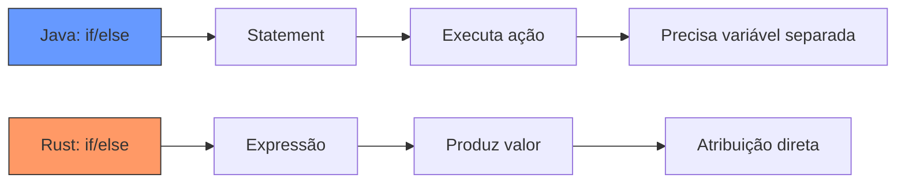
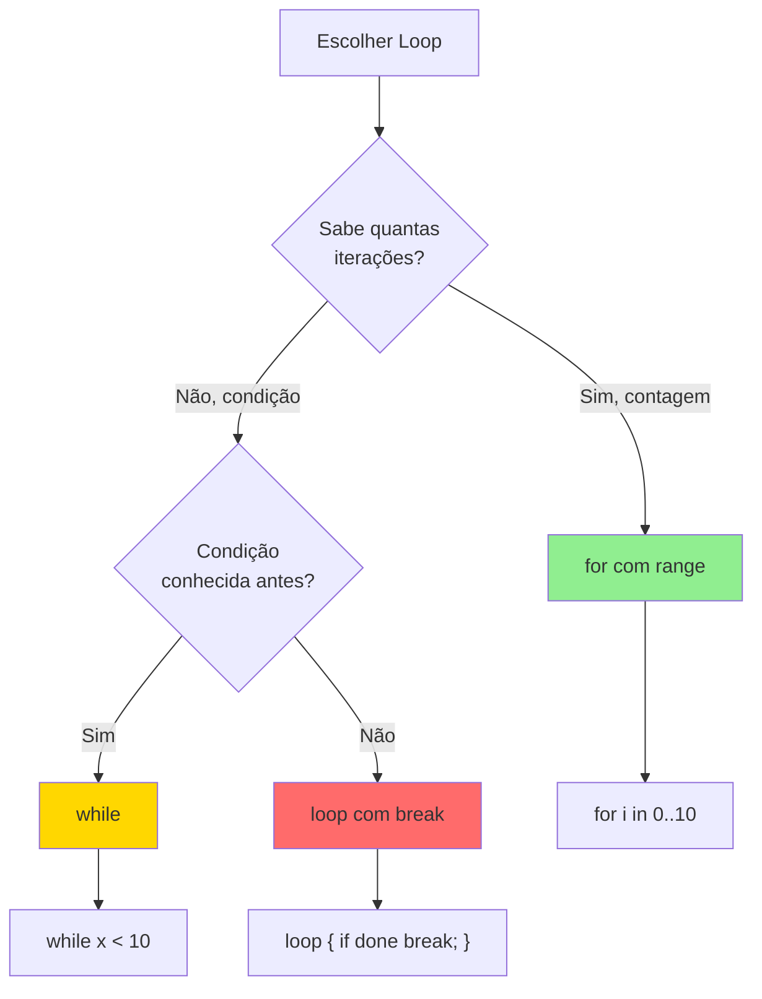
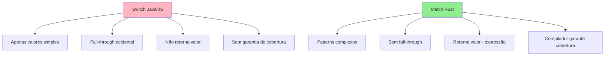
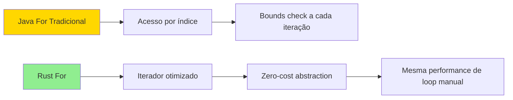

# Controle de Fluxo em Rust: O Guia Completo do Dia 3

---

## Índice Principal

**[Teoria Fundamental](#teoria-fundamental)**
- [If/Else como Expressões](#ifelse-como-expressoes)
- [Loops: loop, while, for](#loops-loop-while-for)
- [Ranges e Iteradores](#ranges-e-iteradores)
- [Match - Pattern Matching](#match-pattern-matching)
- [Break e Continue com Labels](#break-e-continue-com-labels)

**[Comparações: Rust vs Java/JavaScript](#comparacoes-rust-vs-javajavascript)**

**[Exercícios Práticos](#exercicios-praticos)**

**[Cheat Sheet Rápido](#cheat-sheet-rapido)**

---

## Teoria Fundamental

[↑ Voltar ao Índice](#indice-principal)

### If/Else como Expressões

**A Grande Diferença: Expressões vs Statements**

Em Java e JavaScript, `if/else` são **statements** (instruções que executam ações). Em Rust, são **expressões** (produzem valores que podem ser atribuídos).

**Analogia:** Imagine que em Java você pede a um robô: "Se estiver frio, traga um casaco. Senão, traga camiseta." O robô executa a ação. Em Rust, você diz: "Me dê o resultado de: se frio então casaco, senão camiseta" - você recebe diretamente o valor.

```rust {.line-numbers}
// Em Rust, if/else RETORNA um valor
let temperatura = 15;
let roupa = if temperatura < 20 {
    "casaco"  // ← sem ponto-e-vírgula! É o valor retornado
} else {
    "camiseta"
};

println!("Vista: {}", roupa); // "Vista: casaco"
```

**Regras Cruciais:**

```rust {.line-numbers}
// ✅ CORRETO: Tipos compatíveis em todos os ramos
let numero = if condicao { 42 } else { 0 };

// ❌ ERRO: Tipos diferentes (i32 vs &str)
// let valor = if condicao { 42 } else { "texto" };

// ✅ Se não usar o valor, pode ter side effects
if x > 10 {
    println!("Grande!");  // ← com ; porque não retorna valor
}

// ✅ else if encadeado
let nota = 85;
let conceito = if nota >= 90 {
    "A"
} else if nota >= 80 {
    "B"
} else if nota >= 70 {
    "C"
} else {
    "F"
};
```

**Comparação Visual:**



[↑ Voltar ao Índice](#indice-principal)

---

### Loops: loop, while, for

Rust oferece três tipos de loops, cada um com seu propósito específico.

#### 1. Loop Infinito: `loop`

O `loop` é um loop infinito que você controla explicitamente. Diferente de `while(true)` em Java, `loop` é a forma idiomática e o compilador entende que ele realmente não termina (útil para análise de fluxo).

```rust {.line-numbers}
// Loop infinito básico
loop {
    println!("Eternamente!");
    break; // ← precisa de break para sair
}

// Loop como EXPRESSÃO - retorna valor!
let resultado = loop {
    let entrada = ler_usuario();
    
    if entrada.is_valid() {
        break entrada.valor; // ← retorna o valor ao quebrar
    }
    
    println!("Entrada inválida, tente novamente");
};

println!("Você digitou: {}", resultado);
```

**Por que usar `loop` ao invés de `while true`?**

```rust {.line-numbers}
// O compilador SABE que loop não termina sem break
let valor: i32;
loop {
    valor = calcular_algo();
    if valor > 0 {
        break;
    }
}
// ✅ Compilador sabe que valor foi inicializado

// Com while true, o compilador é mais conservador
let valor2: i32;
while true {
    valor2 = calcular_algo();
    if valor2 > 0 {
        break;
    }
}
// ⚠️ Pode reclamar que valor2 não foi inicializado
```

#### 2. While: Condicional

Loop que continua enquanto a condição for verdadeira.

```rust {.line-numbers}
let mut contador = 0;

while contador < 5 {
    println!("Contador: {}", contador);
    contador += 1;
}

// While com múltiplas condições
let mut x = 0;
let mut y = 10;

while x < 5 && y > 0 {
    println!("x={}, y={}", x, y);
    x += 1;
    y -= 2;
}

// While let - para pattern matching
let mut pilha = vec![1, 2, 3];

while let Some(topo) = pilha.pop() {
    println!("Desempilhando: {}", topo);
}
```

#### 3. For: Iteração sobre Coleções

O `for` em Rust itera sobre **iteradores**, não índices como em Java tradicional.

```rust {.line-numbers}
// Iterando sobre range
for numero in 1..=5 {
    println!("Número: {}", numero);
}
// Output: 1, 2, 3, 4, 5

// Iterando sobre array/vec
let frutas = vec!["maçã", "banana", "laranja"];

for fruta in &frutas {
    println!("Fruta: {}", fruta);
}

// Com índice e valor (como enumerate em Python)
for (indice, fruta) in frutas.iter().enumerate() {
    println!("{}: {}", indice, fruta);
}

// Iterando de forma mutável
let mut numeros = vec![1, 2, 3, 4];

for num in &mut numeros {
    *num *= 2; // multiplica cada elemento por 2
}

println!("{:?}", numeros); // [2, 4, 6, 8]
```

**Comparação dos Três Loops:**



[↑ Voltar ao Índice](#indice-principal)

---

### Ranges e Iteradores

Ranges são sequências de números que funcionam como iteradores.

```rust {.line-numbers}
// Range EXCLUSIVO: 1..10 (não inclui o 10)
for i in 1..10 {
    print!("{} ", i); // 1 2 3 4 5 6 7 8 9
}

// Range INCLUSIVO: 1..=10 (inclui o 10)
for i in 1..=10 {
    print!("{} ", i); // 1 2 3 4 5 6 7 8 9 10
}

// Range reverso
for i in (1..=5).rev() {
    print!("{} ", i); // 5 4 3 2 1
}

// Range com step (pulos)
for i in (0..10).step_by(2) {
    print!("{} ", i); // 0 2 4 6 8
}

// Range como slice
let array = [10, 20, 30, 40, 50];
let pedaco = &array[1..4]; // [20, 30, 40]

// Range infinito (útil com take)
for i in (0..).take(5) {
    print!("{} ", i); // 0 1 2 3 4
}
```

**Diferença Crítica: `..` vs `..=`**

```rust {.line-numbers}
// Pense em intervalos matemáticos:
// 1..5  = [1, 5)  = {1, 2, 3, 4}
// 1..=5 = [1, 5]  = {1, 2, 3, 4, 5}

let vetor = vec![10, 20, 30, 40, 50];

// Slice: 0..3 pega índices 0, 1, 2
println!("{:?}", &vetor[0..3]); // [10, 20, 30]

// Slice: 0..=3 pega índices 0, 1, 2, 3
println!("{:?}", &vetor[0..=3]); // [10, 20, 30, 40]
```

[↑ Voltar ao Índice](#indice-principal)

---

### Match - Pattern Matching

O `match` é como o `switch` de Java/JavaScript, mas **infinitamente mais poderoso**. Ele verifica padrões e é uma **expressão** (retorna valor).

#### Match Básico

```rust {.line-numbers}
let numero = 3;

let descricao = match numero {
    1 => "um",
    2 => "dois",
    3 => "três",
    4 => "quatro",
    5 => "cinco",
    _ => "outro" // ← _ é o "default", obrigatório se não cobrir todos casos
};

println!("{}", descricao); // "três"
```

#### Match com Ranges

```rust {.line-numbers}
let nota = 85;

let conceito = match nota {
    90..=100 => "A",
    80..=89  => "B",
    70..=79  => "C",
    60..=69  => "D",
    0..=59   => "F",
    _ => "Nota inválida"
};
```

#### Match com Múltiplos Valores

```rust {.line-numbers}
let dia = 3;

let tipo_dia = match dia {
    1 | 7 => "Final de semana", // | significa "ou"
    2..=6 => "Dia útil",
    _ => "Dia inválido"
};
```

#### Match com Guards (Condições Extras)

```rust {.line-numbers}
let numero = 15;

let classificacao = match numero {
    n if n < 0 => "Negativo",
    n if n == 0 => "Zero",
    n if n % 2 == 0 => "Par positivo",
    n if n % 2 == 1 => "Ímpar positivo",
    _ => "Impossível" // nunca vai acontecer, mas Rust exige
};
```

#### Match com Tuplas

```rust {.line-numbers}
let ponto = (0, 5);

match ponto {
    (0, 0) => println!("Origem"),
    (0, y) => println!("No eixo Y: {}", y),
    (x, 0) => println!("No eixo X: {}", x),
    (x, y) => println!("Em ({}, {})", x, y),
}
```

#### Match com Enums (Preview)

```rust {.line-numbers}
enum Direcao {
    Norte,
    Sul,
    Leste,
    Oeste,
}

let movimento = Direcao::Norte;

match movimento {
    Direcao::Norte => println!("Indo para o norte"),
    Direcao::Sul => println!("Indo para o sul"),
    Direcao::Leste => println!("Indo para o leste"),
    Direcao::Oeste => println!("Indo para o oeste"),
}
// ✅ Compilador garante que todos os casos foram cobertos!
```

#### Match com Blocos

```rust {.line-numbers}
let numero = 42;

let resultado = match numero {
    0 => {
        println!("Detectado zero!");
        "zero"
    },
    1..=10 => {
        println!("Entre 1 e 10");
        "pequeno"
    },
    _ => {
        println!("Número grande: {}", numero);
        "grande"
    }
};
```

**Por que Match é Superior ao Switch:**



[↑ Voltar ao Índice](#indice-principal)

---

### Break e Continue com Labels

Em loops aninhados, você pode usar **labels** (rótulos) para controlar qual loop quebrar ou continuar.

```rust {.line-numbers}
// Label começa com ' (aspas simples)
'externo: for i in 1..=3 {
    println!("Loop externo: {}", i);
    
    'interno: for j in 1..=3 {
        println!("  Loop interno: {}", j);
        
        if i == 2 && j == 2 {
            println!("    Quebrando loop EXTERNO!");
            break 'externo; // ← quebra o loop externo
        }
        
        if j == 2 {
            println!("    Continuando loop externo");
            continue 'externo; // ← pula para próxima iteração do externo
        }
    }
}
```

**Output:**

Loop externo: 1
  Loop interno: 1
  Loop interno: 2
    Continuando loop externo
Loop externo: 2
  Loop interno: 1
  Loop interno: 2
    Quebrando loop EXTERNO!


**Retornando Valores de Loops com Labels:**

```rust {.line-numbers}
let resultado = 'busca: loop {
    for i in 1..=10 {
        for j in 1..=10 {
            if i * j > 50 {
                break 'busca (i, j); // ← retorna tupla
            }
        }
    }
    
    break (-1, -1); // caso não encontre
};

println!("Primeiro produto > 50: {:?}", resultado);
```

**Exemplo Prático: Busca em Matriz**

```rust {.line-numbers}
let matriz = [
    [1, 2, 3],
    [4, 5, 6],
    [7, 8, 9],
];

let alvo = 5;
let mut encontrado = false;

'linhas: for (i, linha) in matriz.iter().enumerate() {
    for (j, &valor) in linha.iter().enumerate() {
        if valor == alvo {
            println!("Encontrado {} em [{}, {}]", alvo, i, j);
            encontrado = true;
            break 'linhas;
        }
    }
}

if !encontrado {
    println!("Valor {} não encontrado", alvo);
}
```

[↑ Voltar ao Índice](#indice-principal)

---

## Comparações: Rust vs Java/JavaScript

[↑ Voltar ao Índice](#indice-principal)

### If/Else: Expressão vs Statement

**JAVA:**

```java
// Java: if é statement, precisa declarar variável antes
int idade = 25;
String categoria;

if (idade < 18) {
    categoria = "Menor";
} else if (idade < 60) {
    categoria = "Adulto";
} else {
    categoria = "Idoso";
}

// Ou usar operador ternário (limitado)
String categoria = idade < 18 ? "Menor" : "Adulto";
```

**RUST:**

```rust {.line-numbers}
// Rust: if é expressão, atribuição direta
let idade = 25;
let categoria = if idade < 18 {
    "Menor"
} else if idade < 60 {
    "Adulto"
} else {
    "Idoso"
};
```

---

### Switch vs Match: Poder Incomparável

**JAVA:**

```java
// Java: switch tradicional (antes do Java 14)
int dia = 3;
String tipoDia;

switch (dia) {
    case 1:
    case 7:
        tipoDia = "Final de semana";
        break; // ← esqueceu break? Bug!
    case 2:
    case 3:
    case 4:
    case 5:
    case 6:
        tipoDia = "Dia útil";
        break;
    default:
        tipoDia = "Inválido";
}

// Java 14+: switch expression
String tipoDia = switch (dia) {
    case 1, 7 -> "Final de semana";
    case 2, 3, 4, 5, 6 -> "Dia útil";
    default -> "Inválido";
};
```

**RUST:**

```rust {.line-numbers}
// Rust: match com patterns poderosos
let dia = 3;

let tipo_dia = match dia {
    1 | 7 => "Final de semana",
    2..=6 => "Dia útil",
    _ => "Inválido"
};

// Match com guards (impossível em Java switch)
let numero = 15;
let classificacao = match numero {
    n if n < 0 => "Negativo",
    n if n % 2 == 0 => "Par",
    _ => "Ímpar"
};

// Match com tuplas (impossível em Java)
let ponto = (0, 5);
match ponto {
    (0, 0) => println!("Origem"),
    (0, y) => println!("Eixo Y: {}", y),
    (x, 0) => println!("Eixo X: {}", x),
    (x, y) => println!("Ponto ({}, {})", x, y),
}
```

---

### For: Índices vs Iteradores

**JAVA:**

```java
// Java: for tradicional com índices
String[] frutas = {"maçã", "banana", "laranja"};

// Estilo C (índices manuais)
for (int i = 0; i < frutas.length; i++) {
    System.out.println(i + ": " + frutas[i]);
}

// Enhanced for (esconde índice)
for (String fruta : frutas) {
    System.out.println(fruta);
}

// Streams (mais próximo de Rust)
IntStream.range(0, 10)
    .forEach(i -> System.out.println(i));
```

**JAVASCRIPT:**

```javascript
// JavaScript: múltiplas formas
const frutas = ['maçã', 'banana', 'laranja'];

// For tradicional
for (let i = 0; i < frutas.length; i++) {
    console.log(i, frutas[i]);
}

// For...of (valores)
for (const fruta of frutas) {
    console.log(fruta);
}

// ForEach
frutas.forEach((fruta, index) => {
    console.log(index, fruta);
});
```

**RUST:**

```rust {.line-numbers}
// Rust: sempre usa iteradores (zero-cost abstractions)
let frutas = vec!["maçã", "banana", "laranja"];

// Iteração simples
for fruta in &frutas {
    println!("{}", fruta);
}

// Com índice (enumerate)
for (indice, fruta) in frutas.iter().enumerate() {
    println!("{}: {}", indice, fruta);
}

// Range (como IntStream.range)
for i in 0..10 {
    println!("{}", i);
}

// Iteração mutável
let mut numeros = vec![1, 2, 3];
for num in &mut numeros {
    *num *= 2;
}
```

**Comparação de Performance:**



---

### Loop Infinito: while(true) vs loop

**JAVA:**

```java
// Java: while(true) é o padrão
while (true) {
    String input = scanner.nextLine();
    
    if (input.equals("sair")) {
        break;
    }
    
    processar(input);
}

// Não pode retornar valor do loop
```

**RUST:**

```rust {.line-numbers}
// Rust: loop é idiomático e mais poderoso
let resultado = loop {
    let input = ler_entrada();
    
    if input == "sair" {
        break "Usuário saiu"; // ← retorna valor!
    }
    
    processar(input);
};

println!("{}", resultado);
```

---

### Tabela Comparativa Geral

| Recurso | Java | JavaScript | Rust |
|---------|------|------------|------|
| If como expressão | ❌ Não (ternário limitado) | ❌ Não (ternário limitado) | ✅ Sim, completo |
| Switch/Match com ranges | ❌ Não | ❌ Não | ✅ Sim |
| Switch/Match com guards | ❌ Não | ❌ Não | ✅ Sim |
| Switch/Match exaustivo | ❌ Não obrigatório | ❌ Não obrigatório | ✅ Compilador exige |
| Loop retorna valor | ❌ Não | ❌ Não | ✅ Sim |
| For sobre iteradores | ⚠️ Streams verboso | ✅ Sim (for...of) | ✅ Sim, otimizado |
| Labels em loops | ✅ Sim | ❌ Não | ✅ Sim |
| Pattern matching | ❌ Limitado (instanceof) | ❌ Não nativo | ✅ Poderoso |

[↑ Voltar ao Índice](#indice-principal)

---

## Exercícios Práticos

[↑ Voltar ao Índice](#indice-principal)

### Exercício 1: Sistema de Classificação de Notas

**Objetivo:** Ler várias notas, classificar em conceitos (A-F), e gerar estatísticas.

**Versão 1: Com Match e Estatísticas Completas**

```rust {.line-numbers}
use std::io::{self, Write};

fn classificar_nota(nota: i32) -> &'static str {
    match nota {
        90..=100 => "A",
        80..=89  => "B",
        70..=79  => "C",
        60..=69  => "D",
        0..=59   => "F",
        _        => "Inválida"
    }
}

fn main() {
    println!("=== SISTEMA DE CLASSIFICAÇÃO DE NOTAS ===\n");
    
    let mut notas = Vec::new();
    
    // Loop para ler notas
    loop {
        print!("Digite uma nota (0-100) ou -1 para finalizar: ");
        io::stdout().flush().unwrap();
        
        let mut input = String::new();
        io::stdin()
            .read_line(&mut input)
            .expect("Falha ao ler entrada");
        
        // Parse da entrada
        let nota: i32 = match input.trim().parse() {
            Ok(num) => num,
            Err(_) => {
                println!("❌ Entrada inválida! Digite um número.\n");
                continue;
            }
        };
        
        // Condição de saída
        if nota == -1 {
            break;
        }
        
        // Validação
        if nota < 0 || nota > 100 {
            println!("❌ Nota deve estar entre 0 e 100!\n");
            continue;
        }
        
        // Adiciona nota válida
        notas.push(nota);
        let conceito = classificar_nota(nota);
        println!("✅ Nota {} registrada: Conceito {}\n", nota, conceito);
    }
    
    // Verifica se há notas para processar
    if notas.is_empty() {
        println!("Nenhuma nota registrada.");
        return;
    }
    
    // Calcula estatísticas
    println!("\n=== ESTATÍSTICAS ===");
    println!("Total de notas: {}", notas.len());
    
    // Soma e média
    let soma: i32 = notas.iter().sum();
    let media = soma as f64 / notas.len() as f64;
    println!("Média: {:.2}", media);
    
    // Maior e menor
    let maior = notas.iter().max().unwrap();
    let menor = notas.iter().min().unwrap();
    println!("Maior nota: {}", maior);
    println!("Menor nota: {}", menor);
    
    // Contagem por conceito
    let mut contagem_a = 0;
    let mut contagem_b = 0;
    let mut contagem_c = 0;
    let mut contagem_d = 0;
    let mut contagem_f = 0;
    
    for &nota in &notas {
        match classificar_nota(nota) {
            "A" => contagem_a += 1,
            "B" => contagem_b += 1,
            "C" => contagem_c += 1,
            "D" => contagem_d += 1,
            "F" => contagem_f += 1,
            _   => {}
        }
    }
    
    println!("\n=== DISTRIBUIÇÃO DE CONCEITOS ===");
    println!("A (90-100): {} alunos", contagem_a);
    println!("B (80-89):  {} alunos", contagem_b);
    println!("C (70-79):  {} alunos", contagem_c);
    println!("D (60-69):  {} alunos", contagem_d);
    println!("F (0-59):   {} alunos", contagem_f);
    
    // Aprovação (>= 60)
    let aprovados = notas.iter().filter(|&&n| n >= 60).count();
    let taxa_aprovacao = (aprovados as f64 / notas.len() as f64) * 100.0;
    println!("\n📊 Taxa de aprovação: {:.1}%", taxa_aprovacao);
}
```

**Versão 2: Com Histograma Visual**

```rust {.line-numbers}
use std::io::{self, Write};

fn classificar_nota(nota: i32) -> &'static str {
    match nota {
        90..=100 => "A",
        80..=89  => "B",
        70..=79  => "C",
        60..=69  => "D",
        0..=59   => "F",
        _        => "Inválida"
    }
}

fn gerar_barra(quantidade: usize) -> String {
    "█".repeat(quantidade)
}

fn main() {
    println!("=== SISTEMA DE NOTAS COM HISTOGRAMA ===\n");
    
    let mut notas = Vec::new();
    
    // Coleta de notas
    loop {
        print!("Nota (0-100) ou -1 para sair: ");
        io::stdout().flush().unwrap();
        
        let mut input = String::new();
        io::stdin().read_line(&mut input).unwrap();
        
        let nota: i32 = match input.trim().parse() {
            Ok(n) if n == -1 => break,
            Ok(n) if n >= 0 && n <= 100 => n,
            _ => {
                println!("Inválido!\n");
                continue;
            }
        };
        
        notas.push(nota);
        println!("Registrado: {} [{}]\n", nota, classificar_nota(nota));
    }
    
    if notas.is_empty() {
        return;
    }
    
    // Contagem por conceito
    let mut conceitos = [0; 5]; // [A, B, C, D, F]
    
    for &nota in &notas {
        let idx = match classificar_nota(nota) {
            "A" => 0,
            "B" => 1,
            "C" => 2,
            "D" => 3,
            "F" => 4,
            _ => continue,
        };
        conceitos[idx] += 1;
    }
    
    // Exibe histograma
    println!("\n=== HISTOGRAMA ===");
    let labels = ["A", "B", "C", "D", "F"];
    
    for i in 0..5 {
        let barra = gerar_barra(conceitos[i]);
        println!("{}: {} ({})", labels[i], barra, conceitos[i]);
    }
    
    // Média
    let soma: i32 = notas.iter().sum();
    let media = soma as f64 / notas.len() as f64;
    println!("\nMédia geral: {:.2}", media);
}
```

**Testes Manuais Sugeridos:**

```
Teste 1 - Casos normais:
Input: 95, 87, 72, 65, 45, -1
Esperado: A, B, C, D, F

Teste 2 - Validações:
Input: -5 (inválido), 105 (inválido), abc (inválido), 80 (válido), -1
Esperado: 3 erros, 1 nota registrada

Teste 3 - Vazio:
Input: -1
Esperado: Mensagem "Nenhuma nota registrada"

Teste 4 - Extremos:
Input: 0, 100, -1
Esperado: F e A, média 50.00

Teste 5 - Todos iguais:
Input: 85, 85, 85, -1
Esperado: 3 notas B, média 85.00
```

[↑ Voltar ao Índice](#indice-principal)

---

### Exercício 2: Gerador Fibonacci

**Objetivo:** Gerar sequência Fibonacci até N termos usando diferentes tipos de loops.

**Versão 1: Usando Loop Tradicional**

```rust {.line-numbers}
use std::io::{self, Write};

fn fibonacci_loop(n: usize) -> Vec<u64> {
    if n == 0 {
        return vec![];
    }
    
    if n == 1 {
        return vec![0];
    }
    
    let mut sequencia = vec![0, 1];
    
    // Loop tradicional - começa do terceiro termo
    let mut contador = 2;
    loop {
        if contador >= n {
            break;
        }
        
        let proximo = sequencia[contador - 1] + sequencia[contador - 2];
        sequencia.push(proximo);
        contador += 1;
    }
    
    sequencia
}

fn main() {
    println!("=== GERADOR FIBONACCI (LOOP) ===\n");
    
    print!("Quantos termos deseja gerar? ");
    io::stdout().flush().unwrap();
    
    let mut input = String::new();
    io::stdin().read_line(&mut input).unwrap();
    
    let n: usize = match input.trim().parse() {
        Ok(num) if num > 0 && num <= 50 => num,
        _ => {
            println!("Digite um número entre 1 e 50!");
            return;
        }
    };
    
    let resultado = fibonacci_loop(n);
    
    println!("\nSequência de Fibonacci ({} termos):", n);
    
    for (i, valor) in resultado.iter().enumerate() {
        print!("{}", valor);
        if i < resultado.len() - 1 {
            print!(", ");
        }
    }
    
    println!("\n\nÚltimo termo: {}", resultado[resultado.len() - 1]);
    
    // Soma de todos os termos
    let soma: u64 = resultado.iter().sum();
    println!("Soma de todos os termos: {}", soma);
}
```

**Versão 2: Usando While**

```rust {.line-numbers}
use std::io::{self, Write};

fn fibonacci_while(n: usize) -> Vec<u64> {
    if n == 0 {
        return vec![];
    }
    
    if n == 1 {
        return vec![0];
    }
    
    let mut sequencia = vec![0, 1];
    let mut contador = 2;
    
    // While loop - condição explícita
    while contador < n {
        let proximo = sequencia[contador - 1] + sequencia[contador - 2];
        sequencia.push(proximo);
        contador += 1;
    }
    
    sequencia
}

fn main() {
    println!("=== GERADOR FIBONACCI (WHILE) ===\n");
    
    print!("Quantos termos? ");
    io::stdout().flush().unwrap();
    
    let mut input = String::new();
    io::stdin().read_line(&mut input).unwrap();
    
    let n: usize = match input.trim().parse() {
        Ok(num) if num > 0 && num <= 50 => num,
        _ => {
            println!("Número inválido!");
            return;
        }
    };
    
    let resultado = fibonacci_while(n);
    
    // Exibição formatada
    println!("\n{:<5} | {}", "Pos", "Valor");
    println!("{}", "-".repeat(20));
    
    for (i, &valor) in resultado.iter().enumerate() {
        println!("{:<5} | {}", i + 1, valor);
    }
}
```

**Versão 3: Usando For (mais idiomático)**

```rust {.line-numbers}
use std::io::{self, Write};

fn fibonacci_for(n: usize) -> Vec<u64> {
    if n == 0 {
        return vec![];
    }
    
    if n == 1 {
        return vec![0];
    }
    
    let mut sequencia = vec![0, 1];
    
    // For loop - mais idiomático em Rust
    for _ in 2..n {
        let proximo = sequencia[sequencia.len() - 1] + sequencia[sequencia.len() - 2];
        sequencia.push(proximo);
    }
    
    sequencia
}

fn main() {
    println!("=== GERADOR FIBONACCI (FOR - IDIOMÁTICO) ===\n");
    
    print!("Quantos termos? ");
    io::stdout().flush().unwrap();
    
    let mut input = String::new();
    io::stdin().read_line(&mut input).unwrap();
    
    let n: usize = match input.trim().parse() {
        Ok(num) if num > 0 && num <= 50 => num,
        _ => {
            println!("Número inválido!");
            return;
        }
    };
    
    let resultado = fibonacci_for(n);
    
    // Exibição em linha
    print!("Fibonacci: ");
    for (i, valor) in resultado.iter().enumerate() {
        print!("{}", valor);
        if i < resultado.len() - 1 {
            print!(" → ");
        }
    }
    println!();
    
    // Proporção áurea (razão entre termos consecutivos)
    if n >= 3 {
        let ultimo = resultado[resultado.len() - 1] as f64;
        let penultimo = resultado[resultado.len() - 2] as f64;
        let razao = ultimo / penultimo;
        println!("\nRazão áurea aproximada: {:.10}", razao);
        println!("(Razão áurea real: 1.618033988...)");
    }
}
```

**Versão 4: Comparação de Performance**

```rust {.line-numbers}
use std::time::Instant;

fn fibonacci_loop(n: usize) -> Vec<u64> {
    if n == 0 { return vec![]; }
    if n == 1 { return vec![0]; }
    
    let mut seq = vec![0, 1];
    let mut i = 2;
    loop {
        if i >= n { break; }
        seq.push(seq[i-1] + seq[i-2]);
        i += 1;
    }
    seq
}

fn fibonacci_while(n: usize) -> Vec<u64> {
    if n == 0 { return vec![]; }
    if n == 1 { return vec![0]; }
    
    let mut seq = vec![0, 1];
    let mut i = 2;
    while i < n {
        seq.push(seq[i-1] + seq[i-2]);
        i += 1;
    }
    seq
}

fn fibonacci_for(n: usize) -> Vec<u64> {
    if n == 0 { return vec![]; }
    if n == 1 { return vec![0]; }
    
    let mut seq = vec![0, 1];
    for _ in 2..n {
        let prox = seq[seq.len()-1] + seq[seq.len()-2];
        seq.push(prox);
    }
    seq
}

fn main() {
    let n = 40;
    
    // Benchmark loop
    let inicio = Instant::now();
    let _ = fibonacci_loop(n);
    let tempo_loop = inicio.elapsed();
    
    // Benchmark while
    let inicio = Instant::now();
    let _ = fibonacci_while(n);
    let tempo_while = inicio.elapsed();
    
    // Benchmark for
    let inicio = Instant::now();
    let _ = fibonacci_for(n);
    let tempo_for = inicio.elapsed();
    
    println!("=== COMPARAÇÃO DE PERFORMANCE (n={}) ===", n);
    println!("loop:  {:?}", tempo_loop);
    println!("while: {:?}", tempo_while);
    println!("for:   {:?}", tempo_for);
    println!("\nEm Rust, todos têm performance similar!");
    println!("Prefira 'for' por ser mais idiomático.");
}
```

**Testes Manuais Sugeridos:**

```
Teste 1 - Casos pequenos:
Input: 1
Esperado: [0]

Input: 2
Esperado: [0, 1]

Input: 5
Esperado: [0, 1, 1, 2, 3]

Teste 2 - Caso médio:
Input: 10
Esperado: [0, 1, 1, 2, 3, 5, 8, 13, 21, 34]

Teste 3 - Verificar overflow:
Input: 50
Esperado: Funciona (u64 suporta até 93º termo)

Input: 100
Esperado: Overflow após termo 93 (pode adicionar verificação)

Teste 4 - Razão áurea:
Input: 20
Esperado: Razão ~1.618033988

Teste 5 - Validações:
Input: 0
Esperado: Vector vazio

Input: -5
Esperado: Mensagem de erro

Input: abc
Esperado: Mensagem de erro
```

[↑ Voltar ao Índice](#indice-principal)

---

### Exercício 3: Jogo de Adivinhação

**Objetivo:** Jogo onde o computador escolhe um número e o jogador deve adivinhar, com validação completa.

**Versão Completa: Com Dicas, Tentativas e Estatísticas**

```rust {.line-numbers}
use std::io::{self, Write};
use std::cmp::Ordering;

fn main() {
    println!("╔═══════════════════════════════════════╗");
    println!("║   JOGO DE ADIVINHAÇÃO EM RUST!      ║");
    println!("╚═══════════════════════════════════════╝\n");
    
    // Simula número aleatório (1-100)
    // Em produção, use: use rand::Rng; let numero = rand::thread_rng().gen_range(1..=100);
    let numero_secreto = 42; // Substitua por gerador aleatório
    
    println!("Pensei em um número entre 1 e 100.");
    println!("Você tem 7 tentativas para acertar!\n");
    
    let max_tentativas = 7;
    let mut tentativa_atual = 0;
    let mut historico = Vec::new();
    let mut acertou = false;
    
    // Loop principal do jogo
    'jogo: loop {
        tentativa_atual += 1;
        
        // Verifica se esgotou tentativas
        if tentativa_atual > max_tentativas {
            println!("\n💔 Suas tentativas acabaram!");
            break 'jogo;
        }
        
        // Exibe cabeçalho da tentativa
        println!("─────────────────────────────────────");
        println!("Tentativa {}/{}", tentativa_atual, max_tentativas);
        print!("Seu palpite: ");
        io::stdout().flush().unwrap();
        
        // Lê entrada do usuário
        let mut palpite_str = String::new();
        io::stdin()
            .read_line(&mut palpite_str)
            .expect("Falha ao ler entrada");
        
        // Parse do palpite
        let palpite: i32 = match palpite_str.trim().parse() {
            Ok(num) => num,
            Err(_) => {
                println!("❌ Isso não é um número válido! Tente novamente.\n");
                tentativa_atual -= 1; // Não conta como tentativa
                continue;
            }
        };
        
        // Validação de range
        if palpite < 1 || palpite > 100 {
            println!("❌ O número deve estar entre 1 e 100!\n");
            tentativa_atual -= 1; // Não conta como tentativa
            continue;
        }
        
        // Verifica se já tentou esse número
        if historico.contains(&palpite) {
            println!("⚠️  Você já tentou {} antes!\n", palpite);
            tentativa_atual -= 1; // Não conta como tentativa
            continue;
        }
        
        // Adiciona ao histórico
        historico.push(palpite);
        
        // Compara com número secreto
        match palpite.cmp(&numero_secreto) {
            Ordering::Less => {
                let diferenca = numero_secreto - palpite;
                
                let dica = match diferenca {
                    1..=5   => "Muito perto! 🔥",
                    6..=15  => "Perto! 🌡️",
                    16..=30 => "Um pouco longe... 🧊",
                    _       => "Muito longe! ❄️"
                };
                
                println!("📈 Muito baixo! {}", dica);
            },
            Ordering::Greater => {
                let diferenca = palpite - numero_secreto;
                
                let dica = match diferenca {
                    1..=5   => "Muito perto! 🔥",
                    6..=15  => "Perto! 🌡️",
                    16..=30 => "Um pouco longe... 🧊",
                    _       => "Muito longe! ❄️"
                };
                
                println!("📉 Muito alto! {}", dica);
            },
            Ordering::Equal => {
                println!("🎉 PARABÉNS! Você acertou!");
                acertou = true;
                break 'jogo;
            }
        }
        
        // Exibe histórico
        print!("Tentativas anteriores: ");
        for (i, &num) in historico.iter().enumerate() {
            print!("{}", num);
            if i < historico.len() - 1 {
                print!(", ");
            }
        }
        println!("\n");
    }
    
    // Resultado final
    println!("\n╔═══════════════════════════════════════╗");
    println!("║           RESULTADO FINAL            ║");
    println!("╚═══════════════════════════════════════╝");
    println!("Número secreto: {}", numero_secreto);
    println!("Tentativas usadas: {}", tentativa_atual);
    
    if acertou {
        let pontuacao = match tentativa_atual {
            1 => "INCRÍVEL! Primeira tentativa! 🏆",
            2..=3 => "EXCELENTE! Muito rápido! 🥇",
            4..=5 => "MUITO BOM! 🥈",
            6..=7 => "BOM! Conseguiu no limite! 🥉",
            _ => "Parabéns!"
        };
        println!("Classificação: {}", pontuacao);
    } else {
        println!("Não foi desta vez... Tente novamente!");
    }
    
    println!("\nHistórico completo: {:?}", historico);
}
```

**Versão 2: Com Sistema de Pontuação e Ranking**

```rust {.line-numbers}
use std::io::{self, Write};
use std::cmp::Ordering;

struct Pontuacao {
    pontos: i32,
    tentativas: usize,
}

fn calcular_pontos(tentativas: usize, max_tentativas: usize) -> i32 {
    let base = 1000;
    let penalidade = (tentativas as i32 - 1) * 100;
    (base - penalidade).max(0)
}

fn jogar_rodada(numero_secreto: i32, max_tentativas: usize) -> Pontuacao {
    let mut tentativa_atual = 0;
    let mut historico = Vec::new();
    
    loop {
        tentativa_atual += 1;
        
        if tentativa_atual > max_tentativas {
            return Pontuacao { 
                pontos: 0, 
                tentativas: max_tentativas 
            };
        }
        
        print!("Tentativa {}/{} - Palpite: ", tentativa_atual, max_tentativas);
        io::stdout().flush().unwrap();
        
        let mut input = String::new();
        io::stdin().read_line(&mut input).unwrap();
        
        let palpite: i32 = match input.trim().parse() {
            Ok(n) if n >= 1 && n <= 100 => n,
            _ => {
                println!("Inválido!\n");
                tentativa_atual -= 1;
                continue;
            }
        };
        
        if historico.contains(&palpite) {
            println!("Já tentou isso!\n");
            tentativa_atual -= 1;
            continue;
        }
        
        historico.push(palpite);
        
        match palpite.cmp(&numero_secreto) {
            Ordering::Less => println!("↑ Muito baixo!\n"),
            Ordering::Greater => println!("↓ Muito alto!\n"),
            Ordering::Equal => {
                println!("🎯 ACERTOU!\n");
                let pontos = calcular_pontos(tentativa_atual, max_tentativas);
                return Pontuacao { pontos, tentativas: tentativa_atual };
            }
        }
    }
}

fn main() {
    println!("=== JOGO DE ADIVINHAÇÃO - MODO RANKING ===\n");
    
    let numeros = [42, 67, 23, 89, 15]; // 5 rodadas
    let max_tentativas = 7;
    let mut pontuacao_total = 0;
    
    for (rodada, &numero) in numeros.iter().enumerate() {
        println!("\n━━━ RODADA {} ━━━", rodada + 1);
        println!("Número entre 1 e 100");
        
        let resultado = jogar_rodada(numero, max_tentativas);
        
        println!("Pontuação desta rodada: {} pontos", resultado.pontos);
        pontuacao_total += resultado.pontos;
    }
    
    // Resultado final
    println!("\n╔═══════════════════════════════════════╗");
    println!("║        PONTUAÇÃO FINAL               ║");
    println!("╚═══════════════════════════════════════╝");
    println!("Total: {} pontos\n", pontuacao_total);
    
    let classificacao = match pontuacao_total {
        4500..=5000 => "🏆 MESTRE - Desempenho perfeito!",
        3500..=4499 => "🥇 EXPERT - Excelente!",
        2500..=3499 => "🥈 AVANÇADO - Muito bom!",
        1500..=2499 => "🥉 INTERMEDIÁRIO - Bom!",
        500..=1499  => "📚 INICIANTE - Continue praticando!",
        _ => "🎯 APRENDIZ - Não desista!"
    };
    
    println!("Classificação: {}", classificacao);
}
```

**Versão 3: Com Hints Progressivos**

```rust {.line-numbers}
use std::io::{self, Write};
use std::cmp::Ordering;

fn dar_hint(numero: i32, tentativa: usize) {
    match tentativa {
        3 => {
            if numero % 2 == 0 {
                println!("💡 Hint: O número é PAR");
            } else {
                println!("💡 Hint: O número é ÍMPAR");
            }
        },
        5 => {
            let dezena = (numero / 10) * 10;
            println!("💡 Hint: Está entre {} e {}", dezena, dezena + 10);
        },
        _ => {}
    }
}

fn main() {
    println!("=== JOGO COM HINTS PROGRESSIVOS ===\n");
    
    let numero_secreto = 42;
    let max_tentativas = 7;
    let mut tentativa = 0;
    
    loop {
        tentativa += 1;
        
        if tentativa > max_tentativas {
            println!("Fim! Era {}", numero_secreto);
            break;
        }
        
        // Dá hint em tentativas específicas
        dar_hint(numero_secreto, tentativa);
        
        print!("[{}/{}] Palpite: ", tentativa, max_tentativas);
        io::stdout().flush().unwrap();
        
        let mut input = String::new();
        io::stdin().read_line(&mut input).unwrap();
        
        let palpite: i32 = match input.trim().parse() {
            Ok(n) if n >= 1 && n <= 100 => n,
            _ => {
                tentativa -= 1;
                println!("Inválido!\n");
                continue;
            }
        };
        
        match palpite.cmp(&numero_secreto) {
            Ordering::Less => println!("↑ Maior!\n"),
            Ordering::Greater => println!("↓ Menor!\n"),
            Ordering::Equal => {
                println!("🎉 Acertou em {} tentativas!", tentativa);
                break;
            }
        }
    }
}
```

**Testes Manuais Sugeridos:**

```
Teste 1 - Acertar de primeira:
Número secreto: 42
Input: 42
Esperado: Vitória em 1 tentativa, pontuação máxima

Teste 2 - Busca binária:
Número secreto: 42
Input: 50 (alto), 25 (baixo), 37 (baixo), 43 (alto), 40 (baixo), 42 (acerto)
Esperado: Vitória em 6 tentativas

Teste 3 - Validações:
Input: abc (inválido), -5 (fora do range), 200 (fora do range)
Esperado: Mensagens de erro, não contar como tentativa

Teste 4 - Números repetidos:
Input: 50, 50
Esperado: Segunda entrada não conta como tentativa

Teste 5 - Esgotar tentativas:
Fazer 7 palpites errados
Esperado: Mensagem de derrota, revelar número

Teste 6 - Hints progressivos:
Número: 42 (par, está entre 40-50)
Esperado: Hint de paridade na tentativa 3, hint de dezena na 5

Teste 7 - Sistema de pontuação:
Acertar em 1 tentativa: 1000 pontos
Acertar em 3 tentativas: 800 pontos
Acertar em 7 tentativas: 400 pontos
```

**Observações Importantes:**

1. **Geração de Números Aleatórios:** Para números verdadeiramente aleatórios, adicione ao `Cargo.toml`:

```toml
[dependencies]
rand = "0.8"
```

E use no código:

```rust {.line-numbers}
use rand::Rng;

fn main() {
    let numero_secreto = rand::thread_rng().gen_range(1..=100);
    // resto do código
}
```

2. **Tratamento de Erros:** Todos os exercícios usam `match` para validação robusta ao invés de `unwrap()` indiscriminado.

3. **Imutabilidade:** Apenas variáveis que realmente mudam são marcadas como `mut`.

[↑ Voltar ao Índice](#indice-principal)

---

## Cheat Sheet Rápido

[↑ Voltar ao Índice](#indice-principal)

### If/Else

```rust {.line-numbers}
// If como expressão
let x = if condicao { 5 } else { 10 };

// If sem else (retorna unit type ())
if x > 0 {
    println!("Positivo");
}

// Else if encadeado
let nota = if x >= 90 { "A" } else if x >= 80 { "B" } else { "C" };
```

### Loops

```rust {.line-numbers}
// Loop infinito
loop {
    if condicao { break; }
}

// Loop retornando valor
let resultado = loop {
    if condicao { break valor; }
};

// While
while condicao {
    // código
}

// For sobre range
for i in 0..10 { }      // 0 a 9
for i in 0..=10 { }     // 0 a 10
for i in (0..10).rev() { } // 10 a 0

// For sobre coleção
for item in &colecao { }     // borrowing
for item in &mut colecao { } // mutável
for item in colecao { }      // ownership (consome)
```

### Match

```rust {.line-numbers}
// Match básico
match valor {
    1 => println!("Um"),
    2 | 3 => println!("Dois ou três"),
    4..=9 => println!("Entre 4 e 9"),
    _ => println!("Outro")
}

// Match com guard
match numero {
    n if n < 0 => println!("Negativo"),
    n if n % 2 == 0 => println!("Par"),
    _ => println!("Ímpar positivo")
}

// Match retornando valor
let resultado = match x {
    0 => "zero",
    1..=10 => "pequeno",
    _ => "grande"
};
```

### Break/Continue com Labels

```rust {.line-numbers}
'externo: for i in 0..5 {
    for j in 0..5 {
        if condicao {
            break 'externo; // quebra loop externo
        }
        if outra_condicao {
            continue 'externo; // pula para próxima iteração do externo
        }
    }
}

// Retornando valor de loop com label
let resultado = 'busca: loop {
    for i in 0..10 {
        if encontrou {
            break 'busca i; // retorna i do loop 'busca
        }
    }
};
```

### Ranges

```rust {.line-numbers}
1..10      // 1 a 9 (exclusivo)
1..=10     // 1 a 10 (inclusivo)
..10       // 0 a 9
..=10      // 0 a 10
1..        // 1 ao infinito (usar com .take())

// Operações com ranges
(1..10).rev()        // reverso
(0..10).step_by(2)   // pulos de 2
```

### Patterns Úteis

```rust {.line-numbers}
// Tupla
match (x, y) {
    (0, 0) => "origem",
    (0, _) => "eixo Y",
    (_, 0) => "eixo X",
    _ => "outro"
}

// Array
match arr {
    [a, b] => println!("2 elementos"),
    [a, b, c] => println!("3 elementos"),
    _ => println!("outro tamanho")
}

// @ binding (captura valor)
match idade {
    n @ 13..=19 => println!("Adolescente: {}", n),
    n @ 20..=59 => println!("Adulto: {}", n),
    _ => println!("Outra idade")
}
```

### Comparação com Java

| Rust | Java Equivalente |
|------|------------------|
| `if x { a } else { b }` | `x ? a : b` |
| `loop { }` | `while(true) { }` |
| `for i in 0..10` | `for(int i=0; i<10; i++)` |
| `match x { ... }` | `switch(x) { ... }` |
| `1..10` | `IntStream.range(1, 10)` |
| `break 'label` | `break label;` |

[↑ Voltar ao Índice](#indice-principal)

---

## Resumo do Dia 3

**Conceitos-Chave Dominados:**

1. **If/Else são Expressões** - Retornam valores diretamente, eliminando código boilerplate
2. **Três Tipos de Loops** - `loop` (infinito), `while` (condicional), `for` (iteradores)
3. **Ranges Poderosos** - `..` exclusivo, `..=` inclusivo, com métodos úteis
4. **Match > Switch** - Pattern matching com guards, ranges, tuplas e garantia de cobertura
5. **Labels** - Controle fino sobre loops aninhados com `break`/`continue`

**Diferenças Críticas vs Java:**

- Expressões everywhere (if, match, loop com break)
- `for` sempre usa iteradores (zero-cost abstractions)
- `match` é exaustivo (compilador força cobrir todos casos)
- Sem fall-through acidental em match
- Ranges são cidadãos de primeira classe

**Próximos Passos (Dia 4):**

- Funções e closures
- Sintaxe de retorno implícito
- Pattern matching em parâmetros
- Funções como valores

---

**🎯 EXERCÍCIO BÔNUS:** Combine todos os conceitos criando um "Menu Interativo" que:
- Use `loop` para manter o menu ativo
- Use `match` para processar opções
- Tenha sub-menus com loops aninhados e labels
- Valide entrada com `if let` ou `match`
- Gere estatísticas ao sair

[↑ Voltar ao Índice](#indice-principal)