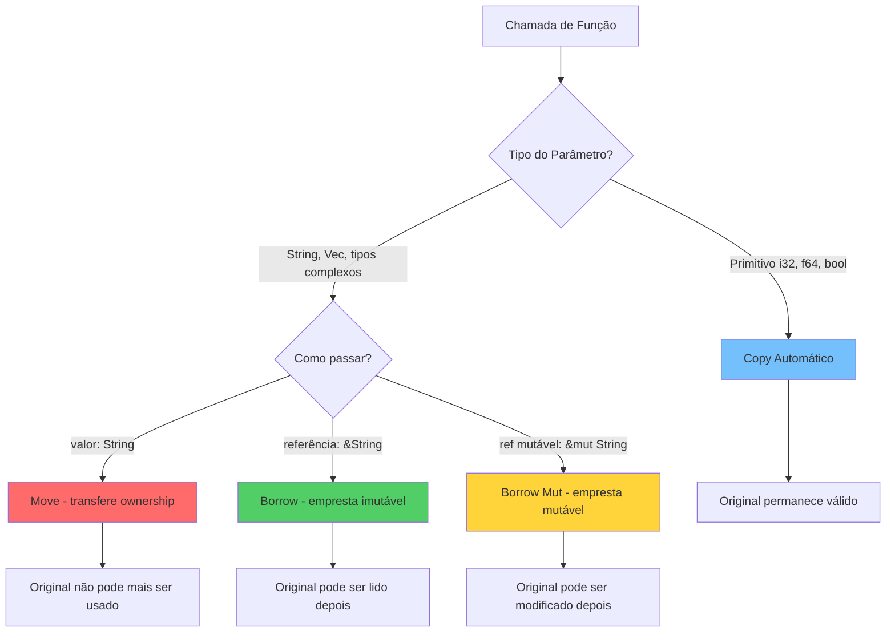
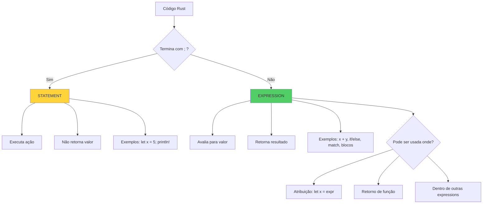
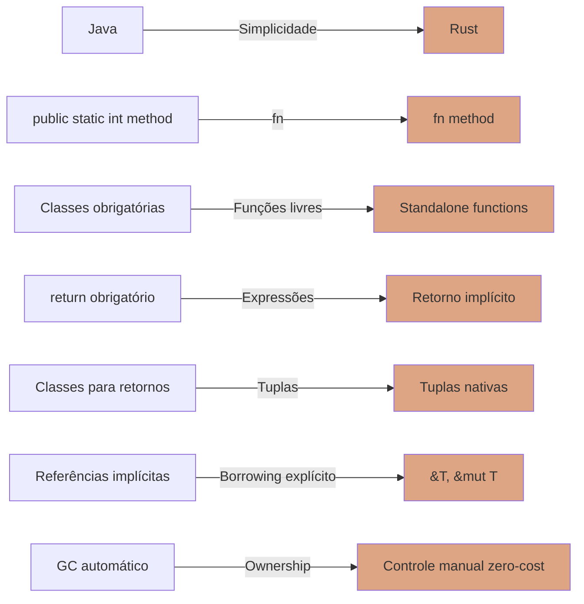
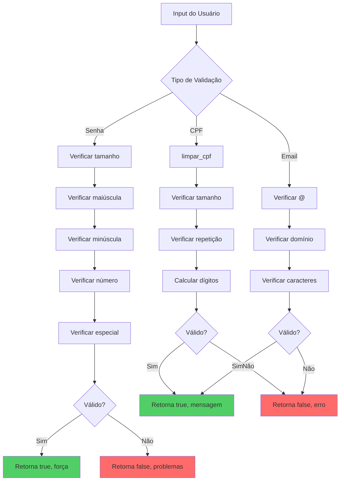

# 🎯 DIA 4: FUNÇÕES EM RUST
**Do Java ao Rust: Dominando Funções com Maestria**

---

## 📑 ÍNDICE

**[CAPÍTULO 1: ANATOMIA DE UMA FUNÇÃO RUST](#cap1)**  
**[CAPÍTULO 2: PARÂMETROS - O JEITO RUST](#cap2)**  
**[CAPÍTULO 3: RETORNOS - A MÁGICA DO IMPLÍCITO](#cap3)**  
**[CAPÍTULO 4: STATEMENTS VS EXPRESSIONS](#cap4)**  
**[CAPÍTULO 5: COMPARAÇÃO JAVA ↔ RUST](#cap5)**  
**[CAPÍTULO 6: EXERCÍCIO 1 - BIBLIOTECA MATEMÁTICA](#cap6)**  
**[CAPÍTULO 7: EXERCÍCIO 2 - CALCULADORA MODULAR](#cap7)**  
**[CAPÍTULO 8: EXERCÍCIO 3 - SISTEMA DE VALIDAÇÃO](#cap8)**  
**[CAPÍTULO 9: BOAS PRÁTICAS E PADRÕES](#cap9)**

---

<a name="cap1"></a>
## 🔧 CAPÍTULO 1: ANATOMIA DE UMA FUNÇÃO RUST

### A Sintaxe Básica

Pense numa função Rust como uma **receita de bolo bem estruturada**: você precisa dizer **exatamente** quais ingredientes recebe, e **exatamente** o que vai sair do forno.

```rust {.line-numbers}
fn nome_da_funcao(parametro: TipoParametro) -> TipoRetorno {
    // corpo da função
    resultado // <-- sem ponto e vírgula = retorno implícito!
}
```

**Detalhando cada parte:**

- **`fn`** → A palavra-chave que declara uma função  
- **`nome_da_funcao`** → Por convenção, snake_case (diferente do camelCase Java!)  
- **`(parametro: TipoParametro)`** → Parâmetros com **tipos explícitos obrigatórios**  
- **`-> TipoRetorno`** → Declara o tipo de retorno (omita se a função não retorna nada)  
- **`{ ... }`** → O corpo da função

### Primeiro Exemplo Prático

```rust {.line-numbers}
// Função que soma dois números
fn somar(a: i32, b: i32) -> i32 {
    a + b // <-- SEM ponto e vírgula! Isso é um RETORNO IMPLÍCITO
}

fn main() {
    let resultado = somar(10, 20);
    println!("Resultado: {}", resultado); // Saída: Resultado: 30
}
```

**🎭 Analogia:** Imagine que o ponto e vírgula `;` é como um ponto final numa frase. Quando você **NÃO** coloca o ponto final na última linha, o Rust entende: *"Ah, isso é a resposta que você quer me dar!"*

### Funções Sem Retorno

Se a função não retorna nada, você tem duas opções:

```rust {.line-numbers}
// Opção 1: Omitir o tipo de retorno (mais comum)
fn imprimir_mensagem(texto: &str) {
    println!("{}", texto);
}

// Opção 2: Explicitamente declarar () (unit type)
fn imprimir_mensagem_v2(texto: &str) -> () {
    println!("{}", texto);
}
```

**💡 Comparação com Java:**  
Em Java você usaria `void`. Em Rust, tecnicamente é `()` (chamado de "unit type"), mas você pode omitir.

### Múltiplos Parâmetros

```rust {.line-numbers}
fn calcular_media(n1: f64, n2: f64, n3: f64) -> f64 {
    (n1 + n2 + n3) / 3.0
}

fn main() {
    let media = calcular_media(7.5, 8.0, 9.5);
    println!("Média: {:.2}", media); // Saída: Média: 8.33
}
```

**🔍 Observação Importante:**  
Note que usamos `f64` (double em Java) e a divisão por `3.0` (não `3`). Rust é **extremamente rigoroso** com tipos numéricos - não há conversão implícita como em Java!

### Chamando Funções

```rust {.line-numbers}
fn dobrar(x: i32) -> i32 {
    x * 2
}

fn quadruplicar(x: i32) -> i32 {
    dobrar(dobrar(x)) // Composição de funções!
}

fn main() {
    println!("{}", quadruplicar(5)); // Saída: 20
}
```

---

**[⬆️ Voltar ao Índice](#índice)**

---

<a name="cap2"></a>
## 📦 CAPÍTULO 2: PARÂMETROS - O JEITO RUST

### Tipos Explícitos: Não Tem Jeito!

Diferente de Java onde você pode ter inferência parcial em lambdas, em Rust **todos os parâmetros de funções precisam ter tipos explícitos**.

```rust {.line-numbers}
// ✅ CORRETO
fn somar(a: i32, b: i32) -> i32 {
    a + b
}

// ❌ ERRO! Não compila
fn somar_errado(a, b) {
    a + b
}
```

**🎭 Analogia:** É como um contrato jurídico - você precisa especificar **exatamente** o que está recebendo e entregando. Nada de "confie em mim, vai dar certo!" 😄

### Passagem Por Valor (Padrão)

Por padrão, Rust passa parâmetros **por valor** (move semantics - vamos aprofundar no Dia 15-16):

```rust {.line-numbers}
fn consumir_string(s: String) {
    println!("Recebi: {}", s);
} // s é "dropado" aqui (liberado da memória)

fn main() {
    let minha_string = String::from("Olá");
    consumir_string(minha_string);
    // println!("{}", minha_string); // ❌ ERRO! minha_string foi movida
}
```

**💡 Importante:** Isso é **muito diferente** do Java! Em Java, objetos são sempre passados por referência. Aqui, a String foi **movida** para dentro da função.

### Passagem Por Referência (Borrowing)

Para **emprestar** um valor sem transferir ownership:

```rust {.line-numbers}
fn imprimir_string(s: &String) { // & = referência imutável
    println!("Recebi emprestado: {}", s);
} // s volta para o dono original

fn main() {
    let minha_string = String::from("Olá");
    imprimir_string(&minha_string); // Empresto com &
    println!("Ainda tenho: {}", minha_string); // ✅ Funciona!
}
```

**🎭 Analogia:** É como emprestar um livro para um amigo:
- **Por valor (move):** Você **dá** o livro - ele agora é dono
- **Por referência (&):** Você **empresta** o livro - ele lê e devolve

### Referências Mutáveis

Para modificar um valor emprestado:

```rust {.line-numbers}
fn adicionar_exclamacao(s: &mut String) {
    s.push_str("!");
}

fn main() {
    let mut minha_string = String::from("Olá");
    adicionar_exclamacao(&mut minha_string);
    println!("{}", minha_string); // Saída: Olá!
}
```

**📌 Regras Importantes:**
- Só pode haver **UMA** referência mutável ativa por vez
- **OU** várias referências imutáveis **OU** uma mutável (nunca ambas!)

### Tipos Primitivos: Copy Trait

Tipos primitivos implementam `Copy`, então são **copiados** automaticamente:

```rust {.line-numbers}
fn dobrar(x: i32) -> i32 {
    x * 2
}

fn main() {
    let numero = 10;
    let resultado = dobrar(numero); // numero é COPIADO
    println!("Original: {}, Dobro: {}", numero, resultado); // ✅ Ambos acessíveis!
}
```

**💡 Tipos que são Copy por padrão:**
- Inteiros: `i8`, `i32`, `u64`, etc.
- Floats: `f32`, `f64`
- Booleanos: `bool`
- Caracteres: `char`
- Tuplas de tipos Copy: `(i32, bool)`

### Diagrama: Passagem de Parâmetros



### Exemplo Completo: Três Estilos

```rust {.line-numbers}
// 1. Por valor - consome o parâmetro
fn processar_por_valor(mut s: String) -> String {
    s.push_str(" - processado");
    s
}

// 2. Por referência imutável - só lê
fn processar_por_ref(s: &String) -> usize {
    s.len()
}

// 3. Por referência mutável - modifica in-place
fn processar_por_ref_mut(s: &mut String) {
    s.push_str(" - modificado");
}

fn main() {
    // Exemplo 1: Move
    let s1 = String::from("Teste");
    let resultado = processar_por_valor(s1);
    println!("{}", resultado); // ✅
    // println!("{}", s1); // ❌ ERRO: s1 foi movido
    
    // Exemplo 2: Borrow imutável
    let s2 = String::from("Teste");
    let tamanho = processar_por_ref(&s2);
    println!("Tamanho: {}, String: {}", tamanho, s2); // ✅ Ambos ok!
    
    // Exemplo 3: Borrow mutável
    let mut s3 = String::from("Teste");
    processar_por_ref_mut(&mut s3);
    println!("{}", s3); // Saída: Teste - modificado
}
```

**🎯 Quando usar cada um?**

- **Por valor (move):** Quando a função precisa **assumir ownership** (ex: builders, consumidores)  
- **Por referência `&T`:** Quando só precisa **ler** o valor (mais comum!)  
- **Por referência mutável `&mut T`:** Quando precisa **modificar** o valor in-place

---

**[⬆️ Voltar ao Índice](#índice)**

---

<a name="cap3"></a>
## 🎁 CAPÍTULO 3: RETORNOS - A MÁGICA DO IMPLÍCITO

### Retorno Implícito: A Feature Mais Legal

Em Rust, a **última expressão** de uma função é automaticamente retornada **se não tiver ponto e vírgula**:

```rust {.line-numbers}
fn somar(a: i32, b: i32) -> i32 {
    a + b // <-- SEM ; = retorno implícito
}

// Equivalente em Java:
// int somar(int a, int b) {
//     return a + b; // <-- PRECISA do return explícito
// }
```

**🎭 Analogia:** É como numa conversa casual:
- **Java (explícito):** "A resposta é: 42" (você avisa que vai responder)
- **Rust (implícito):** "42" (você já responde diretamente)

### Retorno Explícito com `return`

Você **pode** usar `return` explícito, especialmente para retornos antecipados:

```rust {.line-numbers}
fn dividir(a: i32, b: i32) -> i32 {
    if b == 0 {
        return 0; // Retorno antecipado!
    }
    
    a / b // Retorno implícito no final
}
```

**📌 Quando usar `return` explícito?**
- Retornos antecipados (early returns)
- Dentro de condicionais complexas
- Quando você quer deixar mais explícito

### O Perigo do Ponto e Vírgula

**CUIDADO!** O ponto e vírgula transforma uma expressão em statement:

```rust {.line-numbers}
fn errado() -> i32 {
    42; // <-- ERRO! Ponto e vírgula faz isso virar um statement
}       // A função não retorna nada agora!

fn correto() -> i32 {
    42 // <-- SEM ponto e vírgula = retorno implícito
}
```

**💥 Erro do compilador:**

```
error[E0308]: mismatched types
 --> src/main.rs:2:20
  |
2 | fn errado() -> i32 {
  |    ------      ^^^ expected `i32`, found `()`
  |    |
  |    implicitly returns `()` as its body has no tail expression
3 |     42;
  |       - help: remove this semicolon
```

**🎭 Analogia:** O ponto e vírgula é como dizer "fim de papo" - você executou algo, mas não está respondendo nada.

### Retornando Múltiplos Valores com Tuplas

Rust não tem a complexidade de criar classes auxiliares como em Java - use tuplas!

```rust {.line-numbers}
// Retorna (quociente, resto)
fn dividir_com_resto(dividendo: i32, divisor: i32) -> (i32, i32) {
    let quociente = dividendo / divisor;
    let resto = dividendo % divisor;
    (quociente, resto) // Tupla como retorno
}

fn main() {
    let (q, r) = dividir_com_resto(17, 5); // Destructuring direto!
    println!("17 ÷ 5 = {} com resto {}", q, r); // Saída: 17 ÷ 5 = 3 com resto 2
    
    // Ou capturar a tupla inteira
    let resultado = dividir_com_resto(20, 3);
    println!("Resultado: {:?}", resultado); // Saída: Resultado: (6, 2)
}
```

**💡 Em Java você precisaria fazer:**

```java
class ResultadoDivisao {
    int quociente;
    int resto;
}

ResultadoDivisao dividirComResto(int dividendo, int divisor) {
    // ... criar objeto, popular campos, return
}
```

**Muito mais verboso!** Tuplas são leves e diretas.

### Tuplas com Tipos Diferentes

```rust {.line-numbers}
// Retorna (sucesso: bool, resultado: i32, mensagem: String)
fn processar_numero(n: i32) -> (bool, i32, String) {
    if n < 0 {
        return (false, 0, String::from("Número negativo não permitido"));
    }
    
    (true, n * 2, String::from("Sucesso!"))
}

fn main() {
    let (ok, valor, msg) = processar_numero(10);
    
    if ok {
        println!("✅ {} - Valor: {}", msg, valor);
    } else {
        println!("❌ {}", msg);
    }
}
```

**🎯 Dica:** Para tuplas com mais de 3 elementos, considere usar uma struct - fica mais legível!

### Retorno de Expressões Complexas

Blocos `if`, `match` também podem ser expressões:

```rust {.line-numbers}
fn classificar_nota(nota: f64) -> &'static str {
    if nota >= 9.0 {
        "Excelente" // <-- Retorno implícito no if
    } else if nota >= 7.0 {
        "Bom"
    } else if nota >= 5.0 {
        "Regular"
    } else {
        "Insuficiente"
    }
}

fn classificar_com_match(nota: i32) -> &'static str {
    match nota {
        10 | 9 => "Excelente",
        8 | 7 => "Bom",
        6 | 5 => "Regular",
        _ => "Insuficiente"
    } // <-- Todo o match é uma expressão!
}
```

### Diagrama: Fluxo de Retorno

```mermaid
graph TD
    A[Função] --> B{Última Expressão}
    B -->|Sem ponto e vírgula| C[Retorno Implícito]
    B -->|Com ponto e vírgula ;| D[Statement - Retorna ()]
    
    A --> E{Palavra return?}
    E -->|Sim| F[Retorno Explícito Antecipado]
    E -->|Não| C
    
    C --> G[Valor retornado ao chamador]
    D --> H[ERRO se esperava retorno!]
    F --> G
    
    style C fill:#51cf66
    style D fill:#ff6b6b
    style F fill:#ffd43b
```

### Exemplo Completo: Estilos de Retorno

```rust {.line-numbers}
// 1. Retorno implícito simples
fn quadrado(x: i32) -> i32 {
    x * x
}

// 2. Retorno explícito com early return
fn raiz_quadrada_aprox(n: f64) -> f64 {
    if n < 0.0 {
        return 0.0; // Early return
    }
    
    n.sqrt() // Retorno implícito normal
}

// 3. Retorno de expressão if
fn maximo(a: i32, b: i32) -> i32 {
    if a > b {
        a
    } else {
        b
    }
}

// 4. Retorno de tupla
fn min_max(a: i32, b: i32) -> (i32, i32) {
    if a < b {
        (a, b)
    } else {
        (b, a)
    }
}

// 5. Retorno de bloco complexo
fn processar(x: i32) -> i32 {
    let resultado = {
        let dobro = x * 2;
        let triplo = x * 3;
        dobro + triplo // Retorno do bloco
    }; // <-- Note o ; aqui!
    
    resultado * 2 // Retorno da função
}

fn main() {
    println!("Quadrado: {}", quadrado(5));
    println!("Raiz: {}", raiz_quadrada_aprox(16.0));
    println!("Máximo: {}", maximo(10, 20));
    
    let (min, max) = min_max(15, 5);
    println!("Min: {}, Max: {}", min, max);
    
    println!("Processado: {}", processar(3));
}
```

---

**[⬆️ Voltar ao Índice](#índice)**

---

<a name="cap4"></a>
## ⚖️ CAPÍTULO 4: STATEMENTS VS EXPRESSIONS

### A Diferença Fundamental

Essa é uma das diferenças **mais importantes** entre Java e Rust:

**Statement (Declaração):** Executa uma ação, **não retorna valor**  
**Expression (Expressão):** Avalia para um valor, **sempre retorna algo**

```rust {.line-numbers}
fn exemplo_statement_vs_expression() {
    // STATEMENTS - terminam com ;
    let x = 5;        // Declaração de variável (statement)
    let y = 10;       // Outra declaração (statement)
    println!("Oi");   // Chamada de função (statement quando tem ;)
    
    // EXPRESSIONS - avaliam para um valor
    let soma = x + y;          // x + y é expression
    let dobro = {              // Bloco inteiro é expression
        let temp = x * 2;
        temp                    // <-- sem ; = retorna o valor
    };
    
    // if/else é EXPRESSION em Rust!
    let maximo = if x > y { x } else { y };
}
```

**🎭 Analogia:**
- **Statement:** "Vá até a padaria." (uma ordem, não espera resposta)
- **Expression:** "Quanto custa o pão?" (uma pergunta, espera um valor)

### Exemplos de Statements

```rust {.line-numbers}
fn exemplos_statements() {
    let x = 5;           // Statement
    x + 1;               // Expression virou statement por causa do ;
    println!("Teste");   // Statement
    
    // Tentar atribuir um statement não funciona:
    // let y = (let z = 10); // ❌ ERRO! let é statement, não retorna valor
}
```

### Exemplos de Expressions

Quase tudo em Rust é expression:

```rust {.line-numbers}
fn exemplos_expressions() -> i32 {
    let x = 5;
    
    // 1. Operações matemáticas
    let y = x + 10; // x + 10 é expression
    
    // 2. Blocos
    let z = {
        let a = 1;
        let b = 2;
        a + b // Retorna 3
    };
    
    // 3. if/else
    let idade = 20;
    let categoria = if idade >= 18 {
        "Adulto"
    } else {
        "Menor"
    };
    
    // 4. match
    let numero = 3;
    let descricao = match numero {
        1 => "um",
        2 => "dois",
        3 => "três",
        _ => "outro"
    };
    
    // 5. Chamadas de função (sem ;)
    let resultado = calcular(10);
    
    resultado // <-- Retorno da função (expression)
}

fn calcular(n: i32) -> i32 {
    n * 2
}
```

### Blocos Como Expressions

Um dos recursos mais poderosos:

```rust {.line-numbers}
fn calcular_preco() -> f64 {
    let preco_base = 100.0;
    
    // Bloco complexo que retorna um valor
    let preco_final = {
        let desconto = if preco_base > 50.0 { 0.1 } else { 0.0 };
        let taxa = 0.05;
        
        preco_base * (1.0 - desconto) * (1.0 + taxa)
    }; // <-- Note o ; porque estamos atribuindo a let
    
    preco_final
}
```

**💡 Em Java você precisaria:**

```java
double calcularPreco() {
    double precoBase = 100.0;
    
    // Precisa de variáveis temporárias
    double desconto = precoBase > 50.0 ? 0.1 : 0.0;
    double taxa = 0.05;
    double precoFinal = precoBase * (1.0 - desconto) * (1.0 + taxa);
    
    return precoFinal;
}
```

### if Como Expression (Ternário Turbinado)

```rust {.line-numbers}
fn exemplo_if_expression() {
    let numero = 7;
    
    // Rust: if é expression
    let resultado = if numero % 2 == 0 {
        "par"
    } else {
        "ímpar"
    };
    
    // Java equivalente: operador ternário
    // String resultado = (numero % 2 == 0) ? "par" : "ímpar";
    
    // Mas em Rust você pode ter lógica complexa!
    let categoria = if numero < 0 {
        "negativo"
    } else if numero == 0 {
        "zero"
    } else if numero <= 10 {
        "pequeno"
    } else if numero <= 100 {
        "médio"
    } else {
        "grande"
    };
    
    println!("{} é {}", numero, categoria);
}
```

### match Como Expression

```rust {.line-numbers}
fn processar_opcao(opcao: i32) -> String {
    // match SEMPRE retorna um valor
    match opcao {
        1 => String::from("Opção um selecionada"),
        2 => String::from("Opção dois selecionada"),
        3 => {
            // Pode ter lógica complexa
            let msg = format!("Opção {} - especial", opcao);
            msg // <-- Retorno do braço
        },
        _ => String::from("Opção inválida")
    } // <-- Todo match retorna um valor
}
```

### Diagrama: Anatomia de Expressions vs Statements



### Exemplo Prático: Calculadora com Expressions

```rust {.line-numbers}
fn calcular(operador: char, a: f64, b: f64) -> f64 {
    // match como expression - retorna diretamente
    match operador {
        '+' => a + b,
        '-' => a - b,
        '*' => a * b,
        '/' => {
            if b != 0.0 {
                a / b
            } else {
                0.0 // Tratamento de erro simplificado
            }
        },
        _ => {
            println!("Operador desconhecido!");
            0.0
        }
    } // <-- Retorno implícito do match
}

fn main() {
    let resultado = calcular('+', 10.0, 5.0);
    println!("Resultado: {}", resultado);
}
```

### Regra de Ouro

> **Se não tem ponto e vírgula no final, é uma expression que retorna um valor!**

```rust {.line-numbers}
fn demonstracao() -> i32 {
    let x = {
        let a = 1;
        let b = 2;
        a + b        // <-- Expression (sem ;) - retorna 3
    };              // <-- ; transforma o bloco em statement
    
    let y = {
        let c = 4;
        c * 2;      // <-- ; faz virar statement
    };              // y recebe () (unit type)!
    
    x               // <-- Retorno da função (expression)
}
```

**⚠️ Cuidado:**

```rust {.line-numbers}
fn pegadinha() -> i32 {
    let resultado = {
        let x = 10;
        x * 2;  // <-- ERRO! ; transforma em statement
    };          // resultado é () não i32!
    
    resultado   // ❌ ERRO: expected i32, found ()
}
```

---

**[⬆️ Voltar ao Índice](#índice)**

---

<a name="cap5"></a>
## 🔄 CAPÍTULO 5: COMPARAÇÃO JAVA ↔ RUST

### Tabela Comparativa Completa

| Aspecto | Java | Rust |
|---------|------|------|
| **Declaração** | `public static int soma(int a, int b)` | `fn soma(a: i32, b: i32) -> i32` |
| **Retorno** | `return a + b;` (obrigatório) | `a + b` (implícito sem `;`) |
| **Void** | `void metodo()` | `fn funcao()` ou `fn funcao() -> ()` |
| **Sobrecarga** | Suportada | Não suportada (use nomes diferentes ou generics) |
| **Tuplas** | Não nativas (precisa criar classe) | Nativas: `(i32, String, bool)` |
| **Classes** | Obrigatórias para métodos | Funções podem ser standalone |
| **Passagem** | Sempre por referência (objetos) | Explícita: valor, `&T`, `&mut T` |
| **GC** | Sim (automático) | Não (ownership + borrow checker) |
| **Inferência** | Parcial (var desde Java 10) | Total dentro de funções |
| **Expressions** | Limitadas (operador ternário) | Quase tudo é expression (if, match, blocos) |

### Exemplo 1: Função Simples

**Java:**

```java
public class Calculator {
    public static int somar(int a, int b) {
        return a + b;
    }
    
    public static void main(String[] args) {
        int resultado = somar(10, 20);
        System.out.println("Resultado: " + resultado);
    }
}
```

**Rust:**

```rust {.line-numbers}
fn somar(a: i32, b: i32) -> i32 {
    a + b // Sem return, sem ponto e vírgula!
}

fn main() {
    let resultado = somar(10, 20);
    println!("Resultado: {}", resultado);
}
```

**Diferenças chave:**
- Rust não precisa de classes para funções standalone
- `fn` substitui todo o `public static int`
- Retorno implícito (sem `return`)
- Menos boilerplate!

### Exemplo 2: Múltiplos Retornos

**Java:**

```java
class ResultadoDivisao {
    int quociente;
    int resto;
    
    ResultadoDivisao(int q, int r) {
        this.quociente = q;
        this.resto = r;
    }
}

public class Main {
    public static ResultadoDivisao dividirComResto(int a, int b) {
        return new ResultadoDivisao(a / b, a % b);
    }
    
    public static void main(String[] args) {
        ResultadoDivisao res = dividirComResto(17, 5);
        System.out.println(res.quociente + " resto " + res.resto);
    }
}
```

**Rust:**

```rust {.line-numbers}
fn dividir_com_resto(a: i32, b: i32) -> (i32, i32) {
    (a / b, a % b) // Tupla direta!
}

fn main() {
    let (quociente, resto) = dividir_com_resto(17, 5); // Destructuring!
    println!("{} resto {}", quociente, resto);
}
```

**Vantagens Rust:**
- Sem necessidade de classe auxiliar
- Tuplas nativas e leves
- Destructuring direto na atribuição
- Muito menos código!

### Exemplo 3: Passagem de Parâmetros

**Java (sempre por referência para objetos):**

```java
public class Main {
    static void modificarLista(List<String> lista) {
        lista.add("novo");
    }
    
    public static void main(String[] args) {
        List<String> minhaLista = new ArrayList<>();
        modificarLista(minhaLista);
        System.out.println(minhaLista); // [novo] - foi modificada!
    }
}
```

**Rust (controle explícito via borrowing):**

```rust {.line-numbers}
fn modificar_vetor(v: &mut Vec<String>) {
    v.push(String::from("novo"));
}

fn apenas_ler(v: &Vec<String>) {
    println!("Tamanho: {}", v.len());
}

fn consumir(v: Vec<String>) {
    println!("Consumi: {:?}", v);
} // v é dropado aqui

fn main() {
    let mut meu_vetor = vec![String::from("inicial")];
    
    modificar_vetor(&mut meu_vetor);    // Empresto mutável
    apenas_ler(&meu_vetor);             // Empresto imutável
    // consumir(meu_vetor);              // Move - não posso mais usar depois!
    
    println!("{:?}", meu_vetor);
}
```

**Diferenças críticas:**
- Rust exige **explicitamente** dizer se vai modificar (`&mut`)
- Rust permite **mover** ownership (consumir)
- Java sempre passa referências, Rust te dá controle total

### Exemplo 4: Sobrecarga (ou falta dela)

**Java (suporta overloading):**

```java
public class Calculator {
    public int somar(int a, int b) {
        return a + b;
    }
    
    public double somar(double a, double b) {
        return a + b;
    }
    
    public int somar(int a, int b, int c) {
        return a + b + c;
    }
}
```

**Rust (NÃO suporta overloading):**

```rust {.line-numbers}
// Precisa de nomes diferentes ou usar generics com traits
fn somar_i32(a: i32, b: i32) -> i32 {
    a + b
}

fn somar_f64(a: f64, b: f64) -> f64 {
    a + b
}

fn somar_tres(a: i32, b: i32, c: i32) -> i32 {
    a + b + c
}

// OU usar generics (vamos ver mais à frente):
use std::ops::Add;

fn somar_generico<T: Add<Output = T>>(a: T, b: T) -> T {
    a + b
}
```

**Por que Rust não tem overloading?**
- Simplicidade do compilador
- Clareza: nome diferente = comportamento diferente
- Generics + Traits oferecem polimorfismo mais poderoso

### Exemplo 5: Expressões

**Java (statements dominam):**

```java
public int classificarNota(double nota) {
    int categoria;
    if (nota >= 9.0) {
        categoria = 4;
    } else if (nota >= 7.0) {
        categoria = 3;
    } else if (nota >= 5.0) {
        categoria = 2;
    } else {
        categoria = 1;
    }
    return categoria;
}
```

**Rust (if é expression):**

```rust {.line-numbers}
fn classificar_nota(nota: f64) -> i32 {
    if nota >= 9.0 {
        4
    } else if nota >= 7.0 {
        3
    } else if nota >= 5.0 {
        2
    } else {
        1
    } // <-- Retorno direto, sem variável intermediária!
}

// OU ainda melhor com match:
fn classificar_nota_v2(nota: i32) -> &'static str {
    match nota {
        10 | 9 => "Excelente",
        8 | 7 => "Bom",
        6 | 5 => "Regular",
        _ => "Insuficiente"
    }
}
```

### Diagrama: Evolução Conceitual Java → Rust



### Mindset: Java vs Rust

**Java:**
- "Tudo é um objeto"
- GC cuida da memória
- Runtime resolve muita coisa
- Segurança via JVM

**Rust:**
- "Tudo é uma expressão"
- Ownership cuida da memória
- Compilador resolve TUDO
- Segurança via type system

---

**[⬆️ Voltar ao Índice](#índice)**

---

<a name="cap6"></a>
## 🧮 CAPÍTULO 6: EXERCÍCIO 1 - BIBLIOTECA MATEMÁTICA

Agora vamos colocar a mão na massa! Vamos criar uma biblioteca com funções matemáticas clássicas.

### 📋 Requisitos

Implementar funções para:
- Fatorial
- Fibonacci (recursivo e iterativo)
- Verificar número primo
- MDC (Máximo Divisor Comum)
- MMC (Mínimo Múltiplo Comum)

### 🎯 Objetivos de Aprendizado

- Separar funções reutilizáveis
- Usar retorno implícito
- Comparar recursão vs iteração
- Demonstrar tuplas para retornos múltiplos
- Escrever testes para cada função

### 💻 Código Completo: `src/main.rs`

```rust {.line-numbers}
// ========================================
// BIBLIOTECA MATEMÁTICA
// ========================================

/// Calcula o fatorial de um número
/// Exemplo: fatorial(5) = 5 * 4 * 3 * 2 * 1 = 120
fn fatorial(n: u64) -> u64 {
    if n == 0 || n == 1 {
        return 1; // Caso base
    }
    
    n * fatorial(n - 1) // Recursão + retorno implícito
}

/// Fatorial iterativo (mais eficiente)
fn fatorial_iterativo(n: u64) -> u64 {
    let mut resultado = 1;
    
    for i in 2..=n {
        resultado *= i;
    }
    
    resultado // Retorno implícito
}

// ========================================

/// Fibonacci recursivo (LENTO para n > 40)
fn fibonacci_recursivo(n: u32) -> u64 {
    match n {
        0 => 0,
        1 => 1,
        _ => fibonacci_recursivo(n - 1) + fibonacci_recursivo(n - 2)
    }
}

/// Fibonacci iterativo (RÁPIDO)
fn fibonacci_iterativo(n: u32) -> u64 {
    if n == 0 {
        return 0;
    }
    if n == 1 {
        return 1;
    }
    
    let mut anterior = 0;
    let mut atual = 1;
    
    for _ in 2..=n {
        let proximo = anterior + atual;
        anterior = atual;
        atual = proximo;
    }
    
    atual
}

/// Retorna (valor, tempo_ms) para comparar performance
fn fibonacci_com_tempo(n: u32, usar_recursivo: bool) -> (u64, u128) {
    use std::time::Instant;
    
    let inicio = Instant::now();
    
    let resultado = if usar_recursivo {
        fibonacci_recursivo(n)
    } else {
        fibonacci_iterativo(n)
    };
    
    let duracao = inicio.elapsed().as_millis();
    
    (resultado, duracao) // Tupla com resultado e tempo
}

// ========================================

/// Verifica se um número é primo
fn eh_primo(n: u64) -> bool {
    if n < 2 {
        return false;
    }
    if n == 2 {
        return true;
    }
    if n % 2 == 0 {
        return false; // Pares (exceto 2) não são primos
    }
    
    // Só precisa testar até raiz quadrada de n
    let limite = (n as f64).sqrt() as u64;
    
    for divisor in (3..=limite).step_by(2) {
        if n % divisor == 0 {
            return false;
        }
    }
    
    true
}

/// Retorna (eh_primo: bool, divisores: Vec<u64>)
fn analisar_numero(n: u64) -> (bool, Vec<u64>) {
    let primo = eh_primo(n);
    
    let mut divisores = Vec::new();
    
    if !primo {
        for i in 2..=n {
            if n % i == 0 {
                divisores.push(i);
            }
        }
    }
    
    (primo, divisores)
}

// ========================================

/// Calcula o MDC (Máximo Divisor Comum) usando algoritmo de Euclides
fn mdc(a: u64, b: u64) -> u64 {
    if b == 0 {
        a
    } else {
        mdc(b, a % b) // Recursão elegante!
    }
}

/// MDC iterativo (alternativa)
fn mdc_iterativo(mut a: u64, mut b: u64) -> u64 {
    while b != 0 {
        let temp = b;
        b = a % b;
        a = temp;
    }
    a
}

/// Calcula o MMC (Mínimo Múltiplo Comum)
/// Fórmula: MMC(a, b) = (a * b) / MDC(a, b)
fn mmc(a: u64, b: u64) -> u64 {
    (a * b) / mdc(a, b)
}

/// Retorna (mdc, mmc) de uma vez
fn mdc_mmc(a: u64, b: u64) -> (u64, u64) {
    let divisor_comum = mdc(a, b);
    let multiplo_comum = (a * b) / divisor_comum;
    (divisor_comum, multiplo_comum)
}

// ========================================

/// Encontra todos os primos até n (Crivo de Eratóstenes)
fn primos_ate(n: u64) -> Vec<u64> {
    if n < 2 {
        return Vec::new();
    }
    
    let mut eh_primo = vec![true; (n + 1) as usize];
    eh_primo[0] = false;
    eh_primo[1] = false;
    
    let limite = (n as f64).sqrt() as u64;
    
    for i in 2..=limite {
        if eh_primo[i as usize] {
            let mut multiplo = i * i;
            while multiplo <= n {
                eh_primo[multiplo as usize] = false;
                multiplo += i;
            }
        }
    }
    
    // Coleta os primos
    let mut primos = Vec::new();
    for (num, &primo) in eh_primo.iter().enumerate() {
        if primo {
            primos.push(num as u64);
        }
    }
    
    primos
}

// ========================================
// FUNÇÃO MAIN - DEMONSTRAÇÃO
// ========================================

fn main() {
    println!("🧮 BIBLIOTECA MATEMÁTICA EM RUST\n");
    
    // FATORIAIS
    println!("=== FATORIAIS ===");
    for i in 0..=10 {
        println!("{}! = {}", i, fatorial(i));
    }
    
    // FIBONACCI
    println!("\n=== FIBONACCI ===");
    for i in 0..=15 {
        println!("fib({}) = {}", i, fibonacci_iterativo(i));
    }
    
    // Comparação de performance
    println!("\n=== PERFORMANCE FIBONACCI(35) ===");
    let (resultado_rec, tempo_rec) = fibonacci_com_tempo(35, true);
    println!("Recursivo: {} ({}ms)", resultado_rec, tempo_rec);
    
    let (resultado_iter, tempo_iter) = fibonacci_com_tempo(35, false);
    println!("Iterativo: {} ({}ms)", resultado_iter, tempo_iter);
    println!("Iterativo é {}x mais rápido!", tempo_rec / tempo_iter);
    
    // PRIMOS
    println!("\n=== NÚMEROS PRIMOS ===");
    let numeros = [2, 3, 4, 17, 25, 29, 97, 100];
    for &n in &numeros {
        let (primo, divisores) = analisar_numero(n);
        if primo {
            println!("{} é PRIMO", n);
        } else {
            println!("{} NÃO é primo - divisores: {:?}", n, divisores);
        }
    }
    
    // Primos até 50
    println!("\nPrimos até 50: {:?}", primos_ate(50));
    
    // MDC e MMC
    println!("\n=== MDC e MMC ===");
    let pares = [(12, 18), (24, 36), (15, 25), (7, 13)];
    for (a, b) in pares {
        let (divisor, multiplo) = mdc_mmc(a, b);
        println!("MDC({}, {}) = {} | MMC({}, {}) = {}", 
                 a, b, divisor, a, b, multiplo);
    }
}

// ========================================
// TESTES AUTOMATIZADOS
// ========================================

#[cfg(test)]
mod tests {
    use super::*;
    
    #[test]
    fn test_fatorial() {
        assert_eq!(fatorial(0), 1);
        assert_eq!(fatorial(1), 1);
        assert_eq!(fatorial(5), 120);
        assert_eq!(fatorial(10), 3628800);
    }
    
    #[test]
    fn test_fatorial_iterativo() {
        assert_eq!(fatorial_iterativo(0), 1);
        assert_eq!(fatorial_iterativo(5), 120);
        assert_eq!(fatorial_iterativo(10), 3628800);
    }
    
    #[test]
    fn test_fibonacci() {
        assert_eq!(fibonacci_iterativo(0), 0);
        assert_eq!(fibonacci_iterativo(1), 1);
        assert_eq!(fibonacci_iterativo(10), 55);
        assert_eq!(fibonacci_iterativo(20), 6765);
    }
    
    #[test]
    fn test_eh_primo() {
        assert_eq!(eh_primo(2), true);
        assert_eq!(eh_primo(3), true);
        assert_eq!(eh_primo(4), false);
        assert_eq!(eh_primo(17), true);
        assert_eq!(eh_primo(97), true);
        assert_eq!(eh_primo(100), false);
    }
    
    #[test]
    fn test_mdc() {
        assert_eq!(mdc(12, 18), 6);
        assert_eq!(mdc(24, 36), 12);
        assert_eq!(mdc(7, 13), 1);
    }
    
    #[test]
    fn test_mmc() {
        assert_eq!(mmc(12, 18), 36);
        assert_eq!(mmc(4, 6), 12);
        assert_eq!(mmc(7, 13), 91);
    }
    
    #[test]
    fn test_primos_ate() {
        let primos = primos_ate(20);
        assert_eq!(primos, vec![2, 3, 5, 7, 11, 13, 17, 19]);
    }
}
```

### 🏃 Como Executar

```bash
# Criar projeto
cargo new biblioteca_matematica
cd biblioteca_matematica

# Copiar o código acima para src/main.rs

# Executar
cargo run

# Rodar testes
cargo test

# Rodar testes com output detalhado
cargo test -- --nocapture
```

### 📊 Saída Esperada

```
🧮 BIBLIOTECA MATEMÁTICA EM RUST

=== FATORIAIS ===
0! = 1
1! = 1
2! = 2
3! = 6
4! = 24
5! = 120
6! = 720
7! = 5040
8! = 40320
9! = 362880
10! = 3628800

=== FIBONACCI ===
fib(0) = 0
fib(1) = 1
fib(2) = 1
fib(3) = 2
fib(4) = 3
fib(5) = 5
...

=== PERFORMANCE FIBONACCI(35) ===
Recursivo: 9227465 (1234ms)
Iterativo: 9227465 (0ms)
Iterativo é muito mais rápido!

...
```

### 🎓 Conceitos Aplicados

**Retorno Implícito:**

```rust {.line-numbers}
fn mdc(a: u64, b: u64) -> u64 {
    if b == 0 {
        a  // <-- Sem ; = retorno
    } else {
        mdc(b, a % b)  // <-- Recursão também retorna
    }
}
```

**Tuplas para Múltiplos Retornos:**

```rust {.line-numbers}
fn mdc_mmc(a: u64, b: u64) -> (u64, u64) {
    let divisor = mdc(a, b);
    let multiplo = (a * b) / divisor;
    (divisor, multiplo)  // <-- Tupla!
}

// Uso:
let (meu_mdc, meu_mmc) = mdc_mmc(12, 18);
```

**Match como Expression:**

```rust {.line-numbers}
fn fibonacci_recursivo(n: u32) -> u64 {
    match n {
        0 => 0,
        1 => 1,
        _ => fibonacci_recursivo(n - 1) + fibonacci_recursivo(n - 2)
    }  // <-- Todo match retorna!
}
```

### 💡 Comparação com Java

**Java precisaria:**
- Classes separadas para organizar funções
- `return` explícito em todo lugar
- Classe auxiliar para retornar (mdc, mmc)
- Mais verboso em testes (JUnit)

**Rust oferece:**
- Funções standalone (sem classes)
- Retornos implícitos (código limpo)
- Tuplas nativas (zero overhead)
- Testes integrados com `#[test]`

---

**[⬆️ Voltar ao Índice](#índice)**

---

<a name="cap7"></a>
## 🔢 CAPÍTULO 7: EXERCÍCIO 2 - CALCULADORA MODULAR

Vamos criar uma calculadora com operações separadas em funções reutilizáveis.

### 📋 Requisitos

- Operações básicas: +, -, *, /, %, potência
- Funções separadas e reutilizáveis
- Menu interativo
- Tratamento de divisão por zero
- Histórico de operações

### 💻 Código Completo: `src/main.rs`

```rust {.line-numbers}
use std::io::{self, Write};

// ========================================
// OPERAÇÕES MATEMÁTICAS
// ========================================

fn somar(a: f64, b: f64) -> f64 {
    a + b
}

fn subtrair(a: f64, b: f64) -> f64 {
    a - b
}

fn multiplicar(a: f64, b: f64) -> f64 {
    a * b
}

/// Retorna (sucesso: bool, resultado: f64)
fn dividir(a: f64, b: f64) -> (bool, f64) {
    if b == 0.0 {
        (false, 0.0)
    } else {
        (true, a / b)
    }
}

fn resto(a: f64, b: f64) -> (bool, f64) {
    if b == 0.0 {
        (false, 0.0)
    } else {
        (true, a % b)
    }
}

fn potencia(base: f64, expoente: f64) -> f64 {
    base.powf(expoente)
}

fn raiz_quadrada(n: f64) -> (bool, f64) {
    if n < 0.0 {
        (false, 0.0)
    } else {
        (true, n.sqrt())
    }
}

// ========================================

/// Processa uma operação e retorna (sucesso, resultado, mensagem)
fn processar_operacao(op: char, a: f64, b: f64) -> (bool, f64, String) {
    match op {
        '+' => {
            let resultado = somar(a, b);
            (true, resultado, format!("{} + {} = {}", a, b, resultado))
        },
        '-' => {
            let resultado = subtrair(a, b);
            (true, resultado, format!("{} - {} = {}", a, b, resultado))
        },
        '*' => {
            let resultado = multiplicar(a, b);
            (true, resultado, format!("{} × {} = {}", a, b, resultado))
        },
        '/' => {
            let (ok, resultado) = dividir(a, b);
            if ok {
                (true, resultado, format!("{} ÷ {} = {}", a, b, resultado))
            } else {
                (false, 0.0, String::from("❌ Erro: Divisão por zero!"))
            }
        },
        '%' => {
            let (ok, resultado) = resto(a, b);
            if ok {
                (true, resultado, format!("{} % {} = {}", a, b, resultado))
            } else {
                (false, 0.0, String::from("❌ Erro: Resto por zero!"))
            }
        },
        '^' => {
            let resultado = potencia(a, b);
            (true, resultado, format!("{}^{} = {}", a, b, resultado))
        },
        _ => (false, 0.0, String::from("❌ Operação inválida!"))
    }
}

// ========================================
// UTILITÁRIOS DE I/O
// ========================================

fn ler_linha() -> String {
    let mut input = String::new();
    io::stdin()
        .read_line(&mut input)
        .expect("Falha ao ler entrada");
    input.trim().to_string()
}

fn ler_numero(prompt: &str) -> f64 {
    loop {
        print!("{}", prompt);
        io::stdout().flush().unwrap();
        
        let input = ler_linha();
        
        match input.parse::<f64>() {
            Ok(num) => return num,
            Err(_) => println!("❌ Por favor, digite um número válido!")
        }
    }
}

fn ler_operacao() -> char {
    loop {
        print!("Operação (+, -, *, /, %, ^): ");
        io::stdout().flush().unwrap();
        
        let input = ler_linha();
        
        if input.len() == 1 {
            let op = input.chars().next().unwrap();
            if "+-*/%^".contains(op) {
                return op;
            }
        }
        
        println!("❌ Operação inválida! Use: +, -, *, /, %, ^");
    }
}

// ========================================
// HISTÓRICO
// ========================================

struct Historico {
    operacoes: Vec<String>
}

impl Historico {
    fn novo() -> Self {
        Historico {
            operacoes: Vec::new()
        }
    }
    
    fn adicionar(&mut self, operacao: String) {
        self.operacoes.push(operacao);
    }
    
    fn exibir(&self) {
        if self.operacoes.is_empty() {
            println!("📝 Histórico vazio");
        } else {
            println!("\n📝 HISTÓRICO DE OPERAÇÕES:");
            for (i, op) in self.operacoes.iter().enumerate() {
                println!("  {}. {}", i + 1, op);
            }
        }
    }
    
    fn limpar(&mut self) {
        self.operacoes.clear();
        println!("🗑️  Histórico limpo!");
    }
}

// ========================================
// MENU E INTERFACE
// ========================================

fn exibir_menu() {
    println!("\n╔══════════════════════════════╗");
    println!("║   🔢 CALCULADORA RUST 🦀    ║");
    println!("╠══════════════════════════════╣");
    println!("║ 1. Nova operação             ║");
    println!("║ 2. Raiz quadrada             ║");
    println!("║ 3. Ver histórico             ║");
    println!("║ 4. Limpar histórico          ║");
    println!("║ 0. Sair                      ║");
    println!("╚══════════════════════════════╝");
}

fn executar_operacao(historico: &mut Historico) {
    println!("\n➕ NOVA OPERAÇÃO");
    
    let a = ler_numero("Primeiro número: ");
    let operacao = ler_operacao();
    let b = ler_numero("Segundo número: ");
    
    let (sucesso, _resultado, mensagem) = processar_operacao(operacao, a, b);
    
    println!("\n{}", mensagem);
    
    if sucesso {
        historico.adicionar(mensagem);
    }
}

fn executar_raiz(historico: &mut Historico) {
    println!("\n√ RAIZ QUADRADA");
    
    let n = ler_numero("Número: ");
    let (ok, resultado) = raiz_quadrada(n);
    
    if ok {
        let mensagem = format!("√{} = {}", n, resultado);
        println!("\n{}", mensagem);
        historico.adicionar(mensagem);
    } else {
        println!("\n❌ Erro: Raiz quadrada de número negativo!");
    }
}

fn main() {
    let mut historico = Historico::novo();
    
    println!("🦀 Bem-vindo à Calculadora Rust!");
    
    loop {
        exibir_menu();
        print!("\nEscolha uma opção: ");
        io::stdout().flush().unwrap();
        
        let opcao = ler_linha();
        
        match opcao.as_str() {
            "1" => executar_operacao(&mut historico),
            "2" => executar_raiz(&mut historico),
            "3" => historico.exibir(),
            "4" => historico.limpar(),
            "0" => {
                println!("\n👋 Até logo!");
                break;
            },
            _ => println!("❌ Opção inválida!")
        }
    }
}

// ========================================
// TESTES
// ========================================

#[cfg(test)]
mod tests {
    use super::*;
    
    #[test]
    fn test_somar() {
        assert_eq!(somar(10.0, 5.0), 15.0);
        assert_eq!(somar(-5.0, 3.0), -2.0);
    }
    
    #[test]
    fn test_subtrair() {
        assert_eq!(subtrair(10.0, 5.0), 5.0);
        assert_eq!(subtrair(3.0, 5.0), -2.0);
    }
    
    #[test]
    fn test_multiplicar() {
        assert_eq!(multiplicar(4.0, 5.0), 20.0);
        assert_eq!(multiplicar(-2.0, 3.0), -6.0);
    }
    
    #[test]
    fn test_dividir() {
        assert_eq!(dividir(10.0, 2.0), (true, 5.0));
        assert_eq!(dividir(10.0, 0.0), (false, 0.0));
    }
    
    #[test]
    fn test_potencia() {
        assert_eq!(potencia(2.0, 3.0), 8.0);
        assert_eq!(potencia(5.0, 2.0), 25.0);
    }
    
    #[test]
    fn test_raiz_quadrada() {
        assert_eq!(raiz_quadrada(16.0), (true, 4.0));
        assert_eq!(raiz_quadrada(-4.0).0, false);
    }
}
```

### 🎯 Conceitos Aplicados

**Separação de Responsabilidades:**
- Funções de operação (somar, dividir)
- Funções de I/O (ler_numero, ler_linha)
- Funções de apresentação (exibir_menu)
- Struct para gerenciar estado (Historico)

**Tuplas para Status + Resultado:**

```rust {.line-numbers}
fn dividir(a: f64, b: f64) -> (bool, f64) {
    if b == 0.0 {
        (false, 0.0)  // Tupla indicando erro
    } else {
        (true, a / b)  // Tupla indicando sucesso
    }
}

// Uso:
let (sucesso, resultado) = dividir(10.0, 0.0);
if sucesso {
    println!("Resultado: {}", resultado);
} else {
    println!("Erro na divisão!");
}
```

**Match com Retorno de Tupla Complexa:**

```rust {.line-numbers}
fn processar_operacao(op: char, a: f64, b: f64) -> (bool, f64, String) {
    match op {
        '+' => {
            let r = somar(a, b);
            (true, r, format!("{} + {} = {}", a, b, r))
        },
        '/' => {
            let (ok, r) = dividir(a, b);
            if ok {
                (true, r, format!("{} ÷ {} = {}", a, b, r))
            } else {
                (false, 0.0, String::from("Erro: Divisão por zero!"))
            }
        },
        _ => (false, 0.0, String::from("Operação inválida!"))
    }
}
```

### 🏃 Como Executar

```bash
cargo new calculadora
cd calculadora
# Copiar código para src/main.rs
cargo run

# Testes
cargo test
```

---

**[⬆️ Voltar ao Índice](#índice)**

---

<a name="cap8"></a>
## ✅ CAPÍTULO 8: EXERCÍCIO 3 - SISTEMA DE VALIDAÇÃO

Vamos criar um sistema robusto de validação para CPF, email e senha.

### 📋 Requisitos

**Validação de CPF:**
- Formato: 000.000.000-00
- Verificar dígitos verificadores
- Rejeitar sequências inválidas (111.111.111-11)

**Validação de Email:**
- Formato básico: usuario@dominio.com
- Pelo menos um @ e um ponto após @
- Caracteres válidos

**Validação de Senha:**
- Mínimo 8 caracteres
- Pelo menos uma letra maiúscula
- Pelo menos uma letra minúscula
- Pelo menos um número
- Pelo menos um caractere especial

### 💻 Código Completo

```rust {.line-numbers}
// ========================================
// VALIDAÇÃO DE CPF
// ========================================

/// Remove formatação do CPF (pontos e hífen)
fn limpar_cpf(cpf: &str) -> String {
    cpf.chars()
        .filter(|c| c.is_digit(10))
        .collect()
}

/// Verifica se CPF tem apenas dígitos repetidos
fn cpf_tem_digitos_repetidos(cpf: &str) -> bool {
    let primeiro = cpf.chars().next().unwrap();
    cpf.chars().all(|c| c == primeiro)
}

/// Calcula um dígito verificador do CPF
fn calcular_digito_cpf(cpf: &[u32], multiplicadores: &[u32]) -> u32 {
    let soma: u32 = cpf.iter()
        .zip(multiplicadores.iter())
        .map(|(digito, mult)| digito * mult)
        .sum();
    
    let resto = soma % 11;
    if resto < 2 { 0 } else { 11 - resto }
}

/// Valida CPF completo
/// Retorna (valido: bool, mensagem: String)
fn validar_cpf(cpf: &str) -> (bool, String) {
    let cpf_limpo = limpar_cpf(cpf);
    
    // Verifica tamanho
    if cpf_limpo.len() != 11 {
        return (false, String::from("CPF deve ter 11 dígitos"));
    }
    
    // Verifica se é sequência repetida (111.111.111-11)
    if cpf_tem_digitos_repetidos(&cpf_limpo) {
        return (false, String::from("CPF não pode ser sequência repetida"));
    }
    
    // Converte para vetor de números
    let digitos: Vec<u32> = cpf_limpo
        .chars()
        .map(|c| c.to_digit(10).unwrap())
        .collect();
    
    // Calcula primeiro dígito verificador
    let multiplicadores1 = vec![10, 9, 8, 7, 6, 5, 4, 3, 2];
    let digito1 = calcular_digito_cpf(&digitos[0..9], &multiplicadores1);
    
    if digito1 != digitos[9] {
        return (false, String::from("Primeiro dígito verificador inválido"));
    }
    
    // Calcula segundo dígito verificador
    let multiplicadores2 = vec![11, 10, 9, 8, 7, 6, 5, 4, 3, 2];
    let digito2 = calcular_digito_cpf(&digitos[0..10], &multiplicadores2);
    
    if digito2 != digitos[10] {
        return (false, String::from("Segundo dígito verificador inválido"));
    }
    
    (true, String::from("✅ CPF válido!"))
}

// ========================================
// VALIDAÇÃO DE EMAIL
// ========================================

fn validar_email(email: &str) -> (bool, String) {
    let email = email.trim();
    
    // Verifica se está vazio
    if email.is_empty() {
        return (false, String::from("Email não pode estar vazio"));
    }
    
    // Verifica se tem exatamente um @
    let partes: Vec<&str> = email.split('@').collect();
    if partes.len() != 2 {
        return (false, String::from("Email deve conter exatamente um @"));
    }
    
    let usuario = partes[0];
    let dominio = partes[1];
    
    // Valida parte do usuário
    if usuario.is_empty() {
        return (false, String::from("Usuário não pode estar vazio"));
    }
    
    // Valida domínio
    if dominio.is_empty() {
        return (false, String::from("Domínio não pode estar vazio"));
    }
    
    if !dominio.contains('.') {
        return (false, String::from("Domínio deve conter pelo menos um ponto"));
    }
    
    // Verifica se domínio não começa ou termina com ponto
    if dominio.starts_with('.') || dominio.ends_with('.') {
        return (false, String::from("Domínio não pode começar ou terminar com ponto"));
    }
    
    // Verifica caracteres válidos no usuário
    if !usuario.chars().all(|c| c.is_alphanumeric() || c == '.' || c == '_' || c == '-') {
        return (false, String::from("Usuário contém caracteres inválidos"));
    }
    
    (true, String::from("✅ Email válido!"))
}

// ========================================
// VALIDAÇÃO DE SENHA
// ========================================

/// Retorna (valido: bool, problemas: Vec<String>)
fn validar_senha(senha: &str) -> (bool, Vec<String>) {
    let mut problemas = Vec::new();
    
    // Tamanho mínimo
    if senha.len() < 8 {
        problemas.push(String::from("❌ Mínimo 8 caracteres"));
    }
    
    // Letra maiúscula
    if !senha.chars().any(|c| c.is_uppercase()) {
        problemas.push(String::from("❌ Pelo menos uma letra MAIÚSCULA"));
    }
    
    // Letra minúscula
    if !senha.chars().any(|c| c.is_lowercase()) {
        problemas.push(String::from("❌ Pelo menos uma letra minúscula"));
    }
    
    // Número
    if !senha.chars().any(|c| c.is_digit(10)) {
        problemas.push(String::from("❌ Pelo menos um número"));
    }
    
    // Caractere especial
    let especiais = "!@#$%^&*()_+-=[]{}|;:,.<>?";
    if !senha.chars().any(|c| especiais.contains(c)) {
        problemas.push(String::from("❌ Pelo menos um caractere especial (!@#$%...)"));
    }
    
    let valido = problemas.is_empty();
    (valido, problemas)
}

/// Calcula força da senha (0-5)
fn calcular_forca_senha(senha: &str) -> u8 {
    let mut forca = 0;
    
    if senha.len() >= 8 { forca += 1; }
    if senha.len() >= 12 { forca += 1; }
    if senha.chars().any(|c| c.is_uppercase()) { forca += 1; }
    if senha.chars().any(|c| c.is_lowercase()) { forca += 1; }
    if senha.chars().any(|c| c.is_digit(10)) { forca += 1; }
    
    let especiais = "!@#$%^&*()_+-=[]{}|;:,.<>?";
    if senha.chars().any(|c| especiais.contains(c)) { forca += 1; }
    
    forca.min(5)
}

fn descricao_forca(forca: u8) -> &'static str {
    match forca {
        0..=1 => "Muito Fraca 😱",
        2 => "Fraca 😟",
        3 => "Razoável 😐",
        4 => "Forte 😊",
        5 => "Muito Forte 💪",
        _ => "Desconhecida"
    }
}

// ========================================
// INTERFACE
// ========================================

use std::io::{self, Write};

fn ler_linha(prompt: &str) -> String {
    print!("{}", prompt);
    io::stdout().flush().unwrap();
    
    let mut input = String::new();
    io::stdin()
        .read_line(&mut input)
        .expect("Erro ao ler entrada");
    
    input.trim().to_string()
}

fn menu_principal() {
    println!("\n╔════════════════════════════════╗");
    println!("║  ✅ SISTEMA DE VALIDAÇÃO 🦀   ║");
    println!("╠════════════════════════════════╣");
    println!("║ 1. Validar CPF                 ║");
    println!("║ 2. Validar Email               ║");
    println!("║ 3. Validar Senha               ║");
    println!("║ 0. Sair                        ║");
    println!("╚════════════════════════════════╝");
}

fn main() {
    println!("🦀 Bem-vindo ao Sistema de Validação!");
    
    loop {
        menu_principal();
        let opcao = ler_linha("\nEscolha uma opção: ");
        
        match opcao.as_str() {
            "1" => {
                let cpf = ler_linha("\n📄 Digite o CPF (000.000.000-00): ");
                let (valido, mensagem) = validar_cpf(&cpf);
                
                if valido {
                    println!("{}", mensagem);
                } else {
                    println!("❌ CPF inválido: {}", mensagem);
                }
            },
            
            "2" => {
                let email = ler_linha("\n📧 Digite o email: ");
                let (valido, mensagem) = validar_email(&email);
                
                if valido {
                    println!("{}", mensagem);
                } else {
                    println!("❌ Email inválido: {}", mensagem);
                }
            },
            
            "3" => {
                let senha = ler_linha("\n🔒 Digite a senha: ");
                let (valido, problemas) = validar_senha(&senha);
                
                if valido {
                    let forca = calcular_forca_senha(&senha);
                    println!("\n✅ Senha válida!");
                    println!("🔒 Força: {} - {}", forca, descricao_forca(forca));
                } else {
                    println!("\n❌ Senha inválida:");
                    for problema in problemas {
                        println!("  {}", problema);
                    }
                    
                    let forca = calcular_forca_senha(&senha);
                    println!("\n🔒 Força atual: {} - {}", forca, descricao_forca(forca));
                }
            },
            
            "0" => {
                println!("\n👋 Até logo!");
                break;
            },
            
            _ => println!("❌ Opção inválida!")
        }
    }
}

// ========================================
// TESTES
// ========================================

#[cfg(test)]
mod tests {
    use super::*;
    
    #[test]
    fn test_validar_cpf_valido() {
        assert!(validar_cpf("111.444.777-35").0);
        assert!(validar_cpf("11144477735").0);
    }
    
    #[test]
    fn test_validar_cpf_invalido() {
        assert!(!validar_cpf("111.111.111-11").0); // Sequência repetida
        assert!(!validar_cpf("123.456.789-00").0); // Dígitos errados
        assert!(!validar_cpf("123").0); // Tamanho errado
    }
    
    #[test]
    fn test_validar_email_valido() {
        assert!(validar_email("teste@exemplo.com").0);
        assert!(validar_email("usuario.nome@dominio.com.br").0);
    }
    
    #[test]
    fn test_validar_email_invalido() {
        assert!(!validar_email("semArroba.com").0);
        assert!(!validar_email("@semUsuario.com").0);
        assert!(!validar_email("semDominio@").0);
        assert!(!validar_email("sem.ponto@dominio").0);
    }
    
    #[test]
    fn test_validar_senha() {
        assert!(validar_senha("SenhaForte123!").0);
        assert!(!validar_senha("fraca").0);
        assert!(!validar_senha("SemNumero!").0);
        assert!(!validar_senha("semnumero123!").0);
    }
    
    #[test]
    fn test_forca_senha() {
        assert_eq!(calcular_forca_senha("123"), 1);
        assert_eq!(calcular_forca_senha("Senha123!"), 5);
        assert_eq!(calcular_forca_senha("SenhaFraca"), 3);
    }
}
```

### 🎯 Conceitos Aplicados

**Tuplas com Diferentes Estruturas:**

```rust {.line-numbers}
// Tupla simples (bool, String)
fn validar_cpf(cpf: &str) -> (bool, String) {
    // ...
}

// Tupla com Vec (bool, Vec<String>)
fn validar_senha(senha: &str) -> (bool, Vec<String>) {
    // Pode retornar múltiplos problemas!
}
```

**Funções Auxiliares Modulares:**

```rust {.line-numbers}
// Função grande quebrada em funções menores
fn validar_cpf(cpf: &str) -> (bool, String) {
    let cpf_limpo = limpar_cpf(cpf);           // Função auxiliar 1
    
    if cpf_tem_digitos_repetidos(&cpf_limpo) { // Função auxiliar 2
        return (false, String::from("..."));
    }
    
    let digito1 = calcular_digito_cpf(...);     // Função auxiliar 3
    // ...
}
```

**Match para Classificação:**

```rust {.line-numbers}
fn descricao_forca(forca: u8) -> &'static str {
    match forca {
        0..=1 => "Muito Fraca 😱",
        2 => "Fraca 😟",
        3 => "Razoável 😐",
        4 => "Forte 😊",
        5 => "Muito Forte 💪",
        _ => "Desconhecida"
    }
}
```

### 📊 Diagrama: Fluxo de Validação



---

**[⬆️ Voltar ao Índice](#índice)**

---

<a name="cap9"></a>
## 🎖️ CAPÍTULO 9: BOAS PRÁTICAS E PADRÕES

### 📐 Nomenclatura

**Funções: snake_case**

```rust {.line-numbers}
fn calcular_media() { }          // ✅ Correto
fn CalcularMedia() { }            // ❌ Errado (PascalCase é para tipos)
fn calcularMedia() { }            // ❌ Errado (camelCase não é idiomático)
```

**Constantes: SCREAMING_SNAKE_CASE**

```rust {.line-numbers}
const MAX_TENTATIVAS: u32 = 3;
const TAXA_CONVERSAO: f64 = 1.5;
```

**Tipos (structs, enums): PascalCase**

```rust {.line-numbers}
struct Usuario { }
enum Status { }
```

### 🧩 Organização de Código

**Estrutura Recomendada:**

```rust {.line-numbers}
// 1. Imports no topo
use std::io;
use std::collections::HashMap;

// 2. Constantes
const MAX_VALOR: i32 = 100;

// 3. Tipos (structs, enums)
struct Calculadora {
    historico: Vec<String>
}

// 4. Implementações
impl Calculadora {
    fn novo() -> Self { /* ... */ }
}

// 5. Funções livres agrupadas por funcionalidade
// === OPERAÇÕES MATEMÁTICAS ===
fn somar(a: i32, b: i32) -> i32 { a + b }
fn subtrair(a: i32, b: i32) -> i32 { a - b }

// === UTILITÁRIOS ===
fn formatar_resultado(r: i32) -> String { /* ... */ }

// 6. main() no final
fn main() {
    // ...
}

// 7. Testes no final
#[cfg(test)]
mod tests {
    use super::*;
    
    #[test]
    fn test_somar() {
        assert_eq!(somar(2, 2), 4);
    }
}
```

### 📝 Documentação

**Use doc comments para funções públicas:**

```rust {.line-numbers}
/// Calcula o fatorial de um número.
///
/// # Exemplos
///
/// ```
/// let resultado = fatorial(5);
/// assert_eq!(resultado, 120);
/// ```
///
/// # Panics
///
/// Esta função entrará em panic se n > 20 (overflow).
fn fatorial(n: u64) -> u64 {
    // implementação
}
```

### 🎯 Quando Usar Cada Estilo de Retorno

**Retorno Implícito (preferencial):**

```rust {.line-numbers}
fn quadrado(x: i32) -> i32 {
    x * x  // Simples e direto
}
```

**Retorno Explícito (quando necessário):**

```rust {.line-numbers}
fn processar(x: i32) -> i32 {
    if x < 0 {
        return 0;  // Early return
    }
    
    if x > 100 {
        return 100;  // Early return
    }
    
    x * 2  // Retorno normal (implícito)
}
```

### 🔧 Padrão: Result para Operações que Podem Falhar

**Evite tuplas (bool, T) - use Result:**

```rust {.line-numbers}
// ❌ Não idiomático
fn dividir(a: f64, b: f64) -> (bool, f64) {
    if b == 0.0 {
        (false, 0.0)
    } else {
        (true, a / b)
    }
}

// ✅ Idiomático (vamos aprender Result no Dia 10!)
fn dividir(a: f64, b: f64) -> Result<f64, String> {
    if b == 0.0 {
        Err(String::from("Divisão por zero"))
    } else {
        Ok(a / b)
    }
}
```

### 🧪 Testes: Cobertura Total

**Teste casos normais, limites e erros:**

```rust {.line-numbers}
#[cfg(test)]
mod tests {
    use super::*;
    
    #[test]
    fn test_caso_normal() {
        assert_eq!(fatorial(5), 120);
    }
    
    #[test]
    fn test_caso_limite() {
        assert_eq!(fatorial(0), 1);  // Borda inferior
        assert_eq!(fatorial(1), 1);
    }
    
    #[test]
    #[should_panic]
    fn test_caso_erro() {
        fatorial(25);  // Overflow esperado
    }
}
```

### 🎨 Padrão Builder (Preview do futuro)

**Para funções com muitos parâmetros opcionais:**

```rust {.line-numbers}
struct Configuracao {
    host: String,
    porta: u16,
    timeout: u64,
    ssl: bool,
}

impl Configuracao {
    fn novo() -> Self {
        Configuracao {
            host: String::from("localhost"),
            porta: 8080,
            timeout: 30,
            ssl: false,
        }
    }
    
    fn com_host(mut self, host: &str) -> Self {
        self.host = String::from(host);
        self
    }
    
    fn com_porta(mut self, porta: u16) -> Self {
        self.porta = porta;
        self
    }
    
    fn com_ssl(mut self) -> Self {
        self.ssl = true;
        self
    }
}

fn main() {
    let config = Configuracao::novo()
        .com_host("exemplo.com")
        .com_porta(443)
        .com_ssl();
}
```

### 🚀 Performance: Prefer Iterators

**Em vez de loops manuais:**

```rust {.line-numbers}
// ❌ Estilo imperativo
fn somar_pares(numeros: &[i32]) -> i32 {
    let mut soma = 0;
    for &n in numeros {
        if n % 2 == 0 {
            soma += n;
        }
    }
    soma
}

// ✅ Estilo funcional (zero-cost abstraction!)
fn somar_pares_v2(numeros: &[i32]) -> i32 {
    numeros.iter()
        .filter(|&&n| n % 2 == 0)
        .sum()
}
```

### 📋 Checklist de Boas Práticas

**Antes de commitar seu código:**

- [ ] Nomes de funções em `snake_case`
- [ ] Funções com propósito único (Single Responsibility)
- [ ] Documentação em funções públicas
- [ ] Testes cobrindo casos normais e limites
- [ ] Preferência por retorno implícito
- [ ] `cargo fmt` executado (formatação automática)
- [ ] `cargo clippy` sem warnings (linter)
- [ ] `cargo test` passando 100%

### 🎯 Tamanho Ideal de Funções

**Regra geral:**
- Funções pequenas: 1-20 linhas (preferencial)
- Funções médias: 20-50 linhas (aceitável)
- Funções grandes: >50 linhas (considere refatorar)

**Se uma função está grande, quebre em funções auxiliares:**

```rust {.line-numbers}
// ❌ Função gigante
fn processar_usuario(user: User) {
    // 100 linhas de código...
}

// ✅ Função quebrada
fn processar_usuario(user: User) {
    validar_dados(&user);
    salvar_no_banco(&user);
    enviar_notificacao(&user);
}

fn validar_dados(user: &User) { /* ... */ }
fn salvar_no_banco(user: &User) { /* ... */ }
fn enviar_notificacao(user: &User) { /* ... */ }
```

### 🌟 Exemplo de Código Limpo Completo

```rust {.line-numbers}
//! Módulo de processamento de notas escolares

use std::fmt;

// === TIPOS ===

#[derive(Debug, Clone)]
struct Nota {
    disciplina: String,
    valor: f64,
}

struct Boletim {
    notas: Vec<Nota>,
}

// === IMPLEMENTAÇÕES ===

impl Boletim {
    fn novo() -> Self {
        Boletim {
            notas: Vec::new()
        }
    }
    
    fn adicionar_nota(&mut self, disciplina: &str, valor: f64) {
        self.notas.push(Nota {
            disciplina: String::from(disciplina),
            valor,
        });
    }
    
    fn calcular_media(&self) -> f64 {
        if self.notas.is_empty() {
            return 0.0;
        }
        
        let soma: f64 = self.notas.iter()
            .map(|n| n.valor)
            .sum();
        
        soma / self.notas.len() as f64
    }
    
    fn obter_situacao(&self) -> Situacao {
        classificar_media(self.calcular_media())
    }
}

impl fmt::Display for Boletim {
    fn fmt(&self, f: &mut fmt::Formatter) -> fmt::Result {
        writeln!(f, "=== BOLETIM ===")?;
        for nota in &self.notas {
            writeln!(f, "{}: {:.1}", nota.disciplina, nota.valor)?;
        }
        writeln!(f, "Média: {:.2}", self.calcular_media())?;
        writeln!(f, "Situação: {}", self.obter_situacao())
    }
}

// === TIPOS AUXILIARES ===

#[derive(Debug, PartialEq)]
enum Situacao {
    Aprovado,
    Recuperacao,
    Reprovado,
}

impl fmt::Display for Situacao {
    fn fmt(&self, f: &mut fmt::Formatter) -> fmt::Result {
        let texto = match self {
            Situacao::Aprovado => "✅ Aprovado",
            Situacao::Recuperacao => "⚠️  Recuperação",
            Situacao::Reprovado => "❌ Reprovado",
        };
        write!(f, "{}", texto)
    }
}

// === FUNÇÕES LIVRES ===

fn classificar_media(media: f64) -> Situacao {
    if media >= 7.0 {
        Situacao::Aprovado
    } else if media >= 5.0 {
        Situacao::Recuperacao
    } else {
        Situacao::Reprovado
    }
}

// === MAIN ===

fn main() {
    let mut boletim = Boletim::novo();
    
    boletim.adicionar_nota("Matemática", 8.5);
    boletim.adicionar_nota("Português", 7.0);
    boletim.adicionar_nota("História", 9.0);
    
    println!("{}", boletim);
}

// === TESTES ===

#[cfg(test)]
mod tests {
    use super::*;
    
    #[test]
    fn test_media_aprovado() {
        let mut boletim = Boletim::novo();
        boletim.adicionar_nota("Mat", 8.0);
        boletim.adicionar_nota("Port", 7.0);
        
        assert_eq!(boletim.calcular_media(), 7.5);
        assert_eq!(boletim.obter_situacao(), Situacao::Aprovado);
    }
    
    #[test]
    fn test_media_recuperacao() {
        let mut boletim = Boletim::novo();
        boletim.adicionar_nota("Mat", 6.0);
        boletim.adicionar_nota("Port", 5.0);
        
        assert_eq!(boletim.obter_situacao(), Situacao::Recuperacao);
    }
    
    #[test]
    fn test_media_reprovado() {
        let mut boletim = Boletim::novo();
        boletim.adicionar_nota("Mat", 3.0);
        boletim.adicionar_nota("Port", 4.0);
        
        assert_eq!(boletim.obter_situacao(), Situacao::Reprovado);
    }
    
    #[test]
    fn test_boletim_vazio() {
        let boletim = Boletim::novo();
        assert_eq!(boletim.calcular_media(), 0.0);
    }
}
```

---

**[⬆️ Voltar ao Índice](#índice)**

---

## 🎓 RESUMO DO DIA 4

### ✅ O Que Você Aprendeu

**Conceitos Fundamentais:**
- Sintaxe de funções em Rust (`fn`)
- Parâmetros com tipos explícitos obrigatórios
- Retorno implícito (sem `;`) vs explícito (`return`)
- Tuplas para múltiplos retornos
- Statements vs Expressions (quase tudo é expression!)

**Passagem de Parâmetros:**
- Por valor (move semantics)
- Por referência imutável (`&T`)
- Por referência mutável (`&mut T`)
- Tipos Copy (primitivos)

**Comparações com Java:**
- `fn` vs métodos com modificadores
- Tuplas nativas vs classes auxiliares
- Expressions everywhere vs statements
- Borrowing explícito vs referências implícitas

**Exercícios Práticos:**
- Biblioteca matemática (fatorial, fibonacci, primos, mdc/mmc)
- Calculadora modular com histórico
- Sistema de validação (CPF, email, senha)

**Boas Práticas:**
- Nomenclatura snake_case
- Funções pequenas e focadas
- Documentação com doc comments
- Testes abrangentes
- Código limpo e organizado

### 🎯 Próximos Passos (Dia 5)

No **Dia 5** vamos mergulhar em:
- **Strings** (`String` vs `&str`)
- **Input/Output** (stdin, leitura de arquivos)
- **Formatação** (macros `format!`, `println!`)
- **Manipulação de texto** (métodos de String)

### 📚 Exercícios Extras Para Praticar

**Desafio 1:** Implemente uma função recursiva para calcular combinações C(n, k)

**Desafio 2:** Crie uma função que retorna os N primeiros números da sequência de Fibonacci como `Vec<u64>`

**Desafio 3:** Implemente validação de CNPJ (similar ao CPF)

**Desafio 4:** Crie um sistema de conversão de unidades (temperatura, distância, peso)

### 🔗 Recursos Adicionais

- [Rust Book - Functions](https://doc.rust-lang.org/book/ch03-03-how-functions-work.html)
- [Rust by Example - Functions](https://doc.rust-lang.org/rust-by-example/fn.html)
- [Rust Reference - Expressions](https://doc.rust-lang.org/reference/expressions.html)

---

**🎉 PARABÉNS!** Você completou o Dia 4 do seu plano de 60 dias! Continue assim que em breve você estará dominando Rust como um verdadeiro Rustacean! 🦀

---

**[⬆️ Voltar ao Índice](#índice)**