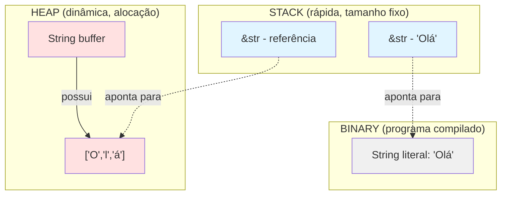

# Dia 5: Strings e I/O em Rust

## Índice

**[Introdução: O Drama das Strings](#introducao)**

**Parte 1: Teoria Fundamental**
- [String vs &str: A Grande Diferença](#string-vs-str)
- [Criando Strings: from() e to_string()](#criando-strings)
- [Concatenação: Três Maneiras de Unir Textos](#concatenacao)
- [Métodos Essenciais de String](#metodos)
- [Lendo Input do Usuário](#input)
- [Formatação de Saída](#formatacao)

**Parte 2: Comparações com Java**
- [String do Java vs String do Rust](#comparacao-java)
- [StringBuilder vs String Mutável](#stringbuilder)

**Parte 3: Prática**
- [Exercício: Sistema de Cadastro Pessoal](#exercicio)

---

<a name="introducao"></a>
## Introdução: O Drama das Strings

Bianeck, se tem uma coisa que confunde TODOS os iniciantes em Rust (inclusive quem vem de Java), é o sistema de Strings. Por que diabos existem **dois tipos** de string? `String` e `&str`? Em Java, temos apenas `String` e pronto!

A resposta está na essência do Rust: **ownership e performance zero-cost**. Vamos desvendar esse mistério hoje com a calma que o tema merece.

**[⬆ voltar ao índice](#indice)**

---

<a name="string-vs-str"></a>
## String vs &str: A Grande Diferença

### A Analogia da Casa e do Endereço

Imagine que você está organizando uma festa:

- **String**: É como você **SER DONO** de uma casa. Você pode reformar, pintar, adicionar cômodos, demolir paredes. A casa é **sua**, está na **heap** (terreno grande e caro), e quando você vai embora, a casa é destruída.

- **&str**: É como você ter o **ENDEREÇO** de uma casa. Você pode visitar, olhar, ler o que está escrito na porta, mas **não pode modificar nada**. É apenas uma **referência** (borrowed) a algo que já existe.

### Diagrama de Memória



### Características Técnicas

**String (Owned - Proprietária)**

```rust
// String aloca memória na HEAP
let mut s = String::from("Olá");

// Podemos modificar porque somos DONOS
s.push_str(", mundo!");

// Quando s sai do escopo, a memória é liberada automaticamente
```

**Características:**
- Armazenada na **heap**
- **Mutável** (se declarada com `mut`)
- **Crescimento dinâmico** (pode aumentar/diminuir)
- **Possui** os dados (ownership)
- Destruída quando sai do escopo

**&str (Borrowed - Emprestada)**

```rust
// &str é uma "fatia" (slice) que aponta para dados já existentes
let s: &str = "Olá"; // String literal (no binário)

// OU uma fatia de uma String
let owned = String::from("Olá, mundo!");
let slice: &str = &owned[0..3]; // "Olá"

// NÃO podemos modificar (é imutável por padrão)
// s.push_str(", mundo!"); // ERRO!
```

**Características:**
- **View** (visualização) de dados UTF-8
- Sempre **imutável**
- **Tamanho fixo** conhecido em compile-time
- **Não possui** os dados (borrowed)
- Pode apontar para: string literals, String, ou qualquer buffer UTF-8

### A Regra de Ouro

> **Use `&str` como parâmetro de função sempre que possível.**  
> **Use `String` quando precisar criar, modificar ou possuir a string.**

**[⬆ voltar ao índice](#indice)**

---

<a name="criando-strings"></a>
## Criando Strings: from() e to_string()

### Três Maneiras de Criar uma String

```rust
fn main() {
    // 1. String::from() - o jeito mais comum
    let s1 = String::from("Olá");
    
    // 2. .to_string() - converte &str para String
    let s2 = "Olá".to_string();
    
    // 3. String::new() + push_str
    let mut s3 = String::new();
    s3.push_str("Olá");
    
    println!("{} {} {}", s1, s2, s3); // Olá Olá Olá
}
```

### Quando Usar Cada Uma?

**String::from()** - Quando você tem um literal de string e quer uma String

```rust
let nome = String::from("Bianeck");
let mensagem = String::from("Bem-vindo!");
```

**to_string()** - Quando você já tem um &str e quer converter

```rust
let static_str: &str = "Rust";
let owned: String = static_str.to_string();

// Útil com métodos que retornam &str
let parte = "Olá, mundo!".split(',').next().unwrap();
let owned_parte = parte.to_string(); // Agora é String
```

**String::new()** - Quando você vai construir a string aos poucos

```rust
let mut resultado = String::new();
for i in 1..=5 {
    resultado.push_str(&i.to_string());
    resultado.push(' ');
}
println!("{}", resultado); // "1 2 3 4 5 "
```

### Conversão &str ⇄ String

```rust
fn main() {
    // &str → String (aloca memória)
    let str_ref: &str = "texto";
    let owned: String = str_ref.to_string();
    let owned2: String = String::from(str_ref);
    
    // String → &str (empresta referência)
    let owned = String::from("texto");
    let borrowed: &str = &owned;  // Coerção automática
    let borrowed2: &str = owned.as_str(); // Explícito
    
    // String → &str temporário (slice)
    let slice: &str = &owned[0..2]; // "te"
}
```

**[⬆ voltar ao índice](#indice)**

---

<a name="concatenacao"></a>
## Concatenação: Três Maneiras de Unir Textos

### 1. Operador + (Move Ownership!)

```rust
fn main() {
    let s1 = String::from("Olá");
    let s2 = String::from(" mundo");
    
    let s3 = s1 + &s2; // s1 foi MOVIDO! Não pode mais usar s1
    
    // println!("{}", s1); // ERRO! s1 foi movido
    println!("{}", s2);    // OK! s2 foi apenas emprestado
    println!("{}", s3);    // OK! s3 é o dono agora
}
```

**ATENÇÃO:** O operador `+` tem esta assinatura:
```rust
fn add(self, s: &str) -> String
```

Isso significa:
- O primeiro operando é **movido** (self, sem &)
- O segundo operando é **emprestado** (&str)
- Retorna uma **nova String**

### 2. format! - A Maneira Mais Flexível

```rust
fn main() {
    let s1 = String::from("Olá");
    let s2 = String::from("mundo");
    let numero = 42;
    
    // Não move nenhuma variável!
    let resultado = format!("{} {}, número: {}", s1, s2, numero);
    
    println!("{}", s1); // OK! s1 ainda existe
    println!("{}", s2); // OK! s2 ainda existe
    println!("{}", resultado); // "Olá mundo, número: 42"
}
```

**Vantagens do format!:**
- Não move ownership
- Aceita múltiplos tipos
- Formatação rica
- Código mais legível

### 3. push_str / push - Modificação In-Place

```rust
fn main() {
    let mut s = String::from("Olá");
    
    // push_str adiciona uma &str
    s.push_str(", mundo");
    
    // push adiciona um único char
    s.push('!');
    
    println!("{}", s); // "Olá, mundo!"
}
```

**Vantagens:**
- Modifica a String existente (eficiente)
- Não cria cópias desnecessárias
- Controle fino sobre alocações

### Comparação de Performance

```rust
fn main() {
    // Método 1: + (múltiplas alocações)
    let s = String::from("A") + " B" + " C" + " D";
    
    // Método 2: format! (uma alocação otimizada)
    let s = format!("{} {} {} {}", "A", "B", "C", "D");
    
    // Método 3: push_str (mais eficiente para loops)
    let mut s = String::new();
    s.push_str("A");
    s.push_str(" B");
    s.push_str(" C");
    s.push_str(" D");
    
    // Método 4: collect (idiomático para iteradores)
    let s: String = vec!["A", "B", "C", "D"].join(" ");
}
```

**[⬆ voltar ao índice](#indice)**

---

<a name="metodos"></a>
## Métodos Essenciais de String

### Informações Básicas

```rust
fn main() {
    let texto = String::from("  Olá, Rust!  ");
    
    // len() - tamanho em BYTES (não caracteres!)
    println!("Bytes: {}", texto.len()); // 16
    
    // chars().count() - número real de caracteres
    println!("Caracteres: {}", texto.chars().count()); // 14
    
    // is_empty() - verifica se está vazia
    let vazia = String::new();
    println!("Vazia? {}", vazia.is_empty()); // true
    
    // capacity() - capacidade alocada
    println!("Capacidade: {}", texto.capacity());
}
```

**IMPORTANTE:** Em Rust, strings são UTF-8. Alguns caracteres ocupam mais de 1 byte!

```rust
let emoji = String::from("😀");
println!("Bytes: {}", emoji.len()); // 4 bytes!
println!("Chars: {}", emoji.chars().count()); // 1 caractere
```

### Limpeza e Transformação

```rust
fn main() {
    let texto = String::from("  Olá, Rust!  ");
    
    // trim() - remove espaços das pontas
    let limpo = texto.trim();
    println!("'{}'", limpo); // 'Olá, Rust!'
    
    // to_uppercase() / to_lowercase()
    let maiuscula = texto.to_uppercase();
    println!("{}", maiuscula); // "  OLÁ, RUST!  "
    
    let minuscula = texto.to_lowercase();
    println!("{}", minuscula); // "  olá, rust!  "
    
    // replace() - substitui padrões
    let novo = texto.replace("Rust", "Mundo");
    println!("{}", novo); // "  Olá, Mundo!  "
}
```

### Busca e Verificação

```rust
fn main() {
    let texto = String::from("Aprendendo Rust é divertido!");
    
    // contains() - verifica se contém substring
    if texto.contains("Rust") {
        println!("Encontrei Rust!");
    }
    
    // starts_with() / ends_with()
    if texto.starts_with("Aprendendo") {
        println!("Começa com 'Aprendendo'");
    }
    
    if texto.ends_with("!") {
        println!("Termina com '!'");
    }
    
    // find() - retorna Option<usize> com a posição
    match texto.find("Rust") {
        Some(pos) => println!("'Rust' está na posição {}", pos),
        None => println!("Não encontrado"),
    }
}
```

### Split - Dividindo Strings

```rust
fn main() {
    let csv = "João,Maria,Pedro,Ana";
    
    // split() retorna um iterador
    for nome in csv.split(',') {
        println!("Nome: {}", nome);
    }
    
    // collect() para transformar em Vec
    let nomes: Vec<&str> = csv.split(',').collect();
    println!("{:?}", nomes); // ["João", "Maria", "Pedro", "Ana"]
    
    // split_whitespace() - divide por espaços
    let frase = "Rust   é     incrível";
    let palavras: Vec<&str> = frase.split_whitespace().collect();
    println!("{:?}", palavras); // ["Rust", "é", "incrível"]
    
    // lines() - divide por linhas
    let texto = "Linha 1\nLinha 2\nLinha 3";
    for linha in texto.lines() {
        println!("> {}", linha);
    }
}
```

### Exemplos Práticos

```rust
fn validar_email(email: &str) -> bool {
    email.contains('@') && email.contains('.')
}

fn normalizar_nome(nome: &str) -> String {
    nome.trim().to_lowercase()
}

fn extrair_dominio(url: &str) -> Option<&str> {
    url.strip_prefix("https://")
       .or_else(|| url.strip_prefix("http://"))
       .and_then(|s| s.split('/').next())
}

fn main() {
    println!("Email válido? {}", validar_email("teste@email.com"));
    println!("Nome: {}", normalizar_nome("  BIANECK  "));
    
    if let Some(dominio) = extrair_dominio("https://rust-lang.org/learn") {
        println!("Domínio: {}", dominio);
    }
}
```

**[⬆ voltar ao índice](#indice)**

---

<a name="input"></a>
## Lendo Input do Usuário

### O Básico: stdin().read_line()

```rust
use std::io;

fn main() {
    println!("Digite seu nome:");
    
    let mut nome = String::new();
    
    // read_line retorna Result<usize>
    io::stdin()
        .read_line(&mut nome)
        .expect("Falha ao ler entrada");
    
    // IMPORTANTE: read_line inclui o \n (nova linha)!
    println!("Olá, {}!", nome.trim());
}
```

### Tratamento de Erro Profissional

```rust
use std::io::{self, Write};

fn ler_linha() -> Result<String, io::Error> {
    let mut buffer = String::new();
    io::stdin().read_line(&mut buffer)?;
    Ok(buffer.trim().to_string())
}

fn main() {
    print!("Digite seu nome: ");
    io::stdout().flush().unwrap(); // Força a impressão antes do input
    
    match ler_linha() {
        Ok(nome) => {
            if nome.is_empty() {
                println!("Nome não pode ser vazio!");
            } else {
                println!("Olá, {}!", nome);
            }
        }
        Err(erro) => {
            eprintln!("Erro ao ler input: {}", erro);
        }
    }
}
```

### Lendo Números

```rust
use std::io;

fn ler_numero() -> Result<i32, Box<dyn std::error::Error>> {
    let mut input = String::new();
    io::stdin().read_line(&mut input)?;
    
    let numero: i32 = input.trim().parse()?;
    Ok(numero)
}

fn main() {
    println!("Digite sua idade:");
    
    match ler_numero() {
        Ok(idade) => {
            if idade < 0 {
                println!("Idade inválida!");
            } else if idade < 18 {
                println!("Menor de idade");
            } else {
                println!("Maior de idade");
            }
        }
        Err(_) => {
            println!("Por favor, digite um número válido!");
        }
    }
}
```

### Função Reutilizável para Input

```rust
use std::io::{self, Write};

fn input(prompt: &str) -> String {
    print!("{}", prompt);
    io::stdout().flush().unwrap();
    
    let mut buffer = String::new();
    io::stdin()
        .read_line(&mut buffer)
        .expect("Falha ao ler entrada");
    
    buffer.trim().to_string()
}

fn input_numero<T>(prompt: &str) -> Result<T, T::Err> 
where
    T: std::str::FromStr
{
    let input = input(prompt);
    input.parse::<T>()
}

fn main() {
    let nome = input("Nome: ");
    let idade = input_numero::<u32>("Idade: ").unwrap_or(0);
    
    println!("Olá, {}! Você tem {} anos.", nome, idade);
}
```

**[⬆ voltar ao índice](#indice)**

---

<a name="formatacao"></a>
## Formatação de Saída

### println! e format! - Básico

```rust
fn main() {
    let nome = "Bianeck";
    let idade = 40;
    let altura = 1.75;
    
    // Formatação posicional
    println!("Nome: {}, Idade: {}", nome, idade);
    
    // Formatação nomeada
    println!("Nome: {nome}, Idade: {idade}");
    
    // Reutilização de argumentos
    println!("{0} tem {1} anos. {0} é desenvolvedor.", nome, idade);
    
    // Formatação de números
    println!("Altura: {:.2}m", altura); // 1.75m (2 casas decimais)
    println!("Percentual: {:.1}%", 87.654); // 87.7%
}
```

### Debug: {:?} e Pretty Debug: {:#?}

```rust
#[derive(Debug)]
struct Usuario {
    nome: String,
    idade: u32,
    email: String,
}

fn main() {
    let user = Usuario {
        nome: String::from("Bianeck"),
        idade: 40,
        email: String::from("bianeck@email.com"),
    };
    
    // Debug normal (uma linha)
    println!("Debug: {:?}", user);
    // Usuario { nome: "Bianeck", idade: 40, email: "bianeck@email.com" }
    
    // Pretty Debug (formatado)
    println!("Pretty Debug:\n{:#?}", user);
    // Usuario {
    //     nome: "Bianeck",
    //     idade: 40,
    //     email: "bianeck@email.com",
    // }
    
    // Com arrays/vectors
    let numeros = vec![1, 2, 3, 4, 5];
    println!("{:?}", numeros); // [1, 2, 3, 4, 5]
}
```

### Formatação Avançada

```rust
fn main() {
    // Padding (preenchimento)
    println!("|{:10}|", "Rust");      // |Rust      | (10 chars)
    println!("|{:<10}|", "Rust");     // |Rust      | (alinhado esquerda)
    println!("|{:>10}|", "Rust");     // |      Rust| (alinhado direita)
    println!("|{:^10}|", "Rust");     // |   Rust   | (centralizado)
    
    // Preenchimento com caracteres
    println!("|{:*^10}|", "Rust");    // |***Rust***|
    
    // Números binário, octal, hexadecimal
    let num = 42;
    println!("Decimal: {}", num);      // 42
    println!("Binário: {:b}", num);    // 101010
    println!("Octal: {:o}", num);      // 52
    println!("Hex: {:x}", num);        // 2a
    println!("Hex maiúsculo: {:X}", num); // 2A
    
    // Formatação de tabelas
    println!("{:<15} {:>10} {:>10}", "Nome", "Idade", "Salário");
    println!("{:-<35}", ""); // Linha separadora
    println!("{:<15} {:>10} {:>10}", "João", 30, 5000);
    println!("{:<15} {:>10} {:>10}", "Maria", 25, 6500);
}
```

**[⬆ voltar ao índice](#indice)**

---

<a name="comparacao-java"></a>
## String do Java vs String do Rust

### Comparação Direta

<table class="border-ds-border-tertiary min-w-full border-collapse overflow-hidden rounded-lg border">
<thead class="border-ds-border-tertiary bg-ds-bg-table-header border-b-2">
<tr>
<th class="border-ds-border-tertiary text-ds-text-chat-secondary border-r px-4 py-3 text-left text-sm font-semibold last:border-r-0">Aspecto</th>
<th class="border-ds-border-tertiary text-ds-text-chat-secondary border-r px-4 py-3 text-left text-sm font-semibold last:border-r-0">Java String</th>
<th class="border-ds-border-tertiary text-ds-text-chat-secondary border-r px-4 py-3 text-left text-sm font-semibold last:border-r-0">Rust String</th>
<th class="border-ds-border-tertiary text-ds-text-chat-secondary border-r px-4 py-3 text-left text-sm font-semibold last:border-r-0">Rust &str</th>
</tr>
</thead>
<tbody>
<tr class="border-ds-border-tertiary hover:bg-ds-bg-table-row-hover border-b">
<td class="border-ds-border-tertiary text-ds-text-chat-secondary border-r px-4 py-3 text-sm last:border-r-0">Mutabilidade</td>
<td class="border-ds-border-tertiary text-ds-text-chat-secondary border-r px-4 py-3 text-sm last:border-r-0">Imutável</td>
<td class="border-ds-border-tertiary text-ds-text-chat-secondary border-r px-4 py-3 text-sm last:border-r-0">Mutável (se mut)</td>
<td class="border-ds-border-tertiary text-ds-text-chat-secondary border-r px-4 py-3 text-sm last:border-r-0">Sempre imutável</td>
</tr>
<tr class="border-ds-border-tertiary hover:bg-ds-bg-table-row-hover border-b">
<td class="border-ds-border-tertiary text-ds-text-chat-secondary border-r px-4 py-3 text-sm last:border-r-0">Localização</td>
<td class="border-ds-border-tertiary text-ds-text-chat-secondary border-r px-4 py-3 text-sm last:border-r-0">Heap (GC)</td>
<td class="border-ds-border-tertiary text-ds-text-chat-secondary border-r px-4 py-3 text-sm last:border-r-0">Heap (owned)</td>
<td class="border-ds-border-tertiary text-ds-text-chat-secondary border-r px-4 py-3 text-sm last:border-r-0">Stack ou static</td>
</tr>
<tr class="border-ds-border-tertiary hover:bg-ds-bg-table-row-hover border-b">
<td class="border-ds-border-tertiary text-ds-text-chat-secondary border-r px-4 py-3 text-sm last:border-r-0">Ownership</td>
<td class="border-ds-border-tertiary text-ds-text-chat-secondary border-r px-4 py-3 text-sm last:border-r-0">Referência (GC)</td>
<td class="border-ds-border-tertiary text-ds-text-chat-secondary border-r px-4 py-3 text-sm last:border-r-0">Único dono</td>
<td class="border-ds-border-tertiary text-ds-text-chat-secondary border-r px-4 py-3 text-sm last:border-r-0">Borrowed view</td>
</tr>
<tr class="border-ds-border-tertiary hover:bg-ds-bg-table-row-hover border-b">
<td class="border-ds-border-tertiary text-ds-text-chat-secondary border-r px-4 py-3 text-sm last:border-r-0">Crescimento</td>
<td class="border-ds-border-tertiary text-ds-text-chat-secondary border-r px-4 py-3 text-sm last:border-r-0">Cria nova string</td>
<td class="border-ds-border-tertiary text-ds-text-chat-secondary border-r px-4 py-3 text-sm last:border-r-0">In-place (mut)</td>
<td class="border-ds-border-tertiary text-ds-text-chat-secondary border-r px-4 py-3 text-sm last:border-r-0">Tamanho fixo</td>
</tr>
<tr class="border-ds-border-tertiary hover:bg-ds-bg-table-row-hover border-b">
<td class="border-ds-border-tertiary text-ds-text-chat-secondary border-r px-4 py-3 text-sm last:border-r-0">Concatenação</td>
<td class="border-ds-border-tertiary text-ds-text-chat-secondary border-r px-4 py-3 text-sm last:border-r-0">+ cria nova</td>
<td class="border-ds-border-tertiary text-ds-text-chat-secondary border-r px-4 py-3 text-sm last:border-r-0">+ move ownership</td>
<td class="border-ds-border-tertiary text-ds-text-chat-secondary border-r px-4 py-3 text-sm last:border-r-0">N/A</td>
</tr>
</tbody>
</table>

### Código Comparativo

**Java:**
```java
// Java - String imutável
String s1 = "Olá";
String s2 = s1 + " mundo";  // Cria nova String
s1 = s1 + "!";              // Cria nova String novamente

// Múltiplas referências OK (GC cuida)
String s3 = s1;
String s4 = s1;
String s5 = s1;  // Todas apontam para a mesma String

// Substring também cria nova String
String parte = s1.substring(0, 3);
```

**Rust:**
```rust
// Rust - String mutável owned
let mut s1 = String::from("Olá");
let s2 = s1 + " mundo";  // s1 foi MOVIDO! Não pode mais usar

let mut s3 = String::from("Olá");
s3.push_str("!");  // Modifica in-place (eficiente!)

// OWNERSHIP: apenas UM dono por vez
let s4 = String::from("Teste");
let s5 = s4;  // s4 foi MOVIDO para s5
// println!("{}", s4);  // ERRO! s4 não existe mais

// Múltiplas referências precisam ser explícitas
let s6 = String::from("Teste");
let r1: &str = &s6;  // Empresta
let r2: &str = &s6;  // Empresta novamente (imutável OK)
println!("{} {}", r1, r2);  // OK!
```

### Por Que Rust É Mais Complexo?

**Java simplifica:**
- Garbage Collector cuida da memória
- Você nunca pensa em "quem é o dono"
- Múltiplas referências "de graça"
- **Custo:** Overhead do GC, pauses imprevisíveis

**Rust otimiza:**
- Sem GC = sem pauses
- Ownership explícito = sem memory leaks
- Zero-cost abstractions
- **Custo:** Você precisa pensar em ownership

### Quando Usar String vs &str em Rust?

**Use String quando:**

```rust
// 1. Precisa criar/construir uma string
let mut nome = String::new();
nome.push_str("Bianeck");

// 2. Precisa modificar
let mut saudacao = String::from("Olá");
saudacao.push_str(", mundo!");

// 3. Precisa retornar de uma função (ownership)
fn criar_mensagem() -> String {
    String::from("Nova mensagem")
}

// 4. Precisa armazenar em struct
struct Usuario {
    nome: String,  // Struct POSSUI o nome
    email: String,
}
```

**Use &str quando:**

```rust
// 1. Parâmetro de função (não precisa modificar)
fn imprimir(texto: &str) {
    println!("{}", texto);
}

// 2. Trabalhar com string literals
let literal: &str = "Texto estático";

// 3. Retornar slice de String existente
fn primeira_palavra(texto: &str) -> &str {
    texto.split_whitespace().next().unwrap_or("")
}

// 4. Economizar alocações
fn processar_varios(textos: &[&str]) {
    for texto in textos {
        println!("{}", texto);
    }
}
```

**[⬆ voltar ao índice](#indice)**

---

<a name="stringbuilder"></a>
## StringBuilder vs String Mutável

### Java StringBuilder

**Em Java**, quando você precisa construir strings de forma eficiente:

```java
// Java - Múltiplas concatenações ineficientes
String resultado = "";
for (int i = 0; i < 1000; i++) {
    resultado += i + " ";  // Cria 1000 Strings intermediárias!
}

// Java - StringBuilder eficiente
StringBuilder sb = new StringBuilder();
for (int i = 0; i < 1000; i++) {
    sb.append(i).append(" ");  // Modifica in-place
}
String resultado = sb.toString();
```

### Rust String Mutável

**Em Rust**, `String` mutável **já é** o StringBuilder!

```rust
// Rust - String mutável é eficiente por padrão
let mut resultado = String::new();
for i in 0..1000 {
    resultado.push_str(&i.to_string());
    resultado.push(' ');
}

// Ou usando with_capacity para pré-alocar
let mut resultado = String::with_capacity(5000);  // Reserva espaço
for i in 0..1000 {
    resultado.push_str(&i.to_string());
    resultado.push(' ');
}
```

### Comparação de Performance

```rust
use std::time::Instant;

fn main() {
    let inicio = Instant::now();
    
    // Método 1: + operator (INEFICIENTE!)
    let mut s = String::from("");
    for i in 0..1000 {
        s = s + &i.to_string() + " ";  // Muitas alocações!
    }
    println!("Método 1: {:?}", inicio.elapsed());
    
    // Método 2: push_str (EFICIENTE)
    let inicio = Instant::now();
    let mut s = String::new();
    for i in 0..1000 {
        s.push_str(&i.to_string());
        s.push(' ');
    }
    println!("Método 2: {:?}", inicio.elapsed());
    
    // Método 3: with_capacity (MAIS EFICIENTE)
    let inicio = Instant::now();
    let mut s = String::with_capacity(5000);
    for i in 0..1000 {
        s.push_str(&i.to_string());
        s.push(' ');
    }
    println!("Método 3: {:?}", inicio.elapsed());
}
```

### Métodos de Capacidade

```rust
fn main() {
    let mut s = String::new();
    println!("Capacidade inicial: {}", s.capacity()); // 0
    
    // Reserva espaço de uma vez
    s.reserve(100);
    println!("Após reserve(100): {}", s.capacity()); // >= 100
    
    // with_capacity - cria com capacidade inicial
    let mut s2 = String::with_capacity(200);
    println!("with_capacity(200): {}", s2.capacity()); // 200
    
    // Adiciona texto (não realoca se couber)
    s2.push_str("Texto que cabe na capacidade");
    println!("Após push_str: {}", s2.capacity()); // Ainda 200
    
    // shrink_to_fit - libera espaço não usado
    s2.shrink_to_fit();
    println!("Após shrink: {}", s2.capacity());
}
```

**[⬆ voltar ao índice](#indice)**

---

<a name="exercicio"></a>
## Exercício: Sistema de Cadastro Pessoal

### Descrição

Vamos criar um **mini sistema de cadastro** que demonstra todos os conceitos do dia:

- String vs &str
- Leitura de input com tratamento de erro
- Manipulação avançada de strings
- Formatação de saída
- Validações

### Especificações

O programa deve:

1. Solicitar nome, email e idade do usuário
2. Validar o email (deve conter @ e .)
3. Normalizar o nome (trim, primeira letra maiúscula)
4. Exibir um resumo formatado
5. Permitir cadastrar múltiplos usuários
6. Listar todos os usuários ao final

### Código Completo

```rust
use std::io::{self, Write};

#[derive(Debug)]
struct Usuario {
    nome: String,
    email: String,
    idade: u32,
}

impl Usuario {
    fn novo(nome: String, email: String, idade: u32) -> Self {
        Usuario {
            nome: capitalizar(&nome),
            email: email.to_lowercase(),
            idade,
        }
    }
    
    fn exibir(&self) {
        println!("\n{:-^50}", " DADOS DO USUÁRIO ");
        println!("{:<15} : {}", "Nome", self.nome);
        println!("{:<15} : {}", "Email", self.email);
        println!("{:<15} : {}", "Idade", self.idade);
        println!("{:-^50}", "");
    }
}

fn input(prompt: &str) -> String {
    print!("{}", prompt);
    io::stdout().flush().unwrap();
    
    let mut buffer = String::new();
    io::stdin()
        .read_line(&mut buffer)
        .expect("Falha ao ler entrada");
    
    buffer.trim().to_string()
}

fn validar_email(email: &str) -> bool {
    if email.is_empty() {
        return false;
    }
    
    let tem_arroba = email.contains('@');
    let tem_ponto = email.contains('.');
    let arroba_antes_ponto = match (email.find('@'), email.find('.')) {
        (Some(arroba), Some(ponto)) => arroba < ponto,
        _ => false,
    };
    
    tem_arroba && tem_ponto && arroba_antes_ponto
}

fn capitalizar(texto: &str) -> String {
    let limpo = texto.trim();
    
    if limpo.is_empty() {
        return String::new();
    }
    
    let mut resultado = String::new();
    let mut primeira = true;
    
    for palavra in limpo.split_whitespace() {
        if !primeira {
            resultado.push(' ');
        }
        
        let mut chars = palavra.chars();
        if let Some(primeiro_char) = chars.next() {
            resultado.push_str(&primeiro_char.to_uppercase().to_string());
            resultado.push_str(&chars.as_str().to_lowercase());
        }
        
        primeira = false;
    }
    
    resultado
}

fn ler_idade() -> Option<u32> {
    loop {
        let input = input("Idade: ");
        
        match input.parse::<u32>() {
            Ok(idade) if idade > 0 && idade < 150 => return Some(idade),
            Ok(_) => println!("❌ Idade deve estar entre 1 e 149!"),
            Err(_) => println!("❌ Digite um número válido!"),
        }
        
        print!("Tentar novamente? (s/n): ");
        io::stdout().flush().unwrap();
        
        let mut resposta = String::new();
        io::stdin().read_line(&mut resposta).unwrap();
        
        if !resposta.trim().eq_ignore_ascii_case("s") {
            return None;
        }
    }
}

fn cadastrar_usuario() -> Option<Usuario> {
    println!("\n{:=^50}", " NOVO CADASTRO ");
    
    let nome = input("Nome completo: ");
    if nome.is_empty() {
        println!("❌ Nome não pode ser vazio!");
        return None;
    }
    
    let email = loop {
        let email = input("Email: ");
        
        if validar_email(&email) {
            break email;
        }
        
        println!("❌ Email inválido! Deve conter @ e .");
        print!("Tentar novamente? (s/n): ");
        io::stdout().flush().unwrap();
        
        let mut resposta = String::new();
        io::stdin().read_line(&mut resposta).unwrap();
        
        if !resposta.trim().eq_ignore_ascii_case("s") {
            return None;
        }
    };
    
    let idade = ler_idade()?;
    
    Some(Usuario::novo(nome, email, idade))
}

fn listar_usuarios(usuarios: &[Usuario]) {
    if usuarios.is_empty() {
        println!("\n⚠️  Nenhum usuário cadastrado.");
        return;
    }
    
    println!("\n{:=^70}", " LISTA DE USUÁRIOS ");
    println!("{:<25} {:<30} {:>10}", "NOME", "EMAIL", "IDADE");
    println!("{:-<70}", "");
    
    for (i, usuario) in usuarios.iter().enumerate() {
        println!(
            "{}. {:<23} {:<30} {:>10}",
            i + 1,
            usuario.nome,
            usuario.email,
            usuario.idade
        );
    }
    
    println!("{:=^70}", "");
    println!("\nTotal de usuários: {}", usuarios.len());
}

fn menu() -> Option<char> {
    println!("\n{:*^50}", " MENU ");
    println!("1. Cadastrar novo usuário");
    println!("2. Listar todos os usuários");
    println!("3. Sair");
    print!("\nEscolha uma opção: ");
    io::stdout().flush().unwrap();
    
    let mut escolha = String::new();
    io::stdin().read_line(&mut escolha).ok()?;
    
    escolha.trim().chars().next()
}

fn main() {
    let mut usuarios: Vec<Usuario> = Vec::new();
    
    println!("{:*^50}", " SISTEMA DE CADASTRO ");
    
    loop {
        match menu() {
            Some('1') => {
                if let Some(usuario) = cadastrar_usuario() {
                    usuario.exibir();
                    usuarios.push(usuario);
                    println!("\n✅ Usuário cadastrado com sucesso!");
                } else {
                    println!("\n⚠️  Cadastro cancelado.");
                }
            }
            Some('2') => {
                listar_usuarios(&usuarios);
            }
            Some('3') => {
                println!("\n👋 Encerrando sistema...");
                listar_usuarios(&usuarios);
                break;
            }
            _ => {
                println!("\n❌ Opção inválida!");
            }
        }
    }
}
```

### O Que o Código Demonstra?

**1. String vs &str:**
```rust
// Parâmetros usam &str (não precisa ownership)
fn validar_email(email: &str) -> bool { ... }
fn capitalizar(texto: &str) -> String { ... }

// Struct possui Strings (ownership dos dados)
struct Usuario {
    nome: String,
    email: String,
    idade: u32,
}
```

**2. Manipulação de Strings:**
```rust
// trim, to_lowercase, contains, find, split_whitespace
fn capitalizar(texto: &str) -> String {
    let limpo = texto.trim();
    // ... split_whitespace(), to_uppercase(), to_lowercase()
}
```

**3. Input com Tratamento de Erro:**
```rust
fn ler_idade() -> Option<u32> {
    loop {
        let input = input("Idade: ");
        match input.parse::<u32>() {
            Ok(idade) if idade > 0 && idade < 150 => return Some(idade),
            // ... tratamento de erros
        }
    }
}
```

**4. Formatação Rica:**
```rust
// Alinhamento, padding, separadores
println!("{:<25} {:<30} {:>10}", "NOME", "EMAIL", "IDADE");
println!("{:-<70}", ""); // Linha separadora
println!("{:=^70}", " LISTA "); // Centralizado com =
```

### Teste o Programa

```bash
cargo new cadastro_usuarios
cd cadastro_usuarios

# Cole o código no src/main.rs

cargo run
```

### Exemplo de Execução

```
**************** SISTEMA DE CADASTRO *****************

******************* MENU *********************
1. Cadastrar novo usuário
2. Listar todos os usuários
3. Sair

Escolha uma opção: 1

============== NOVO CADASTRO ===============
Nome completo: thiago bianeck
Email: bianeck@email.com
Idade: 40

---------------- DADOS DO USUÁRIO ----------------
Nome            : Thiago Bianeck
Email           : bianeck@email.com
Idade           : 40
--------------------------------------------------

✅ Usuário cadastrado com sucesso!
```

### Desafios Extras

Agora que você entendeu o código, tente implementar:

1. **Validação de nome:** Não aceitar números no nome

```rust
fn validar_nome(nome: &str) -> bool {
    !nome.is_empty() && nome.chars().all(|c| c.is_alphabetic() || c.is_whitespace())
}
```

2. **Buscar usuário por nome:**

```rust
fn buscar_usuario(usuarios: &[Usuario], nome: &str) -> Vec<&Usuario> {
    usuarios.iter()
        .filter(|u| u.nome.to_lowercase().contains(&nome.to_lowercase()))
        .collect()
}
```

3. **Editar usuário existente:**

```rust
fn editar_usuario(usuarios: &mut Vec<Usuario>, indice: usize) {
    if let Some(usuario) = usuarios.get_mut(indice) {
        // Lógica para editar campos
    }
}
```

4. **Salvar em arquivo:**

```rust
use std::fs::File;
use std::io::Write;

fn salvar_usuarios(usuarios: &[Usuario]) -> io::Result<()> {
    let mut arquivo = File::create("usuarios.txt")?;
    for usuario in usuarios {
        writeln!(arquivo, "{},{},{}", usuario.nome, usuario.email, usuario.idade)?;
    }
    Ok(())
}
```

**[⬆ voltar ao índice](#indice)**

---

## Resumo do Dia 5

**Conceitos Principais Dominados:**

1. **String vs &str:** Entendeu a diferença entre owned (String) e borrowed (&str)

2. **Criação:** String::from(), to_string(), String::new()

3. **Concatenação:** Operador +, format!, push_str()

4. **Métodos:** len, trim, split, replace, contains, to_uppercase/lowercase

5. **Input:** std::io::stdin(), read_line(), parse(), tratamento de erros

6. **Formatação:** println!, format!, {:?}, {:#?}, alinhamento e padding

7. **Comparação Java:** String imutável vs String/&str ownership

**Regra de Ouro:**

> Use `&str` em parâmetros sempre que possível.  
> Use `String` quando precisar **criar**, **modificar** ou **possuir** a string.

**Próximo Passo:**

Amanhã vamos explorar **Structs**, onde usaremos muito do conhecimento de Strings para criar tipos de dados personalizados e organizados!

**[⬆ voltar ao índice](#indice)**