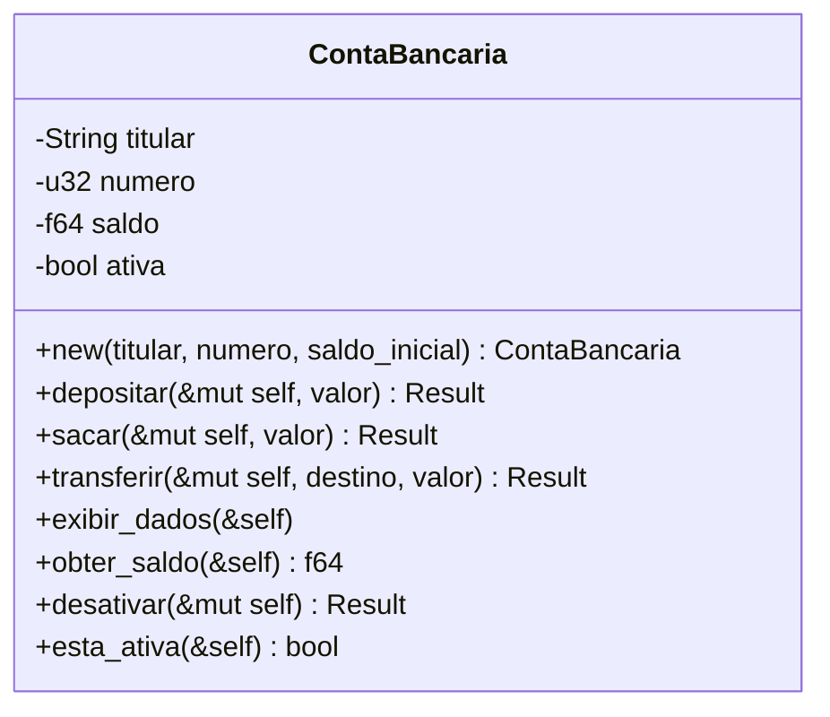

# DIA 6: STRUCTS - Construindo Tipos Personalizados em Rust

---

## Índice

**[Introdução: Classes do Java ao Mundo Rust](#introducao)**

**[Parte 1: Anatomia de uma Struct](#parte1)**
- Definindo Structs
- Instanciando e Field Init Shorthand
- Acessando Campos

**[Parte 2: Métodos com `impl`](#parte2)**
- Métodos de Instância: `&self`, `&mut self`, `self`
- Funções Associadas (Construtores)

**[Parte 3: Variações de Structs](#parte3)**
- Tuple Structs
- Unit Structs
- Desestruturação

**[Parte 4: Comparação Java vs Rust](#parte4)**

**[Parte 5: Exercício Prático - Sistema de Contas Bancárias](#parte5)**

**[Conclusão e Próximos Passos](#conclusao)**

---

<a name="introducao"></a>
## Introdução: Classes do Java ao Mundo Rust

[Voltar ao Índice](#indice)

Olá, **Bianeck**! Bem-vindo ao **Dia 6** do seu mergulho em Rust! 

Imagine que você está construindo uma casa no Java: você tem sua classe (o projeto arquitetônico), herança (andares que herdam a estrutura de baixo), e métodos espalhados dentro da classe. Agora, em Rust, é como se você estivesse construindo com **blocos LEGO modulares**: cada struct é um bloco independente, você monta através de **composição** (encaixar blocos), e os métodos ficam separados em blocos `impl`. **Sem herança! Sem hierarquias complexas!**

A filosofia do Rust é: **"Componha, não herde"**. Isso simplifica muito o design e evita aqueles problemas clássicos de herança múltipla e acoplamento excessivo que você já viu em projetos Java gigantescos.

Hoje você vai aprender:

- **Definir structs** (os "esqueletos" de dados)
- **Adicionar comportamento** com `impl` (métodos separados)
- **Entender `&self`, `&mut self`, `self`** (ownership nos métodos!)
- **Criar construtores** com funções associadas
- **Comparar tudo isso** com suas classes Java

Vamos lá!

---

<a name="parte1"></a>
## Parte 1: Anatomia de uma Struct

[Voltar ao Índice](#indice)

### Definindo Structs

Uma **struct** em Rust é como uma classe Java **sem métodos dentro dela** (por enquanto). É apenas a estrutura de dados, o "esqueleto":

```rust {.line-numbers}
// Struct básica - similar a uma classe Java com apenas atributos
struct Usuario {
    nome: String,
    email: String,
    idade: u32,
    ativo: bool,
}
```

**Java equivalente:**

```java
public class Usuario {
    private String nome;
    private String email;
    private int idade;
    private boolean ativo;
    
    // construtores, getters, setters...
}
```

**Diferenças chave:**

- **Rust:** Definição separada da implementação (`struct` vs `impl`)
- **Java:** Tudo junto (atributos + métodos na mesma classe)
- **Rust:** Sem herança! Sem `extends`!
- **Java:** Herança é comum

---

### Instanciando e Field Init Shorthand

**Forma básica:**

```rust {.line-numbers}
fn main() {
    let usuario1 = Usuario {
        nome: String::from("Bianeck"),
        email: String::from("bianeck@example.com"),
        idade: 40,
        ativo: true,
    };
    
    println!("Nome: {}", usuario1.nome);
    println!("Email: {}", usuario1.email);
}
```

**Field Init Shorthand** (quando variável tem mesmo nome do campo):

```rust {.line-numbers}
fn criar_usuario(nome: String, email: String) -> Usuario {
    let idade = 40;
    let ativo = true;
    
    // Se nome da variável == nome do campo, pode omitir
    Usuario {
        nome,    // shorthand para nome: nome
        email,   // shorthand para email: email
        idade,
        ativo,
    }
}
```

Pensa assim: é como se fosse **autocomplete de campos**. Se você tem uma variável `nome` e um campo `nome`, Rust entende que você quer atribuir um ao outro. Menos verbosidade!

---

### Struct Update Syntax

Imagine que você quer criar um usuário baseado em outro, mudando só alguns campos:

```rust {.line-numbers}
fn main() {
    let usuario1 = Usuario {
        nome: String::from("Bianeck"),
        email: String::from("bianeck@example.com"),
        idade: 40,
        ativo: true,
    };
    
    // Criar usuario2 baseado em usuario1, mudando só o email
    let usuario2 = Usuario {
        email: String::from("outro@example.com"),
        ..usuario1  // "copia" os campos restantes de usuario1
    };
    
    // ATENÇÃO: usuario1.nome foi MOVIDO para usuario2!
    // Não pode mais usar usuario1.nome
    // println!("{}", usuario1.nome); // ❌ ERRO de compilação
}
```

**Cuidado com ownership aqui!** O operador `..` **move** os campos do tipo `String` (ownership). Tipos `Copy` como `u32` e `bool` são copiados.

---

<a name="parte2"></a>
## Parte 2: Métodos com `impl`

[Voltar ao Índice](#indice)

Agora vem a parte legal: **adicionar comportamento** às structs. Em Java, você coloca métodos dentro da classe. Em Rust, você usa um bloco **`impl`** (implementation) separado.

### Métodos de Instância: `&self`, `&mut self`, `self`

Pensa no `self` como o `this` do Java, mas com **três sabores** baseados em ownership:

1. **`&self`** → **Emprestar imutável** (só leitura)
   - Similar a método que não modifica o objeto
   - Mais comum (80% dos casos)

2. **`&mut self`** → **Emprestar mutável** (leitura + escrita)
   - Similar a setter ou método que modifica estado
   - Precisa que a instância seja `mut`

3. **`self`** → **Consumir/Tomar posse**
   - Move o valor, instância não existe mais depois
   - Raro, usado para transformações

**Exemplo prático:**

```rust {.line-numbers}
struct Contador {
    valor: i32,
}

impl Contador {
    // &self: só LER o valor (empréstimo imutável)
    fn obter_valor(&self) -> i32 {
        self.valor  // acessa, mas não modifica
    }
    
    // &mut self: MODIFICAR o valor (empréstimo mutável)
    fn incrementar(&mut self) {
        self.valor += 1;  // modifica o estado interno
    }
    
    // &mut self: decrementar
    fn decrementar(&mut self) {
        self.valor -= 1;
    }
    
    // &mut self: resetar
    fn resetar(&mut self) {
        self.valor = 0;
    }
    
    // self: CONSUMIR o contador (toma posse)
    fn consumir_e_criar_novo(self) -> Contador {
        Contador { valor: self.valor * 2 }
        // 'self' foi movido, não existe mais!
    }
}

fn main() {
    let mut contador = Contador { valor: 0 };
    
    println!("Valor inicial: {}", contador.obter_valor()); // &self
    
    contador.incrementar(); // &mut self
    contador.incrementar();
    
    println!("Após incrementar: {}", contador.obter_valor());
    
    // Consumir o contador
    let novo_contador = contador.consumir_e_criar_novo(); // self
    
    // ❌ Não pode mais usar 'contador' aqui!
    // println!("{}", contador.obter_valor()); // ERRO de compilação
    
    println!("Novo contador: {}", novo_contador.obter_valor());
}
```

**Analogia Java:**

```java
public class Contador {
    private int valor;
    
    // &self - método que só lê
    public int obterValor() {
        return this.valor;
    }
    
    // &mut self - método que modifica
    public void incrementar() {
        this.valor++;
    }
    
    // self - não existe conceito direto em Java
    // seria algo como um método que invalida o objeto atual
    public Contador consumirECriarNovo() {
        return new Contador(this.valor * 2);
        // mas 'this' ainda existe em Java (diferente de Rust!)
    }
}
```

**Regra de ouro:**

- Use **`&self`** quando só precisa **ler dados**
- Use **`&mut self`** quando precisa **modificar dados**
- Use **`self`** quando o método **transforma/consome** o objeto (raro!)

---

### Funções Associadas (Construtores)

Funções associadas são como **métodos estáticos do Java**. Não recebem `self`, são chamadas no tipo, não na instância:

```rust {.line-numbers}
impl Contador {
    // Função associada - similar a método estático
    // Convenção: usar 'new' para construtores
    fn new(valor_inicial: i32) -> Contador {
        Contador { valor: valor_inicial }
    }
    
    // Outro construtor "nomeado"
    fn zero() -> Contador {
        Contador { valor: 0 }
    }
    
    // Factory method
    fn from_string(s: &str) -> Result<Contador, String> {
        match s.parse::<i32>() {
            Ok(num) => Ok(Contador { valor: num }),
            Err(_) => Err(String::from("Número inválido")),
        }
    }
}

fn main() {
    // Chamadas usando :: (não .)
    let c1 = Contador::new(10);
    let c2 = Contador::zero();
    let c3 = Contador::from_string("42").unwrap();
    
    println!("c1: {}, c2: {}, c3: {}", 
             c1.obter_valor(), 
             c2.obter_valor(), 
             c3.obter_valor());
}
```

**Java equivalente:**

```java
public class Contador {
    private int valor;
    
    // Construtor padrão
    public Contador(int valorInicial) {
        this.valor = valorInicial;
    }
    
    // Named constructor (factory method)
    public static Contador zero() {
        return new Contador(0);
    }
    
    public static Contador fromString(String s) {
        try {
            int num = Integer.parseInt(s);
            return new Contador(num);
        } catch (NumberFormatException e) {
            throw new IllegalArgumentException("Número inválido");
        }
    }
}
```

**Diferenças importantes:**

- **Rust:** Usa `::` para chamar funções associadas (`Contador::new`)
- **Java:** Usa `new` ou nome da classe (`new Contador()` ou `Contador.metodoEstatico()`)
- **Rust:** Convenção de usar `new` como nome de função (não é palavra-chave!)
- **Java:** `new` é palavra-chave obrigatória para instanciar

---

<a name="parte3"></a>
## Parte 3: Variações de Structs

[Voltar ao Índice](#indice)

### Tuple Structs

Structs que parecem tuplas, mas com nome de tipo. Útil quando você quer dar nome semântico mas não precisa nomear cada campo:

```rust {.line-numbers}
// Tuple structs - campos sem nome (acessa por índice)
struct Cor(u8, u8, u8);        // RGB
struct Ponto3D(f64, f64, f64);  // x, y, z

fn main() {
    let preto = Cor(0, 0, 0);
    let branco = Cor(255, 255, 255);
    let vermelho = Cor(255, 0, 0);
    
    // Acesso por índice (como tupla)
    println!("Vermelho: R={}, G={}, B={}", vermelho.0, vermelho.1, vermelho.2);
    
    let origem = Ponto3D(0.0, 0.0, 0.0);
    let ponto = Ponto3D(10.5, 20.3, 15.7);
    
    println!("Ponto: x={}, y={}, z={}", ponto.0, ponto.1, ponto.2);
}

// Métodos funcionam normalmente
impl Cor {
    fn luminosidade(&self) -> u8 {
        // Fórmula simplificada
        ((self.0 as u16 + self.1 as u16 + self.2 as u16) / 3) as u8
    }
}
```

**Quando usar:**

- Quando o nome dos campos seria redundante (`Ponto3D(x, y, z)` vs `Ponto3D(f64, f64, f64)`)
- Para criar tipos distintos a partir de tipos primitivos (newtype pattern)

---

### Unit Structs

Structs sem campos! Parecem inúteis, mas são usadas para implementar traits (que você verá em breve):

```rust {.line-numbers}
// Unit struct - sem campos!
struct Marcador;
struct SempreLigado;

impl SempreLigado {
    fn status(&self) -> &str {
        "Sempre ligado!"
    }
}

fn main() {
    let m = Marcador;
    let ligado = SempreLigado;
    
    println!("{}", ligado.status());
}
```

**Quando usar:**

- Implementar traits sem estado (você verá isso mais adiante)
- Markers de tipo (type-level programming)
- Por enquanto, é raro você precisar disso

---

### Desestruturação

Assim como tuplas, você pode desestruturar structs:

```rust {.line-numbers}
struct Pessoa {
    nome: String,
    idade: u32,
}

fn main() {
    let pessoa = Pessoa {
        nome: String::from("Bianeck"),
        idade: 40,
    };
    
    // Desestruturação completa
    let Pessoa { nome, idade } = pessoa;
    println!("Nome: {}, Idade: {}", nome, idade);
    
    // Desestruturação parcial (ignora campos com ..)
    let pessoa2 = Pessoa {
        nome: String::from("Clara"),
        idade: 16,
    };
    
    let Pessoa { nome, .. } = pessoa2;
    println!("Nome: {}", nome);
    
    // Renomear durante desestruturação
    let pessoa3 = Pessoa {
        nome: String::from("Lunna"),
        idade: 13,
    };
    
    let Pessoa { nome: nome_da_pessoa, idade: anos } = pessoa3;
    println!("Pessoa: {}, Anos: {}", nome_da_pessoa, anos);
}
```

---

<a name="parte4"></a>
## Parte 4: Comparação Java vs Rust

[Voltar ao Índice](#indice)

### Tabela Comparativa

| Conceito            | Java                             | Rust                                     |
| ------------------- | -------------------------------- | ---------------------------------------- |
| **Definir tipo**    | `class Usuario { }`              | `struct Usuario { }`                     |
| **Campos**          | Dentro da classe                 | Dentro da struct                         |
| **Métodos**         | Dentro da classe                 | Em bloco `impl` separado                 |
| **Construtor**      | `public Usuario() { }`           | `fn new() -> Usuario { }` (convenção)    |
| **this**            | `this` (implícito)               | `&self`, `&mut self`, `self` (explícito) |
| **Herança**         | `extends SuperClasse`            | ❌ Não existe! Use composição             |
| **Método estático** | `public static void metodo()`    | `fn metodo()` (função associada)         |
| **Encapsulamento**  | `private`, `public`, `protected` | `pub` ou privado (padrão)                |
| **Interfaces**      | `implements Interface`           | Traits (próxima aula!)                   |

---

### Exemplo Completo: Java vs Rust

**Java:**

```java
public class Retangulo {
    private double largura;
    private double altura;
    
    // Construtor
    public Retangulo(double largura, double altura) {
        this.largura = largura;
        this.altura = altura;
    }
    
    // Método de instância
    public double calcularArea() {
        return this.largura * this.altura;
    }
    
    // Método que modifica estado
    public void redimensionar(double novaLargura, double novaAltura) {
        this.largura = novaLargura;
        this.altura = novaAltura;
    }
    
    // Método estático (factory)
    public static Retangulo quadrado(double lado) {
        return new Retangulo(lado, lado);
    }
    
    // Getter
    public double getLargura() {
        return this.largura;
    }
}

// Uso
Retangulo ret = new Retangulo(10.0, 5.0);
System.out.println("Área: " + ret.calcularArea());
ret.redimensionar(20.0, 10.0);

Retangulo quad = Retangulo.quadrado(5.0);
```

**Rust:**

```rust {.line-numbers}
struct Retangulo {
    largura: f64,
    altura: f64,
}

impl Retangulo {
    // Construtor (função associada)
    fn new(largura: f64, altura: f64) -> Retangulo {
        Retangulo { largura, altura }
    }
    
    // Método de instância (&self - só leitura)
    fn calcular_area(&self) -> f64 {
        self.largura * self.altura
    }
    
    // Método que modifica estado (&mut self)
    fn redimensionar(&mut self, nova_largura: f64, nova_altura: f64) {
        self.largura = nova_largura;
        self.altura = nova_altura;
    }
    
    // Função associada (factory)
    fn quadrado(lado: f64) -> Retangulo {
        Retangulo {
            largura: lado,
            altura: lado,
        }
    }
    
    // "Getter" (acesso direto se pub, ou método)
    fn largura(&self) -> f64 {
        self.largura
    }
}

fn main() {
    // Uso
    let mut ret = Retangulo::new(10.0, 5.0);
    println!("Área: {}", ret.calcular_area());
    ret.redimensionar(20.0, 10.0);
    
    let quad = Retangulo::quadrado(5.0);
    println!("Área do quadrado: {}", quad.calcular_area());
}
```

**Observações importantes:**

1. **Sem `new` como palavra-chave:** Em Rust, `new` é apenas uma convenção de nome
2. **Múltiplos blocos `impl`:** Você pode ter vários blocos `impl` para a mesma struct
3. **Sem herança:** Rust não tem `extends`. Você usará **traits** (próxima aula) e **composição**
4. **Ownership explícito:** `&self` vs `&mut self` deixa claro se o método modifica ou não

---

<a name="parte5"></a>
## Parte 5: Exercício Prático - Sistema de Contas Bancárias

[Voltar ao Índice](#indice)

### Descrição do Exercício

Você vai criar um sistema simples de contas bancárias que aplica tudo que aprendeu até agora:

**Requisitos:**

1. Struct `ContaBancaria` com campos:
   - `titular: String`
   - `numero: u32`
   - `saldo: f64`
   - `ativa: bool`

2. Métodos:
   - `new()` - construtor
   - `depositar()` - adiciona valor ao saldo
   - `sacar()` - remove valor do saldo (com validação)
   - `transferir()` - transfere para outra conta
   - `exibir_dados()` - mostra informações da conta
   - `desativar()` - desativa a conta

3. Validações:
   - Saque apenas se saldo suficiente
   - Operações apenas em contas ativas
   - Valores positivos

---

### Solução Completa

```rust {.line-numbers}
use std::io;

// Struct representando uma conta bancária
struct ContaBancaria {
    titular: String,
    numero: u32,
    saldo: f64,
    ativa: bool,
}

impl ContaBancaria {
    // Construtor (função associada)
    fn new(titular: String, numero: u32, saldo_inicial: f64) -> ContaBancaria {
        ContaBancaria {
            titular,
            numero,
            saldo: saldo_inicial,
            ativa: true,
        }
    }
    
    // Método para depositar (&mut self - modifica saldo)
    fn depositar(&mut self, valor: f64) -> Result<(), String> {
        if !self.ativa {
            return Err(String::from("Conta inativa!"));
        }
        
        if valor <= 0.0 {
            return Err(String::from("Valor deve ser positivo!"));
        }
        
        self.saldo += valor;
        Ok(())
    }
    
    // Método para sacar (&mut self - modifica saldo)
    fn sacar(&mut self, valor: f64) -> Result<(), String> {
        if !self.ativa {
            return Err(String::from("Conta inativa!"));
        }
        
        if valor <= 0.0 {
            return Err(String::from("Valor deve ser positivo!"));
        }
        
        if valor > self.saldo {
            return Err(String::from("Saldo insuficiente!"));
        }
        
        self.saldo -= valor;
        Ok(())
    }
    
    // Método para transferir (&mut self e &mut outra)
    fn transferir(&mut self, destino: &mut ContaBancaria, valor: f64) -> Result<(), String> {
        // Tenta sacar da conta origem
        self.sacar(valor)?;
        
        // Se sacar deu certo, deposita na destino
        match destino.depositar(valor) {
            Ok(_) => Ok(()),
            Err(e) => {
                // Se falhar, devolve o valor para conta origem
                self.saldo += valor;
                Err(e)
            }
        }
    }
    
    // Método para exibir dados (&self - só leitura)
    fn exibir_dados(&self) {
        println!("\n========== DADOS DA CONTA ==========");
        println!("Titular: {}", self.titular);
        println!("Número: {}", self.numero);
        println!("Saldo: R$ {:.2}", self.saldo);
        println!("Status: {}", if self.ativa { "Ativa" } else { "Inativa" });
        println!("====================================\n");
    }
    
    // Método para obter saldo (&self - só leitura)
    fn obter_saldo(&self) -> f64 {
        self.saldo
    }
    
    // Método para desativar conta (&mut self)
    fn desativar(&mut self) -> Result<(), String> {
        if self.saldo > 0.0 {
            return Err(String::from("Não pode desativar conta com saldo positivo!"));
        }
        
        self.ativa = false;
        Ok(())
    }
    
    // Método para verificar se está ativa (&self)
    fn esta_ativa(&self) -> bool {
        self.ativa
    }
}

fn main() {
    println!("=== SISTEMA DE CONTAS BANCÁRIAS ===\n");
    
    // Criar contas usando construtor
    let mut conta_bianeck = ContaBancaria::new(
        String::from("Bianeck"),
        1001,
        1000.0
    );
    
    let mut conta_clara = ContaBancaria::new(
        String::from("Clara"),
        1002,
        500.0
    );
    
    let mut conta_lunna = ContaBancaria::new(
        String::from("Lunna"),
        1003,
        300.0
    );
    
    // Exibir dados iniciais
    println!("--- SITUAÇÃO INICIAL ---");
    conta_bianeck.exibir_dados();
    conta_clara.exibir_dados();
    conta_lunna.exibir_dados();
    
    // Operações de depósito
    println!("--- OPERAÇÃO: DEPÓSITO ---");
    match conta_bianeck.depositar(500.0) {
        Ok(_) => println!("✓ Depósito de R$ 500.00 realizado com sucesso!"),
        Err(e) => println!("✗ Erro: {}", e),
    }
    println!("Novo saldo Bianeck: R$ {:.2}", conta_bianeck.obter_saldo());
    
    // Operações de saque
    println!("\n--- OPERAÇÃO: SAQUE ---");
    match conta_clara.sacar(200.0) {
        Ok(_) => println!("✓ Saque de R$ 200.00 realizado com sucesso!"),
        Err(e) => println!("✗ Erro: {}", e),
    }
    println!("Novo saldo Clara: R$ {:.2}", conta_clara.obter_saldo());
    
    // Tentativa de saque com saldo insuficiente
    println!("\n--- TENTATIVA: SAQUE INVÁLIDO ---");
    match conta_lunna.sacar(500.0) {
        Ok(_) => println!("✓ Saque realizado"),
        Err(e) => println!("✗ Erro esperado: {}", e),
    }
    
    // Transferência
    println!("\n--- OPERAÇÃO: TRANSFERÊNCIA ---");
    println!("Transferindo R$ 300.00 de Bianeck para Clara...");
    match conta_bianeck.transferir(&mut conta_clara, 300.0) {
        Ok(_) => {
            println!("✓ Transferência realizada com sucesso!");
            println!("  Saldo Bianeck: R$ {:.2}", conta_bianeck.obter_saldo());
            println!("  Saldo Clara: R$ {:.2}", conta_clara.obter_saldo());
        },
        Err(e) => println!("✗ Erro: {}", e),
    }
    
    // Múltiplas operações
    println!("\n--- MÚLTIPLAS OPERAÇÕES ---");
    let _ = conta_bianeck.depositar(200.0);
    let _ = conta_clara.sacar(100.0);
    let _ = conta_lunna.depositar(150.0);
    
    // Exibir situação final
    println!("\n--- SITUAÇÃO FINAL ---");
    conta_bianeck.exibir_dados();
    conta_clara.exibir_dados();
    conta_lunna.exibir_dados();
    
    // Teste de desativação
    println!("--- TESTE: DESATIVAR CONTA ---");
    
    // Zerar saldo da conta Lunna
    let _ = conta_lunna.sacar(conta_lunna.obter_saldo());
    
    match conta_lunna.desativar() {
        Ok(_) => println!("✓ Conta Lunna desativada com sucesso!"),
        Err(e) => println!("✗ Erro: {}", e),
    }
    
    // Tentar operar em conta inativa
    println!("\n--- TENTATIVA: OPERAR CONTA INATIVA ---");
    match conta_lunna.depositar(100.0) {
        Ok(_) => println!("✓ Depósito realizado"),
        Err(e) => println!("✗ Erro esperado: {}", e),
    }
}
```

---

### Saída Esperada

```
=== SISTEMA DE CONTAS BANCÁRIAS ===

--- SITUAÇÃO INICIAL ---

========== DADOS DA CONTA ==========
Titular: Bianeck
Número: 1001
Saldo: R$ 1000.00
Status: Ativa
====================================


========== DADOS DA CONTA ==========
Titular: Clara
Número: 1002
Saldo: R$ 500.00
Status: Ativa
====================================


========== DADOS DA CONTA ==========
Titular: Lunna
Número: 1003
Saldo: R$ 300.00
Status: Ativa
====================================

--- OPERAÇÃO: DEPÓSITO ---
✓ Depósito de R$ 500.00 realizado com sucesso!
Novo saldo Bianeck: R$ 1500.00

--- OPERAÇÃO: SAQUE ---
✓ Saque de R$ 200.00 realizado com sucesso!
Novo saldo Clara: R$ 300.00

--- TENTATIVA: SAQUE INVÁLIDO ---
✗ Erro esperado: Saldo insuficiente!

--- OPERAÇÃO: TRANSFERÊNCIA ---
Transferindo R$ 300.00 de Bianeck para Clara...
✓ Transferência realizada com sucesso!
  Saldo Bianeck: R$ 1200.00
  Saldo Clara: R$ 600.00

--- MÚLTIPLAS OPERAÇÕES ---

--- SITUAÇÃO FINAL ---

========== DADOS DA CONTA ==========
Titular: Bianeck
Número: 1001
Saldo: R$ 1400.00
Status: Ativa
====================================


========== DADOS DA CONTA ==========
Titular: Clara
Número: 1002
Saldo: R$ 500.00
Status: Ativa
====================================


========== DADOS DA CONTA ==========
Titular: Lunna
Número: 1003
Saldo: R$ 450.00
Status: Ativa
====================================

--- TESTE: DESATIVAR CONTA ---
✓ Conta Lunna desativada com sucesso!

--- TENTATIVA: OPERAR CONTA INATIVA ---
✗ Erro esperado: Conta inativa!
```

---

### Pontos Importantes do Exercício

**1. Múltiplos tipos de `self`:**

```rust {.line-numbers}
fn exibir_dados(&self)           // Só lê dados
fn depositar(&mut self, ...)     // Modifica saldo
fn transferir(&mut self, destino: &mut ContaBancaria, ...) // Duas mutáveis!
```

**2. Result para tratamento de erros:**

```rust {.line-numbers}
fn sacar(&mut self, valor: f64) -> Result<(), String> {
    if valor > self.saldo {
        return Err(String::from("Saldo insuficiente!"));
    }
    // ...
    Ok(())
}
```

**3. Uso de `match` para validações:**

```rust {.line-numbers}
match conta.depositar(100.0) {
    Ok(_) => println!("Sucesso!"),
    Err(e) => println!("Erro: {}", e),
}
```

**4. Operador `?` para propagar erros:**

```rust {.line-numbers}
fn transferir(&mut self, destino: &mut ContaBancaria, valor: f64) -> Result<(), String> {
    self.sacar(valor)?;  // Se der erro, retorna erro imediatamente
    destino.depositar(valor)?;
    Ok(())
}
```

**5. Field init shorthand:**

```rust {.line-numbers}
ContaBancaria {
    titular,    // ao invés de titular: titular
    numero,     // ao invés de numero: numero
    saldo: saldo_inicial,
    ativa: true,
}
```

---

### Diagrama da Estrutura



---

### Desafios Extras

Se quiser praticar mais, tente adicionar:

**1. Histórico de transações:**

```rust {.line-numbers}
struct Transacao {
    tipo: String,  // "Depósito", "Saque", "Transferência"
    valor: f64,
    data: String,  // Pode usar chrono crate depois
}

struct ContaBancaria {
    // campos existentes...
    historico: Vec<Transacao>,
}
```

**2. Limite de saque diário:**

```rust {.line-numbers}
struct ContaBancaria {
    // ...
    limite_diario: f64,
    sacado_hoje: f64,
}

impl ContaBancaria {
    fn sacar(&mut self, valor: f64) -> Result<(), String> {
        if self.sacado_hoje + valor > self.limite_diario {
            return Err(String::from("Limite diário excedido!"));
        }
        // ... resto do código
        self.sacado_hoje += valor;
        Ok(())
    }
}
```

**3. Diferentes tipos de conta (Corrente, Poupança):**

```rust {.line-numbers}
enum TipoConta {
    Corrente,
    Poupanca { taxa_rendimento: f64 },
}

struct ContaBancaria {
    // ...
    tipo: TipoConta,
}
```

---

<a name="conclusao"></a>
## Conclusão e Próximos Passos

[Voltar ao Índice](#indice)

Parabéns, **Bianeck**! Você completou o **Dia 6** e agora domina structs em Rust!

### O que você aprendeu hoje

**Structs:** Tipos personalizados sem herança
**`impl`:** Separação entre dados e comportamento
**`&self`, `&mut self`, `self`:** Ownership nos métodos
**Funções associadas:** Construtores e métodos "estáticos"
**Tuple structs e unit structs:** Variações úteis
**Comparação com Java:** Principais diferenças

### Por que structs são diferentes de classes Java

**Sem herança:** Rust força composição, evitando hierarquias complexas
**Separação clara:** Dados (`struct`) vs comportamento (`impl`)
**Ownership explícito:** `&self` vs `&mut self` deixa claro as intenções
**Múltiplos `impl`:** Você pode ter vários blocos de implementação

### Amanhã: Dia 7 - Enums e Pattern Matching

No próximo dia, você vai descobrir um dos recursos mais poderosos do Rust: **enums algébricos**. Diferente dos enums limitados do Java, enums em Rust podem carregar dados e são a base para tipos como `Option<T>` e `Result<T, E>`.

Você vai aprender:

- Enums que carregam dados diferentes em cada variante
- `Option<T>` para substituir `null`
- `Result<T, E>` para tratamento de erros robusto
- Pattern matching avançado com `match`

### Dica para praticar

Pegue algum código Java que você já escreveu com classes simples (sem herança) e tente reescrevê-lo em Rust usando structs. Isso vai solidificar o conceito de separação entre dados e comportamento.

Até amanhã!