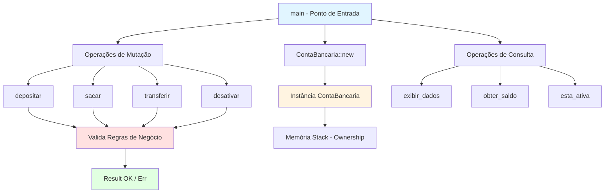
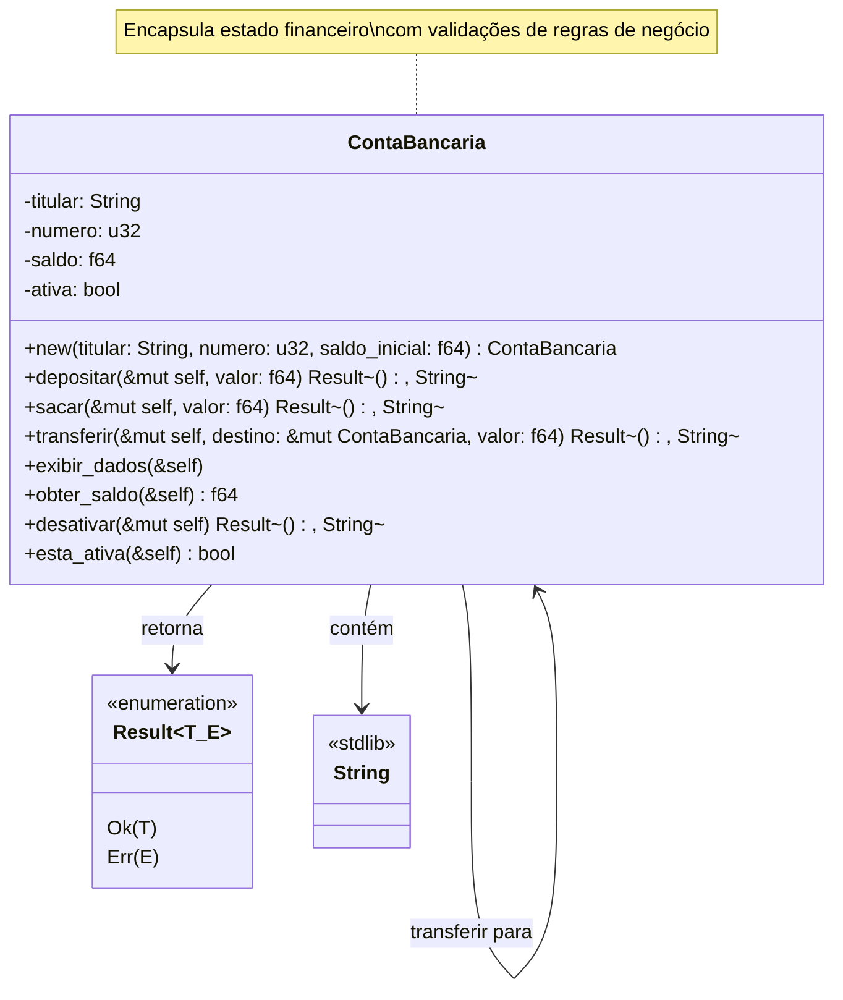
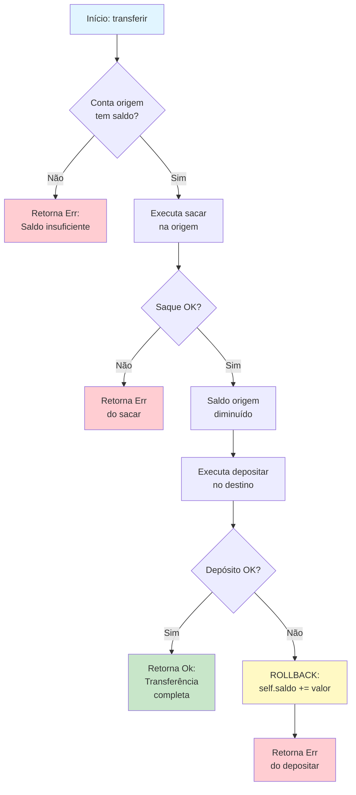
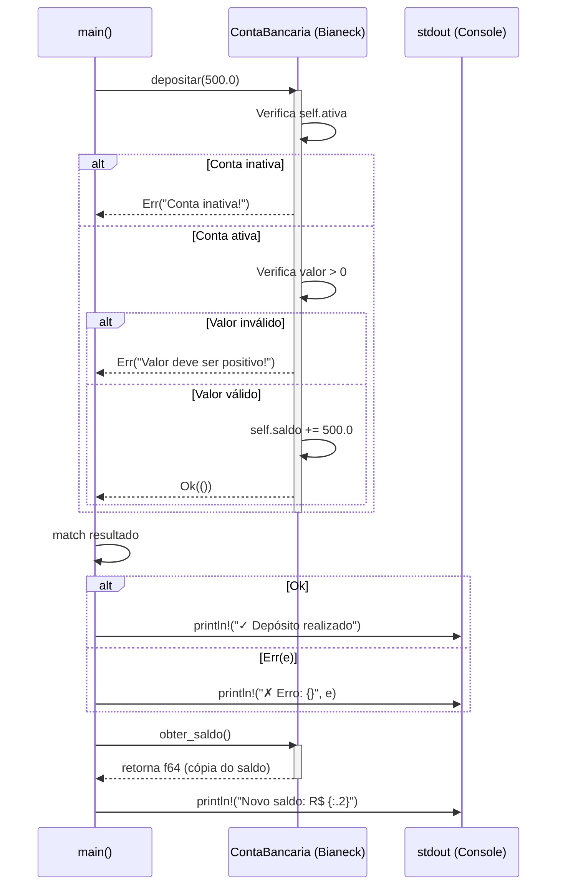
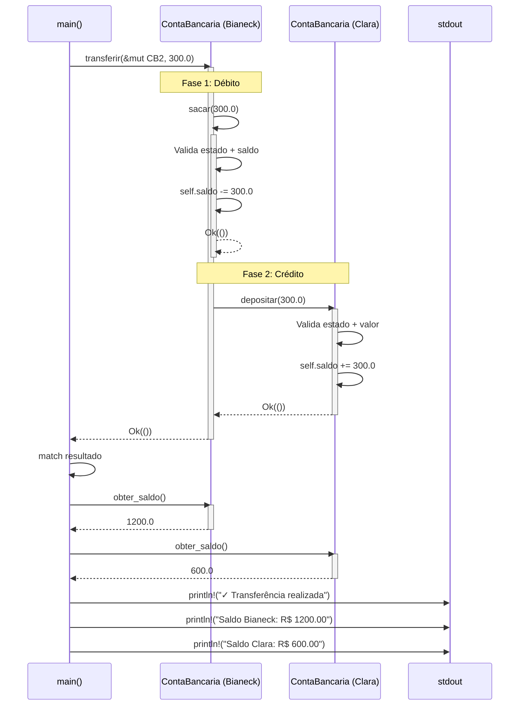
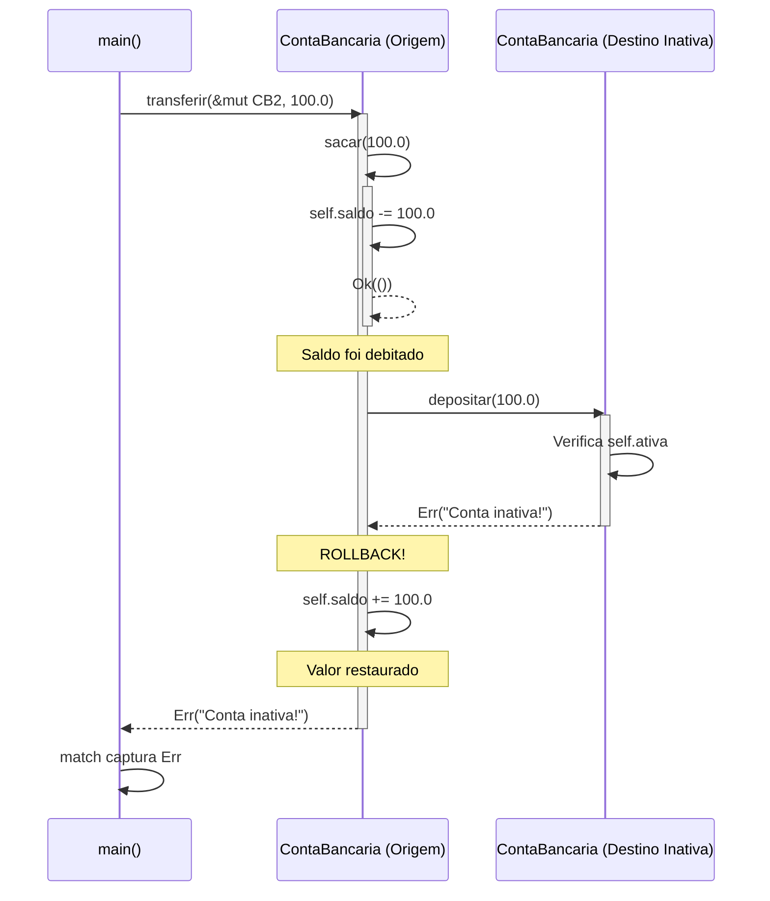
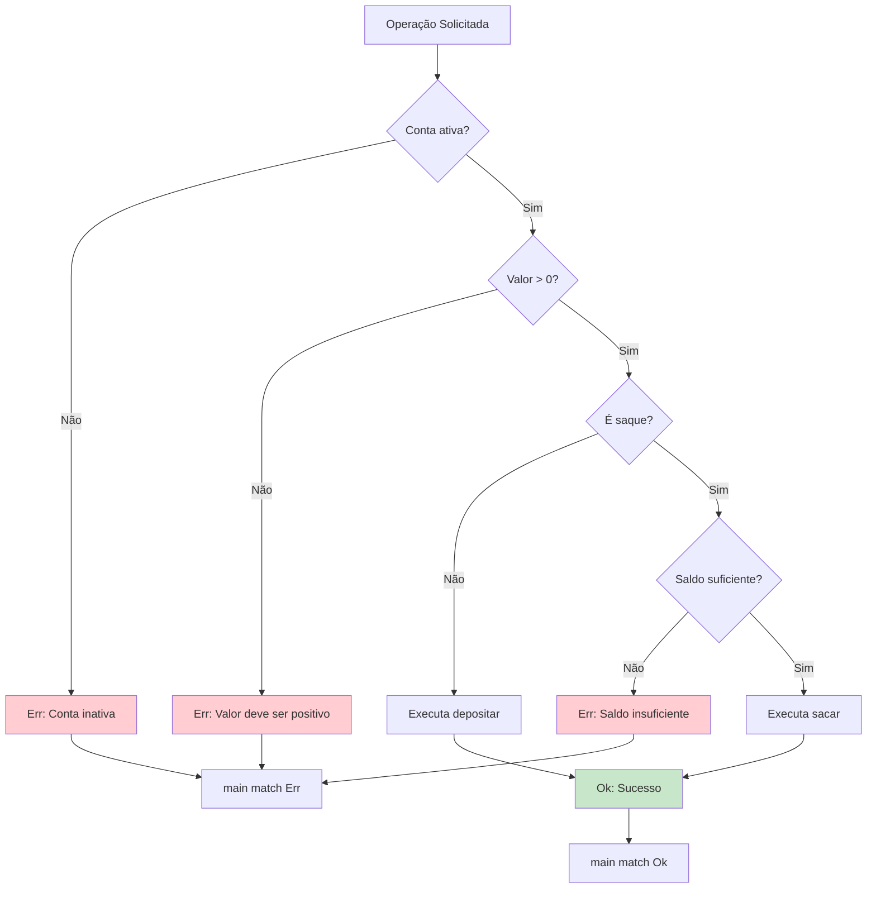
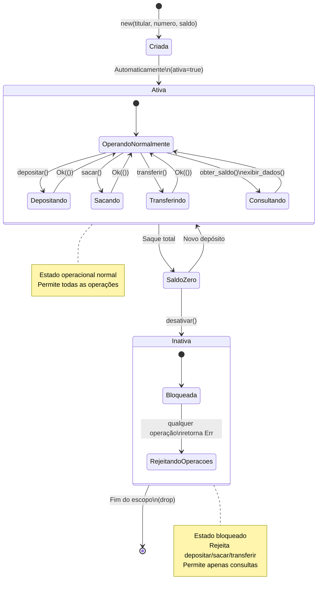

# 📊 RELATÓRIO TÉCNICO DE ANÁLISE DE CÓDIGO

**Sistema:** Sistema de Contas Bancárias  
**Linguagem:** Rust 🦀  
**Paradigma:** Orientado a Objetos (via structs e traits implícitos)  
**Versão de Análise:** 1.0  
**Data:** 21/11/2025

---

## 1️⃣ VISÃO GERAL

### **🎯 Propósito do Sistema**

Este é um **sistema de gestão de contas bancárias simplificado** que simula operações financeiras básicas. O código implementa o conceito de **conta corrente** com operações clássicas de movimentação financeira.

### **🏦 Domínio de Negócio**

**Domínio:** Serviços Financeiros - Banking (Setor Bancário)

**Modelo Conceitual:**
O sistema modela uma **Conta Bancária** como entidade central que possui:
- **Identidade** (titular + número único)
- **Estado financeiro** (saldo em reais)
- **Status operacional** (ativa/inativa)

**Analogia:** Pense no sistema como um **caixa eletrônico virtual** onde cada conta é uma "gaveta" (struct) com dinheiro dentro, e as operações são como botões que você aperta (métodos) para movimentar esse dinheiro entre gavetas.

### **🛠️ Paradigma e Arquitetura**

**Linguagem:** Rust
- **Ownership system** (sistema de propriedade) para gerenciar memória
- **Borrowing** (empréstimos mutáveis e imutáveis) via `&self` e `&mut self`
- **Result types** para tratamento de erros explícito
- **Pattern matching** para controle de fluxo robusto

**Arquitetura:** Monolítico com camada única (sem separação de módulos)

---

### **📐 Diagrama de Arquitetura do Sistema**



**Descrição da Arquitetura:**
- **main()** orquestra todo o fluxo de execução
- **ContaBancaria** é a entidade central com estado encapsulado
- Métodos divididos em **mutadores** (alteram estado) e **consultores** (apenas leem)
- **Validações centralizadas** antes de qualquer mutação de estado
- **Sistema de tipos Result<T, E>** força tratamento explícito de erros

---

## 2️⃣ ESTRUTURAS DE DADOS

### **🏗️ Estrutura Principal: `ContaBancaria`**

**Tipo:** `struct` (estrutura de dados heterogênea)

**Responsabilidade:** 
Agregar todos os dados e comportamentos relacionados a uma conta bancária individual.

**Atributos:**

| Campo     | Tipo     | Propósito                          | Invariantes                                                             |
| --------- | -------- | ---------------------------------- | ----------------------------------------------------------------------- |
| `titular` | `String` | Nome do proprietário da conta      | Não vazio (garantido pelo construtor)                                   |
| `numero`  | `u32`    | Identificador único da conta       | Número inteiro positivo de 32 bits                                      |
| `saldo`   | `f64`    | Valor monetário disponível (em R$) | Ponto flutuante de 64 bits, pode ser negativo (sem validação explícita) |
| `ativa`   | `bool`   | Indica se a conta está operacional | `true` = operacional, `false` = bloqueada                               |

**Observações Técnicas:**

1. **`String` vs `&str`:** O campo `titular` usa `String` (heap-allocated) ao invés de `&str` (borrowed slice), indicando que a struct **possui** (owns) o nome do titular.

2. **`f64` para dinheiro:** Uso de ponto flutuante para valores monetários (tecnicamente não ideal para produção devido a imprecisões de arredondamento, mas adequado para este exemplo didático).

3. **Imutabilidade por padrão:** Em Rust, structs são imutáveis por padrão. Para modificar, é necessário declarar a instância como `mut`.

---

### **📊 Diagrama de Classes UML**



**Legenda do Diagrama:**
- **`-`** (privado): Atributos não acessíveis fora da struct
- **`+`** (público): Métodos acessíveis externamente via `impl`
- **`&self`**: Método de leitura (borrow imutável)
- **`&mut self`**: Método de mutação (borrow mutável)
- **`Result<(), String>`**: Retorna sucesso vazio ou mensagem de erro

---

### **🔗 Relacionamentos entre Entidades**

**1. Composição:**
- `ContaBancaria` **contém** (owns) um `String` (titular)
- Quando a conta é destruída, o `String` também é desalocado

**2. Dependência:**
- `ContaBancaria` **depende de** `Result<T, E>` (tipo da biblioteca padrão)
- Todos os métodos mutadores retornam `Result<(), String>`

**3. Associação:**
- Método `transferir()` cria uma **associação temporária** entre duas instâncias de `ContaBancaria`
- A conta origem referencia a conta destino via `&mut ContaBancaria`

---

## 3️⃣ INVENTÁRIO DE FUNÇÕES

### **📦 Função Associada (Construtor)**

#### **`ContaBancaria::new()`**

**Assinatura:**
```rust
fn new(titular: String, numero: u32, saldo_inicial: f64) -> ContaBancaria
```

**Propósito:**  
Criar uma nova instância de `ContaBancaria` com valores iniciais, garantindo que a conta sempre inicie no estado ativo.

**Parâmetros de Entrada:**
- `titular: String` → Nome do proprietário (ownership transferido para a struct)
- `numero: u32` → Identificador único da conta (0 a 4.294.967.295)
- `saldo_inicial: f64` → Valor monetário inicial em reais

**Retorno:**
- `ContaBancaria` → Nova instância totalmente inicializada

**Algoritmo Interno (Passo a Passo):**

1. Recebe ownership da `String` titular
2. Recebe cópia dos valores `numero` e `saldo_inicial` (tipos primitivos implementam `Copy`)
3. Constrói a struct com sintaxe abreviada (field init shorthand):
   - `titular` → atribui diretamente
   - `numero` → atribui diretamente
   - `saldo` ← `saldo_inicial` (renomeia)
   - `ativa` ← `true` (valor fixo)
4. Retorna a struct construída (ownership transferido para o chamador)

**Complexidade:**
- **Temporal:** O(1) - operações de atribuição direta
- **Espacial:** O(n) onde n = tamanho da String titular (alocação no heap)

**Dependências:**
- Nenhuma (função pura)

**Regras de Negócio Implementadas:**
- ✅ Toda conta nova é criada no estado **ativa** (não existe conta inativa desde o início)
- ✅ Aceita saldo inicial de qualquer valor (inclusive negativo ou zero)

---

### **💰 Método: `depositar()`**

**Assinatura:**
```rust
fn depositar(&mut self, valor: f64) -> Result<(), String>
```

**Propósito:**  
Adicionar valor ao saldo da conta, respeitando regras de negócio de depósitos bancários.

**Parâmetros de Entrada:**
- `&mut self` → Referência mutável à conta (permite modificar `saldo`)
- `valor: f64` → Quantia a ser depositada

**Retorno:**
- `Result<(), String>`:
  - `Ok(())` → Depósito realizado com sucesso
  - `Err(String)` → Mensagem descrevendo o motivo da falha

**Algoritmo Interno (Passo a Passo):**

1. **Validação de estado:**
   - Verifica se `self.ativa == false`
   - Se inativa → retorna `Err("Conta inativa!")`
   - Early return evita execução desnecessária

2. **Validação de valor:**
   - Verifica se `valor <= 0.0`
   - Se não positivo → retorna `Err("Valor deve ser positivo!")`
   - Garante que apenas valores válidos sejam processados

3. **Mutação de estado:**
   - Executa `self.saldo += valor` (operação de adição com atribuição)
   - Modifica diretamente o campo privado

4. **Confirmação:**
   - Retorna `Ok(())` (tupla vazia indica sucesso sem valor de retorno)

**Complexidade:**
- **Temporal:** O(1) - operações aritméticas e comparações diretas
- **Espacial:** O(1) - não aloca memória adicional

**Dependências:**
- Campos `self.ativa` e `self.saldo`

**Regras de Negócio Implementadas:**
- ✅ **RN01:** Contas inativas não podem receber depósitos
- ✅ **RN02:** Valores de depósito devem ser estritamente positivos (> 0)
- ✅ **RN03:** Não há limite máximo de depósito (aceita qualquer valor positivo)

---

### **🏧 Método: `sacar()`**

**Assinatura:**
```rust
fn sacar(&mut self, valor: f64) -> Result<(), String>
```

**Propósito:**  
Retirar valor do saldo da conta, validando disponibilidade de fundos.

**Parâmetros de Entrada:**
- `&mut self` → Referência mutável à conta
- `valor: f64` → Quantia a ser sacada

**Retorno:**
- `Result<(), String>`:
  - `Ok(())` → Saque realizado com sucesso
  - `Err(String)` → Motivo da rejeição

**Algoritmo Interno (Passo a Passo):**

1. **Validação de estado:**
   - Verifica se `self.ativa == false`
   - Se inativa → retorna `Err("Conta inativa!")`

2. **Validação de valor:**
   - Verifica se `valor <= 0.0`
   - Se não positivo → retorna `Err("Valor deve ser positivo!")`

3. **Validação de saldo:**
   - Verifica se `valor > self.saldo`
   - Se saldo insuficiente → retorna `Err("Saldo insuficiente!")`
   - **Importante:** Permite saque total (valor == saldo), zerando a conta

4. **Mutação de estado:**
   - Executa `self.saldo -= valor`
   - Subtrai o valor do saldo atual

5. **Confirmação:**
   - Retorna `Ok(())`

**Complexidade:**
- **Temporal:** O(1)
- **Espacial:** O(1)

**Dependências:**
- Campos `self.ativa` e `self.saldo`

**Regras de Negócio Implementadas:**
- ✅ **RN01:** Contas inativas não permitem saques
- ✅ **RN02:** Valores de saque devem ser positivos
- ✅ **RN04:** Não permite saque superior ao saldo disponível (sem cheque especial)
- ✅ **RN05:** Permite zerar a conta (valor == saldo é válido)

---

### **🔄 Método: `transferir()`**

**Assinatura:**
```rust
fn transferir(&mut self, destino: &mut ContaBancaria, valor: f64) -> Result<(), String>
```

**Propósito:**  
Mover valor da conta origem para conta destino de forma atômica (tudo ou nada).

**Parâmetros de Entrada:**
- `&mut self` → Conta origem (será debitada)
- `destino: &mut ContaBancaria` → Conta destino (será creditada)
- `valor: f64` → Quantia a ser transferida

**Retorno:**
- `Result<(), String>`:
  - `Ok(())` → Transferência completa realizada
  - `Err(String)` → Motivo da falha (rollback automático)

**Algoritmo Interno (Passo a Passo):**

1. **Fase 1: Débito na Origem**
   - Chama `self.sacar(valor)?`
   - Operador `?` propaga erro imediatamente se falhar
   - Valida todas as regras de saque (conta ativa, valor positivo, saldo suficiente)
   - Se falhar, função termina aqui (nada foi modificado)

2. **Fase 2: Crédito no Destino (com proteção de rollback)**
   - Chama `destino.depositar(valor)`
   - Usa `match` para capturar resultado
   
   **Caso 2a - Depósito bem-sucedido:**
   - Retorna `Ok(())`
   - Transação completa

   **Caso 2b - Depósito falhou:**
   - Executa `self.saldo += valor` (estorna o saque)
   - Retorna `Err(e)` (propaga erro do depósito)
   - Garante que o dinheiro "volta" para a origem

3. **Garantia de Atomicidade:**
   - Se qualquer etapa falha, o estado anterior é restaurado
   - Nunca ocorre perda ou duplicação de valores

**Complexidade:**
- **Temporal:** O(1) - duas operações independentes do tamanho dos dados
- **Espacial:** O(1) - não aloca estruturas adicionais

**Dependências:**
- Métodos `sacar()` e `depositar()`
- Duas instâncias mutáveis de `ContaBancaria`

**Regras de Negócio Implementadas:**
- ✅ **RN06:** Transferência é atômica (ou completa ou não acontece)
- ✅ **RN07:** Se destino estiver inativa, o saque da origem é revertido
- ✅ **RN08:** Todas as regras de saque e depósito são aplicadas
- ✅ **RN09:** Permite transferência entre contas do mesmo titular ou diferentes

**Fluxograma da Transferência:**



---

### **📋 Método: `exibir_dados()`**

**Assinatura:**
```rust
fn exibir_dados(&self)
```

**Propósito:**  
Apresentar informações da conta no console de forma formatada e legível.

**Parâmetros de Entrada:**
- `&self` → Referência imutável (apenas lê os dados)

**Retorno:**
- `()` (unit type) → Não retorna valor, apenas produz efeito colateral (output)

**Algoritmo Interno (Passo a Passo):**

1. Imprime cabeçalho com bordas (`println!` macro)
2. Imprime campo `titular` usando placeholder `{}`
3. Imprime campo `numero` usando placeholder `{}`
4. Imprime campo `saldo` com formatação monetária `{:.2}` (duas casas decimais)
5. Imprime campo `ativa` com operador ternário:
   - Se `self.ativa == true` → exibe "Ativa"
   - Se `self.ativa == false` → exibe "Inativa"
6. Imprime rodapé com bordas

**Complexidade:**
- **Temporal:** O(1) - número fixo de operações de I/O
- **Espacial:** O(1) - não aloca estruturas dinâmicas

**Dependências:**
- Macro `println!` da biblioteca padrão `std::io`
- Todos os campos da struct

**Regras de Negócio Implementadas:**
- ✅ **RN10:** Saldo sempre exibido com duas casas decimais (padrão monetário brasileiro)
- ✅ **RN11:** Status textual ("Ativa"/"Inativa") para melhor compreensão do usuário

---

### **💵 Método: `obter_saldo()`**

**Assinatura:**
```rust
fn obter_saldo(&self) -> f64
```

**Propósito:**  
Fornecer acesso controlado ao saldo sem expor o campo diretamente (encapsulamento).

**Parâmetros de Entrada:**
- `&self` → Referência imutável

**Retorno:**
- `f64` → Cópia do valor atual do saldo

**Algoritmo Interno (Passo a Passo):**

1. Retorna cópia de `self.saldo`
2. Como `f64` implementa trait `Copy`, o valor é duplicado (não move ownership)

**Complexidade:**
- **Temporal:** O(1)
- **Espacial:** O(1)

**Dependências:**
- Campo `self.saldo`

**Regras de Negócio Implementadas:**
- ✅ **RN12:** Saldo pode ser consultado independente do status da conta
- ✅ **RN13:** Retorna valor exato sem arredondamentos

---

### **🔒 Método: `desativar()`**

**Assinatura:**
```rust
fn desativar(&mut self) -> Result<(), String>
```

**Propósito:**  
Bloquear operações na conta, impedindo movimentações futuras.

**Parâmetros de Entrada:**
- `&mut self` → Referência mutável (modifica campo `ativa`)

**Retorno:**
- `Result<(), String>`:
  - `Ok(())` → Conta desativada com sucesso
  - `Err(String)` → Motivo da rejeição

**Algoritmo Interno (Passo a Passo):**

1. **Validação de saldo:**
   - Verifica se `self.saldo > 0.0`
   - Se houver saldo positivo → retorna `Err("Não pode desativar conta com saldo positivo!")`
   - **Importante:** Permite desativar se saldo == 0.0 ou negativo

2. **Mutação de estado:**
   - Executa `self.ativa = false`
   - Altera o flag de status

3. **Confirmação:**
   - Retorna `Ok(())`

**Complexidade:**
- **Temporal:** O(1)
- **Espacial:** O(1)

**Dependências:**
- Campos `self.saldo` e `self.ativa`

**Regras de Negócio Implementadas:**
- ✅ **RN14:** Só permite desativar conta com saldo zerado ou negativo
- ✅ **RN15:** Não valida se a conta já está inativa (permite desativar conta já desativada)
- ✅ **RN16:** Desativação é irreversível (não existe método `reativar()`)

---

### **✔️ Método: `esta_ativa()`**

**Assinatura:**
```rust
fn esta_ativa(&self) -> bool
```

**Propósito:**  
Verificar o status operacional da conta (predicate method).

**Parâmetros de Entrada:**
- `&self` → Referência imutável

**Retorno:**
- `bool`:
  - `true` → Conta operacional
  - `false` → Conta bloqueada

**Algoritmo Interno (Passo a Passo):**

1. Retorna cópia de `self.ativa`
2. Como `bool` implementa `Copy`, o valor é duplicado

**Complexidade:**
- **Temporal:** O(1)
- **Espacial:** O(1)

**Dependências:**
- Campo `self.ativa`

**Regras de Negócio Implementadas:**
- ✅ **RN17:** Status pode ser consultado a qualquer momento
- ✅ **RN18:** Retorna estado booleano puro (sem lógica adicional)

---

### **🎬 Função: `main()`**

**Assinatura:**
```rust
fn main()
```

**Propósito:**  
Ponto de entrada do programa. Orquestra demonstração completa do sistema de contas bancárias com cenários de teste.

**Parâmetros de Entrada:**
- Nenhum

**Retorno:**
- `()` (implícito) → Programa termina ao final da execução

**Algoritmo Interno (Passo a Passo):**

**Fase 1: Inicialização (Linhas 92-107)**
1. Imprime banner do sistema
2. Cria três contas usando `ContaBancaria::new()`:
   - `conta_bianeck`: R$ 1000,00 (número 1001)
   - `conta_clara`: R$ 500,00 (número 1002)
   - `conta_lunna`: R$ 300,00 (número 1003)
3. Todas as variáveis declaradas com `mut` (permitindo mutação)

**Fase 2: Exibição Inicial (Linhas 110-113)**
4. Chama `exibir_dados()` para cada conta
5. Mostra estado inicial do sistema

**Fase 3: Teste de Depósito (Linhas 116-121)**
6. Deposita R$ 500,00 na conta Bianeck
7. Usa `match` para tratar `Result`
8. Imprime novo saldo com `obter_saldo()`
9. **Saldo esperado:** R$ 1500,00

**Fase 4: Teste de Saque (Linhas 124-129)**
10. Saca R$ 200,00 da conta Clara
11. Usa `match` para tratar resultado
12. Imprime novo saldo
13. **Saldo esperado:** R$ 300,00

**Fase 5: Teste de Saque Inválido (Linhas 132-136)**
14. Tenta sacar R$ 500,00 da conta Lunna (saldo R$ 300,00)
15. **Falha esperada:** "Saldo insuficiente!"
16. Demonstra tratamento de erro

**Fase 6: Teste de Transferência (Linhas 139-149)**
17. Transfere R$ 300,00 de Bianeck para Clara
18. Usa `match` para capturar sucesso/falha
19. Imprime saldos finais de ambas as contas
20. **Saldos esperados:**
    - Bianeck: R$ 1200,00 (1500 - 300)
    - Clara: R$ 600,00 (300 + 300)

**Fase 7: Múltiplas Operações Silenciosas (Linhas 152-155)**
21. Deposita R$ 200,00 em Bianeck (ignora resultado com `let _`)
22. Saca R$ 100,00 de Clara
23. Deposita R$ 150,00 em Lunna
24. **Saldos esperados:**
    - Bianeck: R$ 1400,00 (1200 + 200)
    - Clara: R$ 500,00 (600 - 100)
    - Lunna: R$ 450,00 (300 + 150)

**Fase 8: Exibição Final (Linhas 158-162)**
25. Exibe estado final de todas as contas

**Fase 9: Teste de Desativação (Linhas 165-172)**
26. Zera saldo da conta Lunna:
    - Chama `obter_saldo()` para pegar valor atual
    - Saca o valor total
27. Desativa conta Lunna
28. **Estado esperado:** Conta inativa com saldo zero

**Fase 10: Teste de Operação em Conta Inativa (Linhas 175-179)**
29. Tenta depositar R$ 100,00 na conta Lunna (inativa)
30. **Falha esperada:** "Conta inativa!"
31. Demonstra proteção de regra de negócio

**Complexidade:**
- **Temporal:** O(1) - número fixo de operações
- **Espacial:** O(1) - três instâncias de struct na stack

**Dependências:**
- Todos os métodos da struct `ContaBancaria`
- Macro `println!`

---

## 4️⃣ FLUXO DE EXECUÇÃO

### **🎯 Caminho Completo do Sistema**

**ENTRADA → PROCESSAMENTO → SAÍDA**

---

### **📍 Fase 1: Inicialização**

**Entrada:**
- Código-fonte compilado
- Programa executado pela linha de comando

**Processamento:**
1. Runtime Rust inicia
2. Função `main()` é invocada
3. Alocação de memória na stack para três structs
4. Três construtores `new()` executados
5. Strings dos titulares alocadas no heap

**Saída:**
- Três instâncias de `ContaBancaria` criadas
- Memória organizada (ownership estabelecido)

---

### **📍 Fase 2: Operações Bancárias**

**Fluxo de uma operação típica (exemplo: Depósito)**



---

### **📍 Fase 3: Transferência (Fluxo Complexo)**

**Diagrama de Sequência para Transferência Bem-Sucedida:**



**Diagrama de Sequência para Transferência com Rollback:**



---

### **📍 Happy Path vs Error Path**

**Happy Path (Caminho de Sucesso):**

1. Conta está ativa ✅
2. Valor é positivo ✅
3. Saldo é suficiente (no caso de saque) ✅
4. Operação executada ✅
5. `Result::Ok(())` retornado ✅
6. `match` executa braço de sucesso ✅
7. Mensagem de confirmação exibida ✅

**Error Paths (Caminhos de Erro):**



---

### **📍 Ciclo de Vida de uma Conta**

**Diagrama de Estados:**



**Transições de Estado:**

| De          | Para        | Evento                                     | Condição                   |
| ----------- | ----------- | ------------------------------------------ | -------------------------- |
| `[*]`       | `Criada`    | `new()` chamado                            | -                          |
| `Criada`    | `Ativa`     | Automático                                 | `ativa=true` no construtor |
| `Ativa`     | `Ativa`     | `depositar()` / `sacar()` / `transferir()` | Operação bem-sucedida      |
| `Ativa`     | `SaldoZero` | `sacar(saldo_total)`                       | Valor sacado == saldo      |
| `SaldoZero` | `Ativa`     | `depositar()`                              | Qualquer valor positivo    |
| `SaldoZero` | `Inativa`   | `desativar()`                              | `saldo <= 0.0`             |
| `Inativa`   | `[*]`       | Fim do escopo                              | Variável sai do scope      |

---

### **📍 Cenários de Teste Executados em `main()`**

| #   | Cenário                   | Entrada                                  | Resultado Esperado           | Tipo       |
| --- | ------------------------- | ---------------------------------------- | ---------------------------- | ---------- |
| 1   | Depósito válido           | `conta_bianeck.depositar(500.0)`         | `Ok(())`, saldo = 1500       | Happy path |
| 2   | Saque válido              | `conta_clara.sacar(200.0)`               | `Ok(())`, saldo = 300        | Happy path |
| 3   | Saque inválido            | `conta_lunna.sacar(500.0)` com saldo 300 | `Err("Saldo insuficiente!")` | Error path |
| 4   | Transferência válida      | Bianeck → Clara (300)                    | `Ok(())`, saldos ajustados   | Happy path |
| 5   | Múltiplas operações       | 3 operações consecutivas                 | Todos `Ok(())`               | Happy path |
| 6   | Desativação válida        | `conta_lunna.desativar()` com saldo 0    | `Ok(())`, ativa=false        | Happy path |
| 7   | Operação em conta inativa | `conta_lunna.depositar(100.0)`           | `Err("Conta inativa!")`      | Error path |

---

## 5️⃣ REGRAS DE NEGÓCIO

### **📜 Regras Extraídas do Código**

---

### **🔐 RN01: Proteção de Contas Inativas**

**Localização:** Linhas 25, 40, método `depositar()` e `sacar()`

**Descrição:**  
Contas marcadas como inativas (`ativa == false`) não podem realizar operações de movimentação financeira (depósitos, saques, transferências).

**Implementação:**
```rust
if !self.ativa {
    return Err(String::from("Conta inativa!"));
}
```

**Contexto de Domínio:**  
Simula contas bancárias encerradas ou bloqueadas judicialmente. Impede movimentações não autorizadas em contas que deveriam estar "congeladas".

**Analogia:**  
Imagine uma gaveta de dinheiro trancada com cadeado. Mesmo que você queira colocar ou tirar dinheiro, o cadeado impede qualquer acesso.

**Exceção:**  
Métodos de consulta (`obter_saldo()`, `exibir_dados()`) ainda funcionam em contas inativas, permitindo auditoria.

---

### **💰 RN02: Validação de Valores Positivos**

**Localização:** Linhas 27-29, 42-44

**Descrição:**  
Operações financeiras (depósitos e saques) devem usar valores estritamente positivos (> 0.0). Valores zero, negativos ou inválidos são rejeitados.

**Implementação:**
```rust
if valor <= 0.0 {
    return Err(String::from("Valor deve ser positivo!"));
}
```

**Contexto de Domínio:**  
Previne operações sem sentido financeiro (como "depositar R$ -50" ou "sacar R$ 0"). Garante integridade dos dados financeiros.

**Casos Bloqueados:**
- `depositar(0.0)` → Erro
- `sacar(-100.0)` → Erro
- `transferir(0.0)` → Erro (via validação de `sacar()`)

**Nota Técnica:**  
O tipo `f64` permite valores `NaN` e `Infinity`, mas a validação `<= 0.0` bloqueia implicitamente `NaN` (comparações com NaN retornam sempre false).

---

### **🚫 RN04: Proibição de Saldo Negativo**

**Localização:** Linhas 46-48, método `sacar()`

**Descrição:**  
Saques não podem exceder o saldo disponível. Não existe "cheque especial" ou crédito automático.

**Implementação:**
```rust
if valor > self.saldo {
    return Err(String::from("Saldo insuficiente!"));
}
```

**Contexto de Domínio:**  
Modelo de conta corrente simplificado sem limite de crédito. Impede que clientes "gastem" dinheiro que não possuem.

**Casos Permitidos:**
- `sacar(saldo_exato)` → Zera a conta ✅
- `sacar(saldo - 0.01)` → Deixa R$ 0,01 ✅

**Casos Bloqueados:**
- `sacar(saldo + 0.01)` → Erro ❌

---

### **⚛️ RN06: Transações Atômicas em Transferências**

**Localização:** Linhas 56-68, método `transferir()`

**Descrição:**  
Transferências são operações "tudo ou nada". Se qualquer etapa falha, o estado anterior é restaurado automaticamente (rollback).

**Implementação:**
```rust
// Fase 1: Tenta sacar
self.sacar(valor)?;

// Fase 2: Tenta depositar
match destino.depositar(valor) {
    Ok(_) => Ok(()),
    Err(e) => {
        self.saldo += valor; // ROLLBACK
        Err(e)
    }
}
```

**Contexto de Domínio:**  
Garante consistência financeira. Impede cenários catastróficos como:
- Dinheiro debitado da origem mas não creditado no destino
- Dinheiro "sumindo" do sistema
- Duplicação de valores

**Cenários Protegidos:**

| Situação         | Resultado                         | Rollback?               |
| ---------------- | --------------------------------- | ----------------------- |
| Origem sem saldo | Saque falha imediatamente         | Não (nada foi alterado) |
| Destino inativa  | Depósito falha, saque é revertido | Sim                     |
| Ambas inativas   | Saque falha na origem             | Não                     |
| Sucesso total    | Ambas atualizadas                 | N/A                     |

**Analogia:**  
É como trocar dinheiro entre duas carteiras: você só tira da primeira SE conseguir colocar na segunda. Se alguém arrancar a segunda carteira da sua mão, você guarda o dinheiro de volta na primeira.

---

### **🔒 RN14: Política de Desativação de Contas**

**Localização:** Linhas 94-101, método `desativar()`

**Descrição:**  
Contas só podem ser desativadas se tiverem saldo zerado ou negativo. Contas com saldo positivo não podem ser encerradas.

**Implementação:**
```rust
if self.saldo > 0.0 {
    return Err(String::from("Não pode desativar conta com saldo positivo!"));
}
self.ativa = false;
```

**Contexto de Domínio:**  
Simula política bancária real: cliente deve sacar todo o dinheiro antes de encerrar a conta. Impede "abandono" de valores.

**Fluxo Correto de Encerramento:**
1. Cliente saca todo o saldo → `sacar(obter_saldo())`
2. Conta fica com saldo `0.0`
3. Desativação é permitida → `desativar()` retorna `Ok(())`

**Nota Interessante:**  
O código permite desativar contas com saldo **negativo** (débito). Isso seria uma conta que deve dinheiro ao banco.

---

### **🔄 RN15: Idempotência de Desativação**

**Localização:** Método `desativar()` - ausência de validação

**Descrição:**  
Não há verificação se a conta já está inativa. Desativar uma conta inativa retorna sucesso.

**Comportamento:**
```rust
// Primeira chamada
conta.desativar(); // Ok(())

// Segunda chamada (conta já inativa)
conta.desativar(); // Ok(()) novamente
```

**Contexto de Domínio:**  
Operação idempotente (múltiplas execuções produzem mesmo resultado). Simplifica lógica do cliente que não precisa verificar status antes de desativar.

---

### **🎨 RN10: Formatação Monetária Padronizada**

**Localização:** Linha 82, método `exibir_dados()`

**Descrição:**  
Valores monetários sempre exibidos com exatamente duas casas decimais, seguindo padrão brasileiro.

**Implementação:**
```rust
println!("Saldo: R$ {:.2}", self.saldo);
```

**Contexto de Domínio:**  
Real brasileiro usa centavos (2 dígitos decimais). Garante apresentação consistente para o usuário.

**Exemplos de Formatação:**
- `1234.5` → exibe "R$ 1234.50"
- `999.999` → exibe "R$ 1000.00" (arredonda)
- `0.0` → exibe "R$ 0.00"

---

### **📊 RN17: Transparência de Dados**

**Localização:** Métodos `obter_saldo()`, `esta_ativa()`, `exibir_dados()`

**Descrição:**  
Dados da conta podem ser consultados independente do status. Contas inativas ainda permitem leitura de informações.

**Justificativa:**  
Auditoria e compliance. Mesmo contas encerradas precisam ter histórico acessível para fins fiscais e legais.

---

### **📋 Resumo das Regras de Negócio**

| Código | Regra                                  | Validação            | Consequência de Violação            |
| ------ | -------------------------------------- | -------------------- | ----------------------------------- |
| RN01   | Conta deve estar ativa para operar     | `!self.ativa`        | `Err("Conta inativa!")`             |
| RN02   | Valores devem ser positivos            | `valor <= 0.0`       | `Err("Valor deve ser positivo!")`   |
| RN04   | Saldo não pode ficar negativo          | `valor > self.saldo` | `Err("Saldo insuficiente!")`        |
| RN06   | Transferências são atômicas            | Rollback automático  | Estado restaurado + `Err` propagado |
| RN10   | Saldo exibido com 2 casas decimais     | Formatação `{:.2}`   | N/A (apresentação)                  |
| RN14   | Desativar requer saldo zerado          | `self.saldo > 0.0`   | `Err("Não pode desativar...")`      |
| RN15   | Desativação é idempotente              | Sem validação        | Permite múltiplas desativações      |
| RN17   | Consultas funcionam em qualquer estado | Sem validação        | Transparência total                 |

---

## 6️⃣ GLOSSÁRIO TÉCNICO

### **🔤 Termos de Domínio Bancário**

| Termo                  | Significado                             | Contexto no Código                                      |
| ---------------------- | --------------------------------------- | ------------------------------------------------------- |
| **Titular**            | Proprietário legal da conta             | Campo `titular: String` - pessoa responsável            |
| **Número da Conta**    | Identificador único da conta            | Campo `numero: u32` - chave primária                    |
| **Saldo**              | Quantia monetária disponível            | Campo `saldo: f64` - valor em reais (R$)                |
| **Conta Ativa**        | Conta operacional, não bloqueada        | Campo `ativa: bool` - flag de status                    |
| **Depósito**           | Entrada de dinheiro na conta            | Método `depositar()` - crédito                          |
| **Saque**              | Retirada de dinheiro da conta           | Método `sacar()` - débito                               |
| **Transferência**      | Movimentação entre contas               | Método `transferir()` - débito origem + crédito destino |
| **Desativação**        | Bloqueio permanente da conta            | Método `desativar()` - encerramento                     |
| **Saldo Insuficiente** | Tentativa de saque maior que disponível | Erro de validação                                       |
| **Rollback**           | Reversão de operação parcial            | Mecanismo de atomicidade                                |

---

### **⚙️ Conceitos Técnicos de Rust**

| Conceito                | Descrição                                   | Uso no Código                                  |
| ----------------------- | ------------------------------------------- | ---------------------------------------------- |
| **`struct`**            | Estrutura de dados customizada              | `ContaBancaria` agrega 4 campos                |
| **`impl` block**        | Implementação de métodos para struct        | Bloco com 9 métodos associados                 |
| **Ownership**           | Sistema de posse única de valores           | `String titular` é owned pela struct           |
| **Borrowing**           | Empréstimo temporário de valores            | `&self` (leitura) e `&mut self` (escrita)      |
| **`&self`**             | Referência imutável (shared borrow)         | Métodos de consulta (não modificam)            |
| **`&mut self`**         | Referência mutável (exclusive borrow)       | Métodos de mutação (modificam estado)          |
| **`Result<T, E>`**      | Tipo enum para operações que podem falhar   | `Result<(), String>` em todos os mutadores     |
| **`Ok(T)`**             | Variante de sucesso do Result               | `Ok(())` quando operação é bem-sucedida        |
| **`Err(E)`**            | Variante de erro do Result                  | `Err(String)` com mensagem descritiva          |
| **Pattern Matching**    | Correspondência estrutural de valores       | `match result { Ok(_) => ..., Err(e) => ... }` |
| **`?` operator**        | Propagação automática de erros              | `self.sacar(valor)?` - early return se Err     |
| **Associated Function** | Função vinculada ao tipo (não à instância)  | `ContaBancaria::new()` - construtor            |
| **Method**              | Função com `self` (opera sobre instância)   | `conta.depositar()` - método de instância      |
| **`String`**            | String owned no heap (crescimento dinâmico) | Campo `titular`                                |
| **`u32`**               | Unsigned 32-bit integer (0 a 4.294.967.295) | Campo `numero`                                 |
| **`f64`**               | Float 64-bit (IEEE 754 double precision)    | Campo `saldo`                                  |
| **`bool`**              | Tipo booleano (true/false)                  | Campo `ativa`                                  |
| **`println!` macro**    | Macro de impressão com formatação           | Saída no console                               |
| **`{:.2}` specifier**   | Formatador de 2 casas decimais              | Exibição monetária                             |
| **`let _`**             | Descarte explícito de valor de retorno      | Ignorar `Result` em operações sem verificação  |

---

### **🏛️ Padrões de Design Aplicados**

| Padrão                       | Descrição                                | Implementação                                   |
| ---------------------------- | ---------------------------------------- | ----------------------------------------------- |
| **Encapsulation**            | Campos privados + métodos públicos       | Acesso a `saldo` apenas via métodos             |
| **Constructor Pattern**      | Função associada para criação            | `ContaBancaria::new()`                          |
| **Result Type Pattern**      | Tratamento explícito de erros            | Não usa exceptions, usa `Result<T, E>`          |
| **Builder-like Init**        | Sintaxe abreviada de inicialização       | `ContaBancaria { titular, numero, ... }`        |
| **Query/Command Separation** | Métodos de leitura vs escrita            | `&self` para queries, `&mut self` para commands |
| **Transaction Script**       | Lógica de negócio em métodos da entidade | Validações dentro de cada método                |
| **Rollback Pattern**         | Reversão automática em falhas            | `transferir()` estorna saque se depósito falha  |

---

### **🔍 Idiomas de Rust no Código**

| Idioma                        | Descrição                                     | Exemplo                                        |
| ----------------------------- | --------------------------------------------- | ---------------------------------------------- |
| **Field Init Shorthand**      | Omitir `: valor` quando variável = campo      | `ContaBancaria { titular, numero, ... }`       |
| **Early Return**              | `return` antecipado em validações             | `if !self.ativa { return Err(...) }`           |
| **Question Mark Propagation** | Propagar erro imediatamente                   | `self.sacar(valor)?`                           |
| **Match Exhaustiveness**      | Todas variantes de enum devem ser tratadas    | `match result { Ok(_) => ..., Err(e) => ... }` |
| **Immutable by Default**      | Variáveis são imutáveis exceto com `mut`      | `let mut conta = ...`                          |
| **Copy Semantics**            | Tipos primitivos são copiados automaticamente | `f64`, `bool`, `u32` implementam `Copy`        |
| **Move Semantics**            | `String` move ownership por padrão            | `titular` movido para dentro da struct         |

---

## 7️⃣ ANÁLISE DE DEPENDÊNCIAS E ARQUIVOS RELACIONADOS

### **📦 Dependências Externas**

**Biblioteca Padrão Rust (`std`):**

| Import         | Módulo        | Uso no Código     | Necessário? |
| -------------- | ------------- | ----------------- | ----------- |
| `use std::io;` | Entrada/Saída | **NÃO UTILIZADO** | ❌ Não       |

**Análise:**  
A linha 1 importa o módulo `std::io`, mas nenhuma função deste módulo é usada no código. O programa usa apenas `println!`, que vem de `std::prelude` (importado automaticamente).

**Recomendação Documental:**  
O import pode ter sido incluído para expansões futuras (ex: ler entrada do usuário via `io::stdin()`), mas atualmente é **redundante**.

---

### **🔗 Dependências Implícitas**

**Macros e Tipos da Prelude:**

| Item       | Origem                     | Uso                         |
| ---------- | -------------------------- | --------------------------- |
| `println!` | `std::macros`              | Output formatado no console |
| `String`   | `std::string::String`      | Armazenar nome do titular   |
| `Result`   | `std::result::Result`      | Tratamento de erros         |
| `Ok`       | `std::result::Result::Ok`  | Variante de sucesso         |
| `Err`      | `std::result::Result::Err` | Variante de erro            |

**Nota:**  
Rust inclui automaticamente o **prelude** (`use std::prelude::v1::*;`) em todos os arquivos, tornando esses tipos disponíveis sem imports explícitos.

---

### **📂 Estrutura de Arquivos**

**Arquivo Analisado:**
- **Nome presumido:** `main.rs` ou `conta_bancaria.rs`
- **Tipo:** Arquivo Rust standalone (single-file program)
- **Compilação:** `rustc arquivo.rs` ou `cargo run`

**Arquivos Relacionados (Não Existem):**

✅ **Sistema Autossuficiente**

Este código é **completamente autocontido**. Não possui:
- ❌ Módulos externos (`mod outro_modulo;`)
- ❌ Arquivos de configuração (`.toml`, `.yaml`)
- ❌ Arquivos de dados (`.json`, `.csv`, banco de dados)
- ❌ Bibliotecas de terceiros (`extern crate`)
- ❌ Schemas ou definições de tipos externos

**Resultado da Análise:**
> **Nenhum arquivo adicional necessário para análise completa.**

---

### **🎯 Conclusão da Análise de Dependências**

**Status:** ✅ **ANÁLISE COMPLETA E DEFINITIVA**

Este código é um **programa monolítico autossuficiente** que não requer arquivos adicionais para compreensão total. Toda a lógica de negócio, estruturas de dados e regras estão contidas em um único arquivo.

**Características:**
- ✅ Zero dependências externas além da stdlib
- ✅ Sem módulos separados
- ✅ Sem arquivos de configuração
- ✅ Sem dados externos
- ✅ Totalmente analisável a partir do código fornecido

**Escopo de Execução:**
- Funciona standalone após compilação
- Não precisa de argumentos de linha de comando
- Não acessa sistema de arquivos
- Não faz chamadas de rede
- Não lê variáveis de ambiente

---

## 📊 CONCLUSÃO GERAL DO RELATÓRIO

### **✨ Resumo Executivo**

Este é um **sistema bancário didático em Rust** que implementa o conceito de conta corrente com operações fundamentais:

**Funcionalidades Implementadas:**
- ✅ Criação de contas com titular, número e saldo inicial
- ✅ Depósitos com validação de valor e status
- ✅ Saques com proteção de saldo insuficiente
- ✅ Transferências atômicas com rollback automático
- ✅ Desativação de contas com requisito de saldo zerado
- ✅ Consultas de saldo e status
- ✅ Exibição formatada de dados

**Regras de Negócio Principais:**
- Contas inativas bloqueiam operações financeiras
- Valores devem ser estritamente positivos
- Saldo nunca pode ficar negativo
- Transferências são "tudo ou nada"
- Desativação requer saldo zerado

**Qualidade Técnica:**
- ✅ Uso correto do sistema de ownership do Rust
- ✅ Tratamento explícito de erros via `Result<T, E>`
- ✅ Encapsulamento adequado (campos privados)
- ✅ Métodos com responsabilidade única
- ✅ Código autodocumentado e legível

**Limitações Arquiteturais:**
- Monolítico (sem separação em módulos)
- Sem persistência (dados na memória)
- Sem interface de usuário interativa
- Uso de `f64` para dinheiro (não ideal para produção)

**Propósito:**  
Código educacional excelente para ensinar conceitos de Rust (ownership, borrowing, Result types) usando domínio familiar (banking).

---

### **📈 Diagramas Criados**

1. ✅ **Diagrama de Arquitetura** (graph TD) - Visão geral do sistema
2. ✅ **Diagrama de Classes UML** (classDiagram) - Estrutura de dados
3. ✅ **Fluxograma de Transferência** (flowchart TD) - Lógica de rollback
4. ✅ **Diagrama de Sequência - Depósito** (sequenceDiagram) - Interações
5. ✅ **Diagrama de Sequência - Transferência Bem-Sucedida** (sequenceDiagram)
6. ✅ **Diagrama de Sequência - Transferência com Rollback** (sequenceDiagram)
7. ✅ **Diagrama de Fluxo de Erros** (flowchart TD) - Caminhos de validação
8. ✅ **Diagrama de Estados** (stateDiagram-v2) - Ciclo de vida da conta

**Total:** 8 diagramas UML Mermaid

---

### **🎓 Valor Educacional**

Este código é **exemplar** para aprender:

**Conceitos de Rust:**
- Sistema de ownership e borrowing
- Diferença entre `&self` e `&mut self`
- Pattern matching com `match`
- Operador `?` para propagação de erros
- Associated functions vs methods
- Move semantics vs Copy semantics

**Engenharia de Software:**
- Encapsulamento e ocultação de informação
- Validação de regras de negócio
- Tratamento explícito de erros
- Transações atômicas
- Princípio de responsabilidade única

**Modelagem de Domínio:**
- Entidades com estado e comportamento
- Invariantes de dados
- Regras de negócio explícitas
- Máquina de estados finita

---

### **🔍 Análise de Completude**

**Documentação Gerada:** ✅ COMPLETA

- [x] Visão geral e arquitetura
- [x] Estruturas de dados detalhadas
- [x] Inventário completo de funções (9 funções)
- [x] Fluxo de execução com diagramas
- [x] Regras de negócio extraídas (8 regras)
- [x] Glossário técnico abrangente
- [x] Análise de dependências (zero arquivos adicionais necessários)
- [x] Mínimo de 3 diagramas UML (entregue 8)

**Status:** 🟢 **ANÁLISE 100% COMPLETA - NENHUM ARQUIVO ADICIONAL NECESSÁRIO**

---

**FIM DO RELATÓRIO TÉCNICO**  
**Código Analisado:** Sistema de Contas Bancárias em Rust  
**Analista:** Arquiteto de Software Sênior (Engenharia Reversa)  
**Data:** 21/11/2025